# Concurrency and Multithreading - Learning Notes

## 1. Thread vs Process

### What is a Process?
- **Definition**: A process is an instance of a program that is getting executed
- **Key Characteristics**:
  - Has its own resource allocation (memory, thread, etc.)
  - OS allocates resources to process when it's created
  - Independent execution environment

### When is a Process Created?
1. **Compilation Phase**: 
   - `javac Test.java` generates bytecode that can be executed by JVM
2. **Execution Phase**: 
   - `java Test` - At this point, JVM starts the new Process
   - The Test class which has `public static void main(String args[])` method gets executed

### Memory Allocation for Process
- **JVM Memory Management**:
  - `-Xms<size>`: Sets the initial heap size (e.g., `-Xms256m` allocates 256MB initially)
  - `-Xmx<size>`: Sets the maximum heap size (e.g., `-Xmx2g` allows up to 2GB)
  - If tries to allocate more memory than max, "OutOfMemoryError" will occur

### What is a Thread?
- **Definition**: Thread is known as lightweight process
- **Alternative Definition**: Smallest sequence of instructions that are executed by CPU independently
- **Key Points**:
  - One process can have multiple threads
  - When a Process is created, it starts with 1 thread (known as 'main thread')
  - From main thread, we can create multiple threads to perform tasks concurrently

### Example Code - Basic Thread
```java
public class MultithreadingLearning {
    public static void main(String args[]){
        System.out.println("Thread Name: " + Thread.currentThread().getName());
    }
}
```
**Output**: `Thread Name: main`

## 2. Memory Architecture - Process and Threads

### Physical Memory Layout
```
Physical Memory (Total JVM Heap Memory allocated)
├── Process1 (JVM Instance1)
│   ├── Code Segment
│   ├── Data Segment  
│   ├── Heap Memory
│   └── Threads (Thread1, Thread2, Thread3)
│       ├── Each thread has: Register, Stack, Counter
└── Process2 (JVM Instance2)
    ├── Code Segment
    ├── Data Segment
    ├── Heap Memory
    └── Threads (Thread1, Thread2, Thread3)
        ├── Each thread has: Register, Stack, Counter
```

### Memory Segments Explained

#### Code Segment
- Contains the compiled **BYTECODE** (machine code) of the Java Program
- **Read-only** segment
- **Shared**: All threads within the same process share the same code segment

#### Data Segment
- Contains the **GLOBAL and STATIC variables**
- **Shared**: All threads within the same process share the same data segment
- Threads can read and modify the same data
- **Synchronization is required** between multiple threads

#### Heap Memory
- Objects created at runtime using "new" keyword are allocated in the heap
- **Shared among all threads** of the same process (but NOT BETWEEN PROCESSES)
- Example: In Process1, X8000 heap memory pointing to some location in physical memory, same X8000 heap memory points to different location for Process2
- Threads can read and modify the heap data
- **Synchronization is required** between multiple threads

#### Stack
- **Thread-specific**: Each thread has its own STACK
- Manages method calls and local variables
- Independent for each thread

#### Register
- **Thread-specific**: Each thread has its own Register
- When JIT (Just-in-time) compiles and converts the Bytecode into native machine code, it uses register to optimize the generated machine code
- Also helps in context switching

#### Counter (Program Counter)
- **Thread-specific**: Each thread has its own counter
- Also known as Program Counter
- Points to the instruction which is getting executed
- Increments its counter after successful execution of the instruction

**Note**: All these components are managed by JVM.

### CPU and Processing
- **CPU Cores**: Multiple CPU cores can process threads in parallel
- **Cache**: Each CPU core has its own cache for faster access
- **Main Memory (RAM)**: Shared resource accessed by all CPU cores

## 3. Multithreading

### Definition of Multithreading
- **Allows a program to perform multiple tasks at the same time**
- **Multiple threads share the same resource** (such as memory space) but still can perform tasks independently

### Benefits of Multithreading
- **Improved performance** by task parallelism
- **Responsiveness** - UI remains responsive while background tasks run
- **Resource sharing** - efficient use of system resources

### Challenges of Multithreading
- **Concurrency issues** like deadlock, data inconsistency etc.
- **Synchronization overhead** - need to coordinate between threads
- **Testing and Debugging is difficult** - race conditions, timing issues

## 4. Multitasking vs Multithreading

### Multitasking
- **Definition**: Running multiple applications/processes simultaneously
- **Process-level**: Each task runs in separate process
- **Memory**: Each process has separate memory space
- **Communication**: Inter-process communication (IPC) required
- **Overhead**: Higher overhead due to separate memory spaces
- **Examples**: Running browser, music player, and text editor simultaneously

### Multithreading
- **Definition**: Running multiple threads within a single process
- **Thread-level**: Multiple threads within same application
- **Memory**: Threads share same memory space (heap, code, data segments)
- **Communication**: Direct memory sharing, easier communication
- **Overhead**: Lower overhead, faster context switching
- **Examples**: Web browser with multiple tabs, each tab as separate thread

## 5. Thread Creation Methods

### Overview
There are **two main ways** to create threads in Java:

```
Thread Creation Ways
├── Implementing 'Runnable' Interface
└── Extending 'Thread' Class
```

### Thread Creation Concepts - Visual Overview

#### Concept Diagram 1: Thread Creation Fundamentals


#### Concept Diagram 2: Implementation Approaches


### Method 1: Implementing Runnable Interface

#### Class Hierarchy
```
<<interface>>
Runnable
├── run()
│
├── Thread (implements Runnable)
│   ├── init(), run(), sleep(), start(), stop(), interrupt(), etc.
│
└── MyClass (implements Runnable)
    └── run()
```

#### Step 1: Create a Runnable Object
- Create a class that implements 'Runnable' interface
- Implement the 'run()' method to define the task which thread has to do

```java
public class MultithreadingLearning implements Runnable {
    
    @Override
    public void run() {
        System.out.println("Code executed by thread: " + Thread.currentThread().getName());
    }
}
```

#### Step 2: Start the Thread
- Create an instance of class that implements 'Runnable'
- Pass the Runnable object to the Thread Constructor
- Start the thread

```java
public class Main {
    public static void main(String args[]) {
        
        System.out.println("Going inside main method: " + Thread.currentThread().getName());
        MultithreadingLearning runnableObj = new MultithreadingLearning();
        Thread thread = new Thread(runnableObj);
        thread.start();
        System.out.println("Finish main method: " + Thread.currentThread().getName());
    }
}
```

**Output:**
```
Going inside main method: main
Finish main method: main
code executed by thread: Thread-0
```

### Method 2: Extending Thread Class

#### Class Hierarchy
```
<<interface>>
Runnable
├── run()
│
├── Thread (implements Runnable)
│   ├── init(), run(), sleep(), start(), stop(), interrupt(), etc.
│   │
│   └── MyClass (extends Thread)
│       └── run()
```

#### Step 1: Create a Thread Subclass
- Create a class that extends 'Thread' class
- Override the 'run()' method to define the task which thread has to do

```java
public class MultithreadingLearning extends Thread {
    
    @Override
    public void run() {
        System.out.println("Code executed by thread: " + Thread.currentThread().getName());
    }
}
```

#### Step 2: Initiate and Start the Thread
- Create an instance of the subclass
- Call the start() method to begin the execution

```java
public class Main {
    public static void main(String args[]) {
        
        System.out.println("Going inside main method: " + Thread.currentThread().getName());
        MultithreadingLearning myThread = new MultithreadingLearning();
        myThread.start();
        System.out.println("Finish main method: " + Thread.currentThread().getName());
    }
}
```

**Output:**
```
Going inside main method: main
Finish main method: main
code executed by thread: Thread-0
```

### Why We Have Two Ways to Create Threads?

#### Key Java OOP Principles:
- **A class can implement more than 1 interface** ✅
- **A class can extend only 1 class** ❌

#### Implications:
- **Implementing Runnable**: Your class can still extend another class and implement multiple interfaces
- **Extending Thread**: Your class cannot extend any other class (single inheritance limitation)

#### Best Practice:
**Prefer implementing Runnable interface** because it provides more flexibility and better design.

## 6. Thread Lifecycle

### Thread States Diagram
```
New → start() → Runnable → (gets CPU) → Running → run() method execution finish → Terminated
                    ↑                      ↓
                    ↑                   yield()
                    ↑                      ↓
               notify()/notifyAll()     ↓
                    ↑                   ↓
               Waiting ← wait()  ← ← ← ← ↓
                    ↑                   ↓
               sleep time expires       ↓
                    ↑                   ↓
               Timed Waiting ← sleep()/join() ← ↓
                                       ↓
               I/O done/               ↓  
               lock acquired           ↓
                    ↑                   ↓
               Blocked ← ← ← ← ← ← ← ← ← ↓
                         I/O task or acquire lock
```

### Thread Lifecycle Visual Diagram


### Thread States Explained

| Lifecycle State | Description |
|----------------|-------------|
| **New** | • Thread has been created but not started<br/>• It's just an Object in memory |
| **Runnable** | • Thread is ready to run<br/>• Waiting for CPU time |
| **Running** | • When thread starts executing its code |
| **Blocked** | **Different scenarios where runnable thread goes into the Blocking state:**<br/>• **I/O**: like reading from a file or database<br/>• **Lock acquired**: if thread wants to lock on a resource which is locked by other thread, it has to wait<br/>• **Releases all the MONITOR LOCKS** |
| **Waiting** | • Thread goes into this state when we call the wait() method, makes it non runnable<br/>• It goes back to runnable, once we call notify() or notifyAll() method<br/>• **Releases all the MONITOR LOCKS** |
| **Timed Waiting** | • Thread waits for specific period of time and comes back to runnable state, after specific conditions met<br/>• Like sleep(), join()<br/>• **Do not Release any MONITOR LOCKS** |
| **Terminated** | • Life of thread is completed, it can not be started back again |

### Key Points about Thread States:
- **Monitor Locks**: Important concept for thread synchronization
- **Blocked vs Waiting**: Both release monitor locks, but different triggering conditions
- **Timed Waiting**: Does NOT release monitor locks (important distinction)
- **Terminated**: Final state, thread cannot be restarted

## 7. Monitor Lock (Synchronization)

### What is Monitor Lock?
**MONITOR LOCK**: It helps to make sure that only 1 thread goes inside the particular section of code (a synchronized block or method)

### Monitor Lock Concept Diagram


### Key Synchronization Concepts:

1. **synchronized keyword**: Ensures only one thread can access the synchronized block/method at a time
2. **Monitor Lock**: Each object has an intrinsic lock (monitor)
3. **Thread Safety**: Prevents race conditions when multiple threads access shared resources
4. **Lambda Expressions**: Can be used instead of creating separate Runnable classes
5. **Producer-Consumer Pattern**: Common multithreading pattern for coordinating between threads

### Practical Examples:
- **Basic Monitor Lock**: See `learning/src/main/java/learning/monitor_lock/SimpleMonitorLock.java`
- **Producer-Consumer Pattern**: See `learning/src/main/java/learning/monitor_lock/ProducerConsumerDemo.java`
- **Multiple Synchronization Tasks**: See `learning/src/main/java/learning/monitor_lock/MonitorLockTasksDemo.java`
- **Assignment Solution**: See `learning/src/main/java/learning/monitor_lock/ProducerConsumerAssignment.java`


## 8. Producer-Consumer Problem Solutions

### Problem Statement
The **Producer-Consumer problem** is a classic synchronization problem in concurrent programming where:
- **Producer threads** generate data and put it into a shared buffer
- **Consumer threads** remove data from the shared buffer and process it
- Both need to coordinate access to avoid race conditions

### Solution Approaches

#### 1. Using wait() and notify() - Traditional Approach
```java
// Key methods for coordination:
// wait() - releases monitor lock and waits
// notify() - wakes up one waiting thread
// notifyAll() - wakes up all waiting threads
```

**Key Points:**
- Producer waits when buffer is **full**
- Consumer waits when buffer is **empty**
- Use `synchronized` blocks/methods for thread safety
- `wait()` releases the monitor lock
- `notify()/notifyAll()` wakes up waiting threads

#### 2. Using BlockingQueue - Modern Approach
```java
// Modern Java provides BlockingQueue implementations:
// ArrayBlockingQueue - fixed size
// LinkedBlockingQueue - growable
// PriorityBlockingQueue - priority-based
```

**Advantages of BlockingQueue:**
- **Built-in synchronization** - no need for explicit wait/notify
- **Thread-safe operations** - put() and take() handle blocking automatically
- **Less error-prone** - reduces chances of deadlocks

### Common Use Cases
- **Web Servers**: Request processing with thread pools
- **File Processing**: Reading and processing large files
- **Logging Systems**: Asynchronous log writing
- **GUI Applications**: Background task processing

## 9. Deprecated Thread Methods and Modern Solutions

### Deprecated Methods
The following Thread methods are **deprecated since Java 1.2**:

#### 1. stop() Method - ⚠️ DEPRECATED
```java
thread.stop(); // DON'T USE!
```

**Why it's dangerous:**
- **Abrupt termination** - Thread stops immediately without cleanup
- **Resource corruption** - May leave shared objects in inconsistent state
- **Lock not released** - Monitor locks might not be properly released
- **No chance for cleanup** - finally blocks might not execute

#### 2. suspend() Method - ⚠️ DEPRECATED
```java
thread.suspend(); // DON'T USE!
```

**Why it's problematic:**
- **Deadlock prone** - Thread keeps all monitor locks while suspended
- **No automatic resume** - Need explicit resume() call
- **Resource blocking** - Other threads can't access locked resources

#### 3. resume() Method - ⚠️ DEPRECATED
```java
thread.resume(); // DON'T USE!
```

**Problems:**
- **Race conditions** - resume() might be called before suspend()
- **Unreliable** - No guarantee of proper coordination

### Modern Solutions

#### Alternative to stop() - Cooperative Cancellation
```java
public class ModernThreadExample implements Runnable {
    private volatile boolean shouldStop = false;
    
    public void run() {
        while (!shouldStop) {
            // Do work here
            
            // Check for interruption
            if (Thread.currentThread().isInterrupted()) {
                break;
            }
        }
        // Cleanup code here
    }
    
    public void stopThread() {
        shouldStop = true;
    }
}
```

**Key Pattern:**
- Use **volatile boolean flag** for signaling
- Check flag regularly in loop
- Handle **Thread.interrupt()** properly
- Perform cleanup in finally blocks

#### Alternative to suspend/resume - wait/notify Pattern
```java
public class ControlledThread implements Runnable {
    private volatile boolean isPaused = false;
    private final Object pauseLock = new Object();
    
    public void run() {
        while (!Thread.currentThread().isInterrupted()) {
            synchronized (pauseLock) {
                while (isPaused) {
                    try {
                        pauseLock.wait(); // Releases the lock
                    } catch (InterruptedException e) {
                        Thread.currentThread().interrupt();
                        return;
                    }
                }
            }
            // Do work here
        }
    }
    
    public void pause() {
        isPaused = true;
    }
    
    public void resume() {
        synchronized (pauseLock) {
            isPaused = false;
            pauseLock.notifyAll(); // Wake up waiting threads
        }
    }
}
```

## 10. Thread Joining

### What is Thread Joining?
**Thread.join()** allows one thread to **wait for another thread to complete** its execution before proceeding.

### Syntax and Variations
```java
// Basic join - waits indefinitely
thread.join();

// Timed join - waits for specified time
thread.join(5000); // Wait for 5 seconds maximum

// Precise timed join
thread.join(5000, 500000); // 5 seconds and 500,000 nanoseconds
```

### How join() Works
1. **Calling thread blocks** until the target thread finishes
2. **Returns immediately** if target thread has already finished
3. **Can be interrupted** - throws InterruptedException
4. **Releases monitor locks** while waiting

### Practical Example
```java
public class JoinExample {
    public static void main(String[] args) throws InterruptedException {
        System.out.println("Main thread started: " + Thread.currentThread().getName());
        
        Thread worker1 = new Thread(() -> {
            try {
                Thread.sleep(3000);
                System.out.println("Worker 1 completed");
            } catch (InterruptedException e) {
                Thread.currentThread().interrupt();
            }
        });
        
        Thread worker2 = new Thread(() -> {
            try {
                Thread.sleep(2000);
                System.out.println("Worker 2 completed");
            } catch (InterruptedException e) {
                Thread.currentThread().interrupt();
            }
        });
        
        worker1.start();
        worker2.start();
        
        // Main thread waits for both workers to complete
        worker1.join();
        worker2.join();
        
        System.out.println("All workers completed. Main thread ending.");
    }
}
```

**Output:**
```
Main thread started: main
Worker 2 completed
Worker 1 completed
All workers completed. Main thread ending.
```

### Common Use Cases
- **Waiting for background tasks** to complete before proceeding
- **Coordinating multiple threads** in specific order
- **Ensuring data processing** is complete before using results
- **Clean shutdown** - waiting for all worker threads to finish

### join() vs Other Coordination Methods
| Method | Purpose | Releases Locks | Timeout Support |
|--------|---------|---------------|-----------------|
| **join()** | Wait for thread completion | ✅ Yes | ✅ Yes |
| **wait()** | Wait for notification | ✅ Yes | ✅ Yes |
| **sleep()** | Pause execution | ❌ No | ✅ Yes |
| **yield()** | Give up CPU temporarily | ❌ No | ❌ No |

## 11. Thread Priority

### Understanding Thread Priority
**Thread priority** is a hint to the thread scheduler about the relative importance of threads. It's a value between **1 (lowest) and 10 (highest)**.

### Priority Constants
```java
Thread.MIN_PRIORITY  = 1    // Minimum priority
Thread.NORM_PRIORITY = 5    // Normal/Default priority  
Thread.MAX_PRIORITY  = 10   // Maximum priority
```

### Setting and Getting Priority
```java
// Setting priority
Thread thread = new Thread(new MyRunnable());
thread.setPriority(Thread.MAX_PRIORITY);

// Getting priority
int priority = thread.getPriority();
System.out.println("Thread priority: " + priority);

// Main thread default priority
System.out.println("Main thread priority: " + Thread.currentThread().getPriority());
```

### Important Characteristics

#### 1. Inheritance
- **Child threads inherit** the priority of their parent thread
- If main thread has priority 5, new threads will also have priority 5

#### 2. Platform Dependent
- **Not guaranteed** - JVM maps to OS thread priorities
- **Different OS behavior** - Windows, Linux, macOS handle priorities differently
- **Scheduler dependent** - Round-robin vs priority-based scheduling

#### 3. Starvation Risk
- **High priority threads** might monopolize CPU
- **Low priority threads** might never get CPU time
- **Not suitable for critical timing** requirements

### Practical Example
```java
public class PriorityExample {
    public static void main(String[] args) {
        
        Thread lowPriorityThread = new Thread(() -> {
            for (int i = 0; i < 5; i++) {
                System.out.println("Low Priority Thread: " + i);
                try {
                    Thread.sleep(100);
                } catch (InterruptedException e) {
                    Thread.currentThread().interrupt();
                }
            }
        });
        
        Thread highPriorityThread = new Thread(() -> {
            for (int i = 0; i < 5; i++) {
                System.out.println("High Priority Thread: " + i);
                try {
                    Thread.sleep(100);
                } catch (InterruptedException e) {
                    Thread.currentThread().interrupt();
                }
            }
        });
        
        // Set priorities
        lowPriorityThread.setPriority(Thread.MIN_PRIORITY);   // 1
        highPriorityThread.setPriority(Thread.MAX_PRIORITY);  // 10
        
        // Start threads
        lowPriorityThread.start();
        highPriorityThread.start();
    }
}
```

### Best Practices
- **Don't rely on priorities** for critical synchronization
- **Use sparingly** - most applications should use default priority
- **Test on target platform** - behavior varies across systems
- **Consider alternatives** - ThreadPools, Executors for better control

## 12. Daemon Threads

### What are Daemon Threads?
**Daemon threads** are background threads that provide services to other threads. The JVM **exits when all non-daemon threads finish**, regardless of whether daemon threads are still running.

### Key Characteristics
- **Background service threads** - run in the background
- **JVM termination** - JVM can exit even if daemon threads are running
- **No blocking JVM shutdown** - don't prevent application from ending
- **Automatic cleanup** - get terminated when JVM shuts down

### Daemon vs User Threads
| Aspect | User Thread | Daemon Thread |
|--------|-------------|---------------|
| **JVM Shutdown** | Blocks JVM exit | Doesn't block JVM exit |
| **Priority** | High priority for completion | Lower priority |
| **Purpose** | Main application logic | Background services |
| **Examples** | Main thread, worker threads | Garbage collector, JIT compiler |

### Creating Daemon Threads
```java
Thread daemonThread = new Thread(() -> {
    while (true) {
        System.out.println("Daemon thread running...");
        try {
            Thread.sleep(1000);
        } catch (InterruptedException e) {
            Thread.currentThread().interrupt();
            break;
        }
    }
});

// MUST be set before calling start()
daemonThread.setDaemon(true);
daemonThread.start();

// Check if thread is daemon
boolean isDaemon = daemonThread.isDaemon();
```

### Important Rules
1. **Set before start()** - Must call `setDaemon(true)` before `start()`
2. **Inheritance** - Child threads inherit daemon status from parent
3. **Main thread** - Always a user thread (non-daemon)
4. **Cannot change** - Cannot change daemon status after thread starts

### Practical Example
```java
public class DaemonExample {
    public static void main(String[] args) throws InterruptedException {
        
        // Create daemon thread for background monitoring
        Thread monitorThread = new Thread(() -> {
            while (true) {
                System.out.println("Monitoring system... Time: " + System.currentTimeMillis());
                try {
                    Thread.sleep(2000);
                } catch (InterruptedException e) {
                    System.out.println("Daemon thread interrupted");
                    break;
                }
            }
        });
        
        // Set as daemon BEFORE starting
        monitorThread.setDaemon(true);
        monitorThread.start();
        
        // Create user thread for main work
        Thread workThread = new Thread(() -> {
            for (int i = 1; i <= 5; i++) {
                System.out.println("Doing work... Step " + i);
                try {
                    Thread.sleep(1000);
                } catch (InterruptedException e) {
                    Thread.currentThread().interrupt();
                    break;
                }
            }
            System.out.println("Work completed!");
        });
        
        workThread.start();
        workThread.join(); // Wait for work to complete
        
        System.out.println("Main thread ending...");
        // JVM will exit here, terminating the daemon thread
    }
}
```

**Expected Output:**
```
Monitoring system... Time: 1641234567890
Doing work... Step 1
Doing work... Step 2
Monitoring system... Time: 1641234569890
Doing work... Step 3
Doing work... Step 4
Monitoring system... Time: 1641234571890
Doing work... Step 5
Work completed!
Main thread ending...
// Daemon thread gets terminated when JVM exits
```

### Common Use Cases for Daemon Threads
- **Garbage Collection** - JVM's built-in garbage collector
- **JIT Compilation** - Just-in-time compiler optimization
- **Background Monitoring** - System health checks, performance monitoring  
- **Periodic Cleanup** - Temporary file cleanup, cache maintenance
- **Heartbeat Services** - Keep-alive signals in distributed systems

### Best Practices
- **Use for background services** that don't need graceful shutdown
- **Avoid for critical work** that must complete
- **Set before starting** - always call `setDaemon(true)` before `start()`
- **Consider graceful shutdown** - even for daemon threads when possible

---

## 13. Issues with Monitor Lock - Multiple Objects

### The Problem with Object-Level Synchronization

When using `synchronized` keyword, the lock is acquired on the **object instance**. This can lead to issues when multiple objects are involved:

#### Problem Scenario
```java
class Counter {
    private int count = 0;
    
    public synchronized void increment() { // Locks on 'this' object
        count++;
    }
    
    public synchronized int getCount() { // Locks on 'this' object
        return count;
    }
}

// Problem: Each Counter object has its own lock!
Counter counter1 = new Counter();
Counter counter2 = new Counter();
// These two objects can be accessed simultaneously by different threads
// because they have different monitor locks
```

#### Issues with Multiple Objects
1. **No Cross-Object Synchronization**: Each object has its own monitor lock
2. **Race Conditions**: When threads access different objects simultaneously
3. **Inconsistent State**: Shared resources across objects aren't protected
4. **Deadlock Potential**: When multiple locks are involved

### Solutions

#### 1. Class-Level Synchronization
```java
class Counter {
    private static int globalCount = 0;
    
    public static synchronized void increment() { // Locks on Counter.class
        globalCount++;
    }
    
    public static synchronized int getGlobalCount() {
        return globalCount;
    }
}
```

#### 2. Shared Lock Object
```java
class Counter {
    private static final Object SHARED_LOCK = new Object();
    private int count = 0;
    
    public void increment() {
        synchronized(SHARED_LOCK) { // All instances use same lock
            count++;
        }
    }
}
```

#### 3. External Synchronization
```java
Object externalLock = new Object();

synchronized(externalLock) {
    counter1.increment();
    counter2.increment();
    // Both operations are atomic together
}
```

---

## 14. Pessimistic vs Optimistic Locking

### Pessimistic Locking
**"Expect the worst, lock early"**

#### Characteristics
- **Assumes conflicts will happen** - locks resources immediately
- **Exclusive access** - only one thread can access at a time
- **Blocking approach** - other threads wait until lock is released
- **High safety** - prevents all race conditions

#### Examples
- `synchronized` keyword
- `ReentrantLock`
- Database row-level locks
- File system locks

#### When to Use
- **High contention** scenarios
- **Critical sections** with frequent writes
- **Short operations** where lock overhead is minimal
- **Strong consistency** requirements

### Optimistic Locking
**"Expect the best, check at the end"**

#### Characteristics
- **Assumes conflicts are rare** - doesn't lock immediately
- **Version-based approach** - checks for conflicts before committing
- **Non-blocking** - threads can proceed simultaneously
- **Retry on conflict** - if conflict detected, retry the operation

#### Examples
- **Compare-and-Swap (CAS)** operations
- **Atomic classes** (`AtomicInteger`, `AtomicReference`)
- **Version numbers** in databases
- **StampedLock** optimistic read

#### Implementation Pattern
```java
// Optimistic approach with AtomicInteger
AtomicInteger counter = new AtomicInteger(0);

public void increment() {
    int current;
    int next;
    do {
        current = counter.get();  // Read current value
        next = current + 1;       // Calculate new value
    } while (!counter.compareAndSet(current, next)); // Try to update
    // If compareAndSet fails, someone else modified it, so retry
}
```

### Comparison
| Aspect | Pessimistic | Optimistic |
|--------|-------------|------------|
| **Performance** | Lower (blocking) | Higher (non-blocking) |
| **Contention** | Good for high contention | Good for low contention |
| **Complexity** | Simple to implement | More complex (retry logic) |
| **Consistency** | Strong | Eventually consistent |
| **Deadlock Risk** | Higher | Lower |

---

## 15. Reentrant Lock

### ReentrantLock Concept Diagram


### What is Reentrant Lock?
**ReentrantLock** is a more flexible alternative to `synchronized` that provides the same basic behavior but with additional features.

### Key Features

#### 1. **Reentrancy**
The same thread can acquire the lock multiple times:
```java
ReentrantLock lock = new ReentrantLock();

public void method1() {
    lock.lock();
    try {
        System.out.println("Method1");
        method2(); // Same thread can acquire lock again
    } finally {
        lock.unlock();
    }
}

public void method2() {
    lock.lock();
    try {
        System.out.println("Method2");
    } finally {
        lock.unlock();
    }
}
```

#### 2. **Interruptible Lock Acquisition**
```java
ReentrantLock lock = new ReentrantLock();

try {
    // Thread can be interrupted while waiting for lock
    lock.lockInterruptibly();
    try {
        // Critical section
    } finally {
        lock.unlock();
    }
} catch (InterruptedException e) {
    // Handle interruption
    Thread.currentThread().interrupt();
}
```

#### 3. **Timed Lock Acquisition**
```java
ReentrantLock lock = new ReentrantLock();

if (lock.tryLock(5, TimeUnit.SECONDS)) {
    try {
        // Got the lock within 5 seconds
        // Critical section
    } finally {
        lock.unlock();
    }
} else {
    // Couldn't get lock within timeout
    System.out.println("Could not acquire lock");
}
```

#### 4. **Fair vs Unfair Locking**
```java
// Unfair lock (default) - better performance
ReentrantLock unfairLock = new ReentrantLock();

// Fair lock - first-come-first-served
ReentrantLock fairLock = new ReentrantLock(true);
```

### Advanced Features

#### Lock Monitoring
```java
ReentrantLock lock = new ReentrantLock();

// Check if lock is held by any thread
boolean isLocked = lock.isLocked();

// Check if current thread holds the lock
boolean isHeldByCurrentThread = lock.isHeldByCurrentThread();

// Get number of times current thread has acquired this lock
int holdCount = lock.getHoldCount();

// Get approximate number of threads waiting for this lock
int queueLength = lock.getQueueLength();
```

### ReentrantLock vs synchronized

| Feature | ReentrantLock | synchronized |
|---------|---------------|--------------|
| **Reentrancy** | ✅ Yes | ✅ Yes |
| **Interruptible** | ✅ Yes | ❌ No |
| **Timeout** | ✅ Yes | ❌ No |
| **Fair/Unfair** | ✅ Configurable | ❌ Unfair only |
| **Condition Variables** | ✅ Multiple | ✅ One (wait/notify) |
| **Performance** | Slightly slower | Faster |
| **Try Lock** | ✅ Yes | ❌ No |

---

## 16. ReadWriteLock

### ReadWriteLock Concept Diagram


### Overview
**ReadWriteLock** allows multiple threads to read simultaneously but ensures exclusive access for writing operations.

### Types of Locks

#### 1. **Shared Lock (Read Lock)**
- **Multiple readers** can acquire simultaneously
- **No writers** can acquire while readers hold the lock
- **Optimized for read-heavy workloads**

#### 2. **Exclusive Lock (Write Lock)**  
- **Only one writer** can acquire at a time
- **No readers or other writers** can acquire while writer holds the lock
- **Ensures data consistency during modifications**

### ReentrantReadWriteLock Implementation

```java
import java.util.concurrent.locks.ReentrantReadWriteLock;

class SharedResource {
    private final ReentrantReadWriteLock lock = new ReentrantReadWriteLock();
    private final ReentrantReadWriteLock.ReadLock readLock = lock.readLock();
    private final ReentrantReadWriteLock.WriteLock writeLock = lock.writeLock();
    
    private String data = "Initial Data";
    
    // Multiple threads can read simultaneously
    public String readData() {
        readLock.lock();
        try {
            System.out.println(Thread.currentThread().getName() + " reading: " + data);
            Thread.sleep(1000); // Simulate read operation
            return data;
        } catch (InterruptedException e) {
            Thread.currentThread().interrupt();
            return null;
        } finally {
            readLock.unlock();
        }
    }
    
    // Only one thread can write at a time
    public void writeData(String newData) {
        writeLock.lock();
        try {
            System.out.println(Thread.currentThread().getName() + " writing: " + newData);
            Thread.sleep(2000); // Simulate write operation
            this.data = newData;
        } catch (InterruptedException e) {
            Thread.currentThread().interrupt();
        } finally {
            writeLock.unlock();
        }
    }
}
```

### Lock Compatibility Matrix

| Current Lock | Read Request | Write Request |
|--------------|-------------|---------------|
| **None** | ✅ Grant | ✅ Grant |
| **Read** | ✅ Grant | ❌ Block |
| **Write** | ❌ Block | ❌ Block |

### Advanced Features

#### 1. **Lock Downgrading**
```java
// You can downgrade from write lock to read lock
writeLock.lock();
try {
    // Modify data
    data = "Updated";
    
    // Downgrade to read lock
    readLock.lock();
} finally {
    writeLock.unlock(); // Release write lock
}

try {
    // Now have read lock, others can also read
    System.out.println("Reading after write: " + data);
} finally {
    readLock.unlock();
}
```

#### 2. **Lock Monitoring**
```java
ReentrantReadWriteLock lock = new ReentrantReadWriteLock();

// Check read lock status
int readLockCount = lock.getReadLockCount();
boolean isWriteLocked = lock.isWriteLocked();
boolean hasQueuedThreads = lock.hasQueuedThreads();
```

### Use Cases
- **Caches** - frequent reads, occasional writes
- **Configuration data** - mostly read, rarely updated
- **Shared collections** - many readers, few writers
- **Statistics/metrics** - constant reading, periodic updates

---

## 17. StampedLock

### StampedLock Concept Diagram


### Overview
**StampedLock** is a more advanced lock introduced in Java 8 that provides three modes of operation and better performance than ReadWriteLock for read-heavy scenarios.

### Three Lock Modes

#### 1. **Write Lock (Exclusive)**
```java
StampedLock lock = new StampedLock();

long stamp = lock.writeLock(); // Acquire write lock
try {
    // Exclusive write operations
    data = "New Value";
} finally {
    lock.unlockWrite(stamp); // Must pass stamp to unlock
}
```

#### 2. **Read Lock (Shared)**
```java
long stamp = lock.readLock(); // Acquire read lock
try {
    // Shared read operations
    String value = data;
} finally {
    lock.unlockRead(stamp);
}
```

#### 3. **Optimistic Read (No Lock)**
```java
long stamp = lock.tryOptimisticRead(); // Get optimistic stamp
String localData = data; // Read without locking

// Validate that no write occurred during read
if (!lock.validate(stamp)) {
    // Optimistic read failed, fall back to read lock
    stamp = lock.readLock();
    try {
        localData = data; // Re-read with proper lock
    } finally {
        lock.unlockRead(stamp);
    }
}
// Use localData safely
```

### Complete Example
```java
class OptimizedCounter {
    private final StampedLock lock = new StampedLock();
    private int count = 0;
    
    // Write operation
    public void increment() {
        long stamp = lock.writeLock();
        try {
            count++;
        } finally {
            lock.unlockWrite(stamp);
        }
    }
    
    // Optimistic read operation
    public int getCount() {
        long stamp = lock.tryOptimisticRead();
        int currentCount = count; // Read without lock
        
        if (!lock.validate(stamp)) {
            // Optimistic read failed, get read lock
            stamp = lock.readLock();
            try {
                currentCount = count;
            } finally {
                lock.unlockRead(stamp);
            }
        }
        return currentCount;
    }
    
    // Pessimistic read operation
    public int getCountPessimistic() {
        long stamp = lock.readLock();
        try {
            return count;
        } finally {
            lock.unlockRead(stamp);
        }
    }
}
```

### Key Features

#### 1. **Stamp-Based Validation**
- Each lock operation returns a **stamp** (long value)
- Stamp must be provided when unlocking
- Optimistic reads can be **validated** using stamps

#### 2. **Lock Conversion**
```java
long stamp = lock.readLock();
try {
    // Try to convert read lock to write lock
    long writeStamp = lock.tryConvertToWriteLock(stamp);
    if (writeStamp != 0) {
        // Conversion successful
        stamp = writeStamp;
        // Now have write lock
        count++;
    } else {
        // Conversion failed, release read lock and acquire write lock
        lock.unlockRead(stamp);
        stamp = lock.writeLock();
        count++;
    }
} finally {
    lock.unlock(stamp); // Works for both read and write locks
}
```

### Performance Benefits
- **Better than ReadWriteLock** for read-heavy workloads
- **No thread blocking** for optimistic reads
- **Lower contention** - optimistic reads don't interfere with each other
- **CPU cache friendly** - less synchronization overhead

---

## 18. Semaphore Lock

### Semaphore Concept Diagram


### What is a Semaphore?
**Semaphore** is a synchronization primitive that maintains a set of permits. Threads can **acquire** permits to proceed and **release** permits when done.

### Key Concepts
- **Permits**: Number of threads that can access resource simultaneously  
- **Acquire**: Get a permit (blocks if none available)
- **Release**: Return a permit (increases available permits)
- **Counting Semaphore**: Can have multiple permits
- **Binary Semaphore**: Only 0 or 1 permit (like mutex)

### Basic Usage
```java
import java.util.concurrent.Semaphore;

// Allow maximum 3 threads to access resource simultaneously
Semaphore semaphore = new Semaphore(3);

public void accessResource() {
    try {
        semaphore.acquire(); // Get a permit
        System.out.println(Thread.currentThread().getName() + " accessing resource");
        
        // Simulate resource usage
        Thread.sleep(2000);
        
        System.out.println(Thread.currentThread().getName() + " releasing resource");
    } catch (InterruptedException e) {
        Thread.currentThread().interrupt();
    } finally {
        semaphore.release(); // Return the permit
    }
}
```

### Advanced Semaphore Operations

#### 1. **Multiple Permits**
```java
Semaphore semaphore = new Semaphore(10);

// Acquire multiple permits at once
semaphore.acquire(3); // Need 3 permits
try {
    // Use 3 units of the resource
} finally {
    semaphore.release(3); // Return 3 permits
}
```

#### 2. **Try Acquire with Timeout**
```java
// Try to get permit without blocking
if (semaphore.tryAcquire()) {
    try {
        // Got permit immediately
    } finally {
        semaphore.release();
    }
} else {
    System.out.println("No permits available");
}

// Try to get permit with timeout
if (semaphore.tryAcquire(5, TimeUnit.SECONDS)) {
    try {
        // Got permit within 5 seconds
    } finally {
        semaphore.release();
    }
} else {
    System.out.println("Timeout waiting for permit");
}
```

#### 3. **Fair vs Unfair Semaphores**
```java
// Unfair semaphore (default) - better performance
Semaphore unfairSemaphore = new Semaphore(3);

// Fair semaphore - first-come-first-served
Semaphore fairSemaphore = new Semaphore(3, true);
```

### Real-World Example: Connection Pool
```java
class DatabaseConnectionPool {
    private final Semaphore available = new Semaphore(10, true); // Max 10 connections
    private final List<Connection> connections = new ArrayList<>();
    
    public DatabaseConnectionPool() {
        // Initialize connection pool
        for (int i = 0; i < 10; i++) {
            connections.add(createConnection());
        }
    }
    
    public Connection getConnection() throws InterruptedException {
        available.acquire(); // Wait for available connection
        return getNextAvailableConnection();
    }
    
    public void returnConnection(Connection connection) {
        putConnectionBack(connection);
        available.release(); // Make connection available
    }
    
    // Monitoring methods
    public int getAvailablePermits() {
        return available.availablePermits();
    }
    
    public int getQueueLength() {
        return available.getQueueLength();
    }
}
```

### Common Use Cases
- **Resource pools** - database connections, thread pools
- **Rate limiting** - API call limits, bandwidth throttling  
- **Producer-consumer** - limiting queue size
- **Parking lot** - limiting number of cars
- **Download manager** - limiting concurrent downloads

---

## 19. Lock Comparison and When to Use

### Complete Lock Comparison

| Lock Type | Concurrency | Performance | Complexity | Use Case |
|-----------|-------------|-------------|------------|----------|
| **synchronized** | Low | High | Low | Simple mutual exclusion |
| **ReentrantLock** | Low | Medium | Medium | Need timeout, interrupt, fair locking |
| **ReadWriteLock** | Medium | Medium | Medium | Read-heavy workloads |
| **StampedLock** | High | High | High | Read-heavy with occasional writes |
| **Semaphore** | High | Medium | Low | Resource pooling, rate limiting |

### Detailed Comparison

#### 1. **Performance Characteristics**

| Scenario | Best Choice | Reason |
|----------|------------|---------|
| **High contention writes** | synchronized | JVM optimizations, simpler |
| **Read-heavy workload** | StampedLock | Optimistic reads, no blocking |
| **Mixed read/write** | ReadWriteLock | Allows concurrent reads |
| **Resource limiting** | Semaphore | Natural permit-based model |
| **Need timeout/interrupt** | ReentrantLock | Advanced features |

#### 2. **Feature Matrix**

| Feature | synchronized | ReentrantLock | ReadWriteLock | StampedLock | Semaphore |
|---------|-------------|---------------|---------------|-------------|-----------|
| **Reentrancy** | ✅ | ✅ | ✅ | ❌ | ❌ |
| **Interruptible** | ❌ | ✅ | ✅ | ✅ | ✅ |
| **Timeout** | ❌ | ✅ | ✅ | ✅ | ✅ |
| **Fair locking** | ❌ | ✅ | ✅ | ❌ | ✅ |
| **Multiple permits** | ❌ | ❌ | ❌ | ❌ | ✅ |
| **Optimistic read** | ❌ | ❌ | ❌ | ✅ | ❌ |
| **Lock conversion** | ❌ | ❌ | Limited | ✅ | ❌ |

### Decision Tree: Which Lock to Use?

```
1. Do you need to limit number of concurrent accesses?
   YES → Use Semaphore
   NO → Continue to 2

2. Is your workload mostly reads with occasional writes?
   YES → Continue to 3
   NO → Continue to 4

3. Do you need maximum performance for reads?
   YES → Use StampedLock
   NO → Use ReadWriteLock

4. Do you need advanced features (timeout, interrupt, fair locking)?
   YES → Use ReentrantLock
   NO → Continue to 5

5. Is it simple mutual exclusion?
   YES → Use synchronized
   NO → Use ReentrantLock for flexibility
```

### Best Practices Summary

#### ✅ **Use synchronized when:**
- Simple mutual exclusion needed
- High contention scenarios
- JVM-level optimizations are beneficial
- Code simplicity is priority

#### ✅ **Use ReentrantLock when:**
- Need timeout for lock acquisition
- Need interruptible locking
- Need fair locking
- Need try-lock functionality

#### ✅ **Use ReadWriteLock when:**
- Read operations significantly outnumber writes
- Read operations are time-consuming
- Want to allow concurrent reads

#### ✅ **Use StampedLock when:**
- Extremely read-heavy workloads
- Need maximum read performance
- Can handle more complex code
- Java 8+ environment

#### ✅ **Use Semaphore when:**
- Need to control number of concurrent accesses
- Implementing resource pools
- Rate limiting scenarios
- Producer-consumer with capacity limits

### Common Anti-Patterns to Avoid

#### ❌ **Don't:**
- Use StampedLock for write-heavy workloads
- Use ReadWriteLock when synchronized would suffice
- Forget to release locks in finally blocks
- Mix different lock types for same resource
- Use fair locking unless specifically needed (performance impact)

#### ✅ **Do:**
- Always use try-finally for lock release
- Consider lock-free alternatives (AtomicXXX classes)
- Profile and measure performance
- Start with simplest solution (synchronized)
- Use concurrent collections when possible

---

## 20. Concurrency Mechanisms Overview

### Two Main Approaches to Achieve Concurrency

Concurrency in Java can be achieved through two primary mechanisms:

```
Concurrency Mechanisms
├── 1. Lock-Based Mechanisms
│   ├── synchronized keyword
│   ├── ReentrantLock
│   ├── ReadWriteLock
│   ├── StampedLock
│   └── Semaphore
│
└── 2. Lock-Free Mechanisms
    ├── Compare-And-Swap (CAS) Operations
    ├── Atomic Classes
    ├── Volatile Variables
    └── Lock-Free Data Structures
```

### Lock-Based vs Lock-Free Comparison

| Aspect | Lock-Based | Lock-Free |
|--------|------------|-----------|
| **Blocking** | Threads can block | Non-blocking operations |
| **Performance** | Can cause contention | Better under high contention |
| **Deadlock Risk** | Possible | No deadlock risk |
| **Complexity** | Simpler to understand | More complex algorithms |
| **Scalability** | Limited by lock contention | Better scalability |
| **Use Cases** | Complex critical sections | Simple atomic operations |

### When to Choose Each Approach

#### ✅ **Use Lock-Based When:**
- Complex operations requiring multiple steps
- Need to coordinate multiple variables
- Operations are not performance-critical
- Team familiarity with traditional locking

#### ✅ **Use Lock-Free When:**
- Simple atomic operations
- High-performance requirements
- High contention scenarios
- Want to avoid blocking and deadlocks

---

## 21. Lock-Free Programming and CAS Operations

### What is Compare-And-Swap (CAS)?

**CAS** is an atomic instruction that compares the contents of a memory location with a given value and, only if they are the same, modifies the contents to a new value.

### CAS Operation Steps
1. **Read** the current value from memory location
2. **Compare** it with expected value
3. **If equal**: Update with new value and return true
4. **If not equal**: Return false (someone else modified it)

### CAS Pseudocode
```
function compareAndSwap(memory_location, expected_value, new_value):
    current_value = read(memory_location)
    if current_value == expected_value:
        write(memory_location, new_value)
        return true
    else:
        return false
```

### Hardware Support
- **x86/x64**: `CMPXCHG` instruction
- **ARM**: `LDREX/STREX` instructions
- **Java**: `Unsafe.compareAndSwapInt()` (internal)
- **Modern CPUs**: Atomic operations supported at hardware level

### CAS in Java - Under the Hood
```java
// This is what happens internally in AtomicInteger
public final boolean compareAndSet(int expect, int update) {
    return unsafe.compareAndSwapInt(this, valueOffset, expect, update);
}
```

### Lock-Free Algorithm Pattern
```java
public class LockFreeCounter {
    private volatile int count = 0;
    
    public void increment() {
        int current;
        int next;
        do {
            current = count;        // Read current value
            next = current + 1;     // Calculate new value
        } while (!compareAndSet(current, next)); // Retry until success
    }
    
    private boolean compareAndSet(int expected, int newValue) {
        // This would use actual CAS operation
        return true; // Simplified for example
    }
}
```

### ABA Problem
A classic issue with CAS operations:

```java
// Thread 1: Reads A, plans to change to C
// Thread 2: Changes A to B, then back to A
// Thread 1: CAS succeeds (sees A), but value has been modified!
```

**Solutions:**
- **Version numbers/stamps** (like in StampedLock)
- **Pointer marking** techniques
- **Hazard pointers** for memory management

---

## 22. Atomic Classes

### Overview of Atomic Classes
Java provides several atomic classes in `java.util.concurrent.atomic` package that use CAS operations internally for lock-free programming.

### Core Atomic Classes

#### 1. **AtomicInteger**
```java
import java.util.concurrent.atomic.AtomicInteger;

AtomicInteger counter = new AtomicInteger(0);

// Basic operations
int currentValue = counter.get();
counter.set(10);

// Atomic increment/decrement
int newValue = counter.incrementAndGet(); // ++counter
int oldValue = counter.getAndIncrement(); // counter++
counter.decrementAndGet(); // --counter
counter.getAndDecrement(); // counter--

// Atomic add
counter.addAndGet(5);     // counter += 5
counter.getAndAdd(5);     // returns old value, then adds 5

// Compare and set
boolean success = counter.compareAndSet(10, 20); // if value is 10, set to 20

// Update with function
counter.updateAndGet(value -> value * 2);         // value = value * 2
counter.getAndUpdate(value -> value * 2);         // returns old, then updates
```

#### 2. **AtomicBoolean**
```java
import java.util.concurrent.atomic.AtomicBoolean;

AtomicBoolean flag = new AtomicBoolean(false);

// Basic operations
boolean current = flag.get();
flag.set(true);

// Compare and set
boolean changed = flag.compareAndSet(false, true); // if false, set to true

// Get and set atomically
boolean previous = flag.getAndSet(true); // returns old value, sets to true

// Practical use case: One-time initialization
public class OnceFlag {
    private final AtomicBoolean initialized = new AtomicBoolean(false);
    
    public void initialize() {
        if (initialized.compareAndSet(false, true)) {
            // This block runs only once across all threads
            performExpensiveInitialization();
        }
    }
}
```

#### 3. **AtomicLong**
```java
import java.util.concurrent.atomic.AtomicLong;

AtomicLong longCounter = new AtomicLong(0L);

// Same operations as AtomicInteger but for long values
longCounter.incrementAndGet();
longCounter.addAndGet(1000L);
longCounter.compareAndSet(100L, 200L);

// Useful for IDs, timestamps, large counters
public class IDGenerator {
    private final AtomicLong idCounter = new AtomicLong(0);
    
    public long generateId() {
        return idCounter.incrementAndGet();
    }
}
```

#### 4. **AtomicReference<T>**
```java
import java.util.concurrent.atomic.AtomicReference;

// Can hold any object type
AtomicReference<String> atomicString = new AtomicReference<>("initial");

String current = atomicString.get();
atomicString.set("new value");

// Compare and set with objects
boolean changed = atomicString.compareAndSet("initial", "updated");

// Practical example: Lock-free linked list node
public class Node<T> {
    final T data;
    final AtomicReference<Node<T>> next;
    
    public Node(T data) {
        this.data = data;
        this.next = new AtomicReference<>(null);
    }
}

// Lock-free stack implementation
public class LockFreeStack<T> {
    private final AtomicReference<Node<T>> head = new AtomicReference<>();
    
    public void push(T item) {
        Node<T> newNode = new Node<>(item);
        Node<T> currentHead;
        do {
            currentHead = head.get();
            newNode.next.set(currentHead);
        } while (!head.compareAndSet(currentHead, newNode));
    }
    
    public T pop() {
        Node<T> currentHead;
        Node<T> newHead;
        do {
            currentHead = head.get();
            if (currentHead == null) return null;
            newHead = currentHead.next.get();
        } while (!head.compareAndSet(currentHead, newHead));
        return currentHead.data;
    }
}
```

### Advanced Atomic Operations

#### 1. **Atomic Field Updaters**
```java
import java.util.concurrent.atomic.AtomicIntegerFieldUpdater;

public class AtomicFieldExample {
    // Field must be volatile
    private volatile int count = 0;
    
    // Create updater for the field
    private static final AtomicIntegerFieldUpdater<AtomicFieldExample> updater =
        AtomicIntegerFieldUpdater.newUpdater(AtomicFieldExample.class, "count");
    
    public void increment() {
        updater.incrementAndGet(this);
    }
    
    public int getCount() {
        return updater.get(this);
    }
}
```

#### 2. **Atomic Arrays**
```java
import java.util.concurrent.atomic.AtomicIntegerArray;

AtomicIntegerArray atomicArray = new AtomicIntegerArray(10);

// Atomic operations on array elements
atomicArray.set(0, 100);
int value = atomicArray.get(0);
atomicArray.incrementAndGet(0);
boolean success = atomicArray.compareAndSet(0, 100, 200);

// Useful for parallel algorithms
public class ParallelSum {
    private final AtomicIntegerArray partialSums;
    
    public ParallelSum(int numThreads) {
        this.partialSums = new AtomicIntegerArray(numThreads);
    }
    
    public void addToPartialSum(int threadId, int value) {
        partialSums.addAndGet(threadId, value);
    }
    
    public int getTotalSum() {
        int total = 0;
        for (int i = 0; i < partialSums.length(); i++) {
            total += partialSums.get(i);
        }
        return total;
    }
}
```

### Performance Characteristics

#### Atomic vs Synchronized Performance
```java
// Benchmarking atomic vs synchronized counter
public class PerformanceComparison {
    
    // Atomic approach
    private final AtomicInteger atomicCounter = new AtomicInteger(0);
    
    public void incrementAtomic() {
        atomicCounter.incrementAndGet();
    }
    
    // Synchronized approach
    private int syncCounter = 0;
    
    public synchronized void incrementSync() {
        syncCounter++;
    }
}
```

**Performance Results (typical):**
- **Low contention**: Atomic and synchronized perform similarly
- **High contention**: Atomic significantly outperforms synchronized
- **Memory usage**: Atomic classes have slightly more overhead
- **CPU usage**: CAS can cause more CPU cycles due to retry loops

---

## 23. Concurrent Collections

### Overview
Java provides thread-safe collections in `java.util.concurrent` package that are optimized for concurrent access without requiring external synchronization.

### Traditional vs Concurrent Collections

| Traditional (Synchronized) | Concurrent Collections |
|---------------------------|----------------------|
| `Collections.synchronizedMap()` | `ConcurrentHashMap` |
| `Collections.synchronizedList()` | `CopyOnWriteArrayList` |
| `Vector` | `ConcurrentLinkedQueue` |
| `Hashtable` | `LinkedBlockingQueue` |

### Key Advantages of Concurrent Collections
- **Better performance** under concurrent access
- **Lock-free or fine-grained locking** strategies
- **Fail-safe iterators** (don't throw ConcurrentModificationException)
- **Atomic operations** for common patterns

---

### 1. ConcurrentHashMap

#### Features
- **Segment-based locking** (Java 7) / **Node-based locking** (Java 8+)
- **Lock-free reads** in most cases
- **Atomic operations** for common patterns
- **Parallel bulk operations**

#### Basic Operations
```java
import java.util.concurrent.ConcurrentHashMap;

ConcurrentHashMap<String, Integer> map = new ConcurrentHashMap<>();

// Basic operations (thread-safe)
map.put("key1", 100);
Integer value = map.get("key1");
map.remove("key1");

// Atomic operations
map.putIfAbsent("key2", 200);           // Only put if key doesn't exist
map.replace("key2", 200, 300);          // Replace only if current value is 200
Integer removed = map.remove("key2", 300); // Remove only if value matches

// Atomic compute operations
map.compute("counter", (key, val) -> val == null ? 1 : val + 1);
map.computeIfAbsent("newKey", key -> expensiveComputation(key));
map.computeIfPresent("existingKey", (key, val) -> val * 2);

// Merge operation
map.merge("counter", 1, Integer::sum); // Add 1 to existing value or set to 1
```

#### Advanced Features
```java
// Parallel bulk operations (Java 8+)
map.parallelismThreshold = 1000;

// Search operations
String result = map.search(1000, (key, value) -> 
    value > 100 ? key : null);

// Reduce operations
Integer sum = map.reduce(1000, (key, value) -> value, 0, Integer::sum);

// ForEach with parallelism
map.forEach(1000, (key, value) -> System.out.println(key + "=" + value));
```

#### Use Cases
- **Caches** with high read/write concurrency
- **Shared configuration** data
- **Counting and statistics** with merge operations
- **General-purpose** concurrent map needs

---

### 2. CopyOnWriteArrayList

#### Characteristics
- **Copy-on-write** strategy for mutations
- **Lock-free reads** - multiple readers can access simultaneously
- **Expensive writes** - creates new array on each modification
- **Eventually consistent** - readers might see stale data briefly

#### Usage
```java
import java.util.concurrent.CopyOnWriteArrayList;

CopyOnWriteArrayList<String> list = new CopyOnWriteArrayList<>();

// Write operations (expensive - copies entire array)
list.add("item1");
list.add("item2");
list.remove("item1");

// Read operations (fast - no locking)
for (String item : list) {
    System.out.println(item); // No ConcurrentModificationException
}

// Safe iteration even during modifications
Iterator<String> iter = list.iterator();
while (iter.hasNext()) {
    String item = iter.next();
    // Other threads can modify list safely during iteration
}
```

#### When to Use
- **Read-heavy workloads** (90%+ reads)
- **Small to medium lists** (copying overhead)
- **Event listener lists** - rarely modified, frequently iterated
- **Configuration data** - updated occasionally, read frequently

---

### 3. Blocking Queues

#### Common Implementations
```java
// Fixed capacity queue
ArrayBlockingQueue<String> arrayQueue = new ArrayBlockingQueue<>(100);

// Unbounded queue (limited by memory)
LinkedBlockingQueue<String> linkedQueue = new LinkedBlockingQueue<>();

// Priority-based queue
PriorityBlockingQueue<Task> priorityQueue = new PriorityBlockingQueue<>();

// Synchronous handoff (capacity = 0)
SynchronousQueue<String> syncQueue = new SynchronousQueue<>();

// Delay queue - elements available after delay
DelayQueue<DelayedTask> delayQueue = new DelayQueue<>();
```

#### Key Operations
```java
BlockingQueue<String> queue = new LinkedBlockingQueue<>();

// Blocking operations
try {
    queue.put("item");           // Blocks if queue is full
    String item = queue.take();  // Blocks if queue is empty
} catch (InterruptedException e) {
    Thread.currentThread().interrupt();
}

// Non-blocking operations
boolean added = queue.offer("item");              // Returns false if full
String item = queue.poll();                       // Returns null if empty

// Timed operations
boolean success = queue.offer("item", 5, TimeUnit.SECONDS);
String result = queue.poll(10, TimeUnit.SECONDS);
```

#### Producer-Consumer with BlockingQueue
```java
public class ProducerConsumerExample {
    private final BlockingQueue<Task> queue = new LinkedBlockingQueue<>();
    
    // Producer
    public void produce() {
        for (int i = 0; i < 100; i++) {
            try {
                queue.put(new Task("Task-" + i));
            } catch (InterruptedException e) {
                Thread.currentThread().interrupt();
                break;
            }
        }
    }
    
    // Consumer
    public void consume() {
        while (!Thread.currentThread().isInterrupted()) {
            try {
                Task task = queue.take();
                processTask(task);
            } catch (InterruptedException e) {
                Thread.currentThread().interrupt();
                break;
            }
        }
    }
}
```

---

### 4. ConcurrentLinkedQueue

#### Features
- **Lock-free** implementation using CAS
- **Unbounded** - grows as needed
- **High performance** under heavy contention
- **FIFO ordering**

#### Usage
```java
import java.util.concurrent.ConcurrentLinkedQueue;

ConcurrentLinkedQueue<String> queue = new ConcurrentLinkedQueue<>();

// Non-blocking operations
queue.offer("item1");    // Always succeeds (unbounded)
queue.offer("item2");

String head = queue.poll();  // Returns null if empty
String peek = queue.peek();  // Look at head without removing

// Size operation is O(n) - use carefully
int size = queue.size();
boolean empty = queue.isEmpty();
```

#### When to Use
- **High-throughput** scenarios
- **Producer-consumer** without blocking requirements
- **Work distribution** systems
- **Event processing** pipelines

---

### Concurrent Collections Comparison

| Collection | Thread Safety | Performance | Use Case |
|------------|---------------|-------------|----------|
| **ConcurrentHashMap** | Full | High | General concurrent map |
| **CopyOnWriteArrayList** | Full | Read: High, Write: Low | Read-heavy lists |
| **ConcurrentLinkedQueue** | Full | Very High | High-throughput queues |
| **ArrayBlockingQueue** | Full | High | Producer-consumer with bounds |
| **LinkedBlockingQueue** | Full | High | Producer-consumer unbounded |
| **PriorityBlockingQueue** | Full | Medium | Priority-based processing |

### Best Practices for Concurrent Collections

#### ✅ **Do:**
- Use `ConcurrentHashMap` instead of `Collections.synchronizedMap()`
- Choose appropriate queue type based on blocking requirements
- Use `CopyOnWriteArrayList` for read-heavy, small collections
- Leverage atomic operations like `putIfAbsent()`, `merge()`

#### ❌ **Don't:**
- Use `Vector` or `Hashtable` (legacy synchronized collections)
- Call `size()` frequently on `ConcurrentLinkedQueue` (expensive)
- Use `CopyOnWriteArrayList` for write-heavy workloads
- Forget about the performance characteristics of each collection

#### Performance Tips
- **Benchmark** your specific use case
- **Consider batch operations** when possible
- **Use bulk operations** in `ConcurrentHashMap`
- **Monitor memory usage** with copy-on-write collections
- **Profile contention** to choose optimal collection type

---

## 24. Thread Pool

### What is a Thread Pool?
A **Thread Pool** is a collection of pre-initialized threads that are ready to execute tasks. Instead of creating new threads for each task, the pool reuses existing threads, improving performance and resource management.

### Thread Pool Architecture
```
Thread Pool Architecture
├── Task Queue (BlockingQueue)
│   ├── Task 1
│   ├── Task 2
│   └── Task 3
│
├── Worker Threads
│   ├── Thread 1 ← Takes tasks from queue
│   ├── Thread 2 ← Takes tasks from queue
│   └── Thread 3 ← Takes tasks from queue
│
└── Thread Pool Manager
    ├── Creates/destroys threads
    ├── Manages queue
    └── Handles rejections
```

### Problems with Creating Threads Manually

#### 1. **Performance Overhead**
```java
// Bad: Creating thread for each task
for (int i = 0; i < 1000; i++) {
    Thread thread = new Thread(() -> {
        // Do some work
        performTask();
    });
    thread.start(); // Creates 1000 threads!
}
```

**Issues:**
- **Thread creation cost** - expensive operation
- **Context switching overhead** - too many threads
- **Memory consumption** - each thread uses ~1MB of stack space
- **OS limits** - system can handle limited number of threads

#### 2. **Resource Management**
- **Uncontrolled thread creation** can exhaust system resources
- **No way to limit** concurrent thread count
- **Difficult cleanup** - threads might not terminate properly

### Benefits of Thread Pool

#### 1. **Performance Benefits**
- **Thread reuse** - avoids creation/destruction overhead
- **Reduced context switching** - optimal number of threads
- **Better CPU utilization** - threads stay busy with queued tasks

#### 2. **Resource Management**
- **Controlled resource usage** - limit number of threads
- **Memory management** - predictable memory footprint
- **Graceful degradation** - handle load spikes with queuing

#### 3. **Management Features**
- **Task queuing** - handle more tasks than threads
- **Lifecycle management** - proper startup/shutdown
- **Monitoring** - statistics and health checks

### Thread Pool Lifecycle

```
Thread Pool States
New → start() → Running → shutdown() → Shutting Down → Terminated
                    ↑                        ↓
                    ↑                   shutdownNow()
                    ↑                        ↓
               Tasks executing          Force termination
```

#### Lifecycle States
| State | Description |
|-------|-------------|
| **New** | Pool created but not started |
| **Running** | Accepting and executing tasks |
| **Shutting Down** | Not accepting new tasks, finishing existing |
| **Terminated** | All threads stopped, all tasks completed |

### Types of Thread Pools (Executors)

#### 1. **Fixed Thread Pool**
```java
import java.util.concurrent.Executors;
import java.util.concurrent.ExecutorService;

// Create pool with fixed number of threads
ExecutorService fixedPool = Executors.newFixedThreadPool(4);

// Submit tasks
for (int i = 0; i < 10; i++) {
    final int taskId = i;
    fixedPool.submit(() -> {
        System.out.println("Task " + taskId + " executed by " + 
                          Thread.currentThread().getName());
        try {
            Thread.sleep(2000); // Simulate work
        } catch (InterruptedException e) {
            Thread.currentThread().interrupt();
        }
    });
}

// Shutdown pool
fixedPool.shutdown();
```

**Characteristics:**
- **Fixed number of threads** (e.g., 4 threads)
- **Unbounded queue** - tasks wait if all threads busy
- **Threads persist** until pool is shut down
- **Good for CPU-bound tasks**

#### 2. **Cached Thread Pool**
```java
ExecutorService cachedPool = Executors.newCachedThreadPool();

// Submit tasks
for (int i = 0; i < 20; i++) {
    final int taskId = i;
    cachedPool.submit(() -> {
        System.out.println("Task " + taskId + " by " + 
                          Thread.currentThread().getName());
    });
}

cachedPool.shutdown();
```

**Characteristics:**
- **Dynamic thread creation** - creates threads as needed
- **Thread timeout** - idle threads die after 60 seconds
- **No queuing** - uses SynchronousQueue
- **Good for I/O-bound tasks** with varying load

#### 3. **Single Thread Executor**
```java
ExecutorService singlePool = Executors.newSingleThreadExecutor();

// All tasks execute sequentially in order
for (int i = 0; i < 5; i++) {
    final int taskId = i;
    singlePool.submit(() -> {
        System.out.println("Sequential task " + taskId);
    });
}

singlePool.shutdown();
```

**Characteristics:**
- **Only one thread** - tasks execute sequentially
- **Unbounded queue** - tasks wait in order
- **Guaranteed ordering** - tasks execute in submission order
- **Good for sequential processing**

#### 4. **Scheduled Thread Pool**
```java
import java.util.concurrent.ScheduledExecutorService;
import java.util.concurrent.TimeUnit;

ScheduledExecutorService scheduledPool = Executors.newScheduledThreadPool(2);

// Execute once after delay
scheduledPool.schedule(() -> {
    System.out.println("Delayed task executed");
}, 5, TimeUnit.SECONDS);

// Execute repeatedly with fixed rate
scheduledPool.scheduleAtFixedRate(() -> {
    System.out.println("Periodic task: " + System.currentTimeMillis());
}, 0, 3, TimeUnit.SECONDS); // Start immediately, repeat every 3 seconds

// Execute repeatedly with fixed delay
scheduledPool.scheduleWithFixedDelay(() -> {
    System.out.println("Fixed delay task");
}, 2, 4, TimeUnit.SECONDS); // 2 sec initial delay, 4 sec between completions

// Shutdown
scheduledPool.shutdown();
```

**Characteristics:**
- **Scheduled execution** - delays and periodic tasks
- **Multiple scheduling options** - rate vs delay based
- **Good for periodic maintenance** tasks

### Working with Thread Pools

#### 1. **Submitting Tasks**
```java
ExecutorService pool = Executors.newFixedThreadPool(3);

// Submit Runnable (no return value)
pool.submit(() -> System.out.println("Runnable task"));

// Submit Callable (returns value)
Future<String> future = pool.submit(() -> {
    Thread.sleep(1000);
    return "Task result";
});

// Execute Runnable (fire and forget)
pool.execute(() -> System.out.println("Fire and forget"));

// Get result from Future
try {
    String result = future.get(); // Blocks until completion
    System.out.println("Result: " + result);
} catch (Exception e) {
    e.printStackTrace();
}
```

#### 2. **Proper Shutdown**
```java
ExecutorService pool = Executors.newFixedThreadPool(4);

// Submit tasks...

// Graceful shutdown
pool.shutdown(); // Stop accepting new tasks

try {
    // Wait for existing tasks to complete
    if (!pool.awaitTermination(60, TimeUnit.SECONDS)) {
        // Force shutdown if tasks don't complete in time
        pool.shutdownNow();
        
        // Wait a bit more for forced shutdown
        if (!pool.awaitTermination(60, TimeUnit.SECONDS)) {
            System.err.println("Pool did not terminate");
        }
    }
} catch (InterruptedException e) {
    // Force shutdown if interrupted
    pool.shutdownNow();
    Thread.currentThread().interrupt();
}
```

### Thread Pool Best Practices

#### ✅ **Do:**
- **Always shutdown** thread pools when done
- **Use appropriate pool type** for your workload
- **Handle exceptions** in tasks properly
- **Monitor pool health** and performance
- **Set reasonable timeouts** for task completion

#### ❌ **Don't:**
- **Create unlimited threads** (use cached pool carefully)
- **Block indefinitely** on Future.get() without timeout
- **Ignore shutdown** - leads to resource leaks
- **Mix CPU and I/O bound** tasks in same pool

### Common Use Cases

| Use Case | Recommended Pool Type | Reason |
|----------|----------------------|--------|
| **Web server request handling** | Fixed or Custom | Predictable load, resource control |
| **Background file processing** | Fixed | CPU-bound work, controlled parallelism |
| **Periodic maintenance tasks** | Scheduled | Built-in scheduling capabilities |
| **Event processing** | Cached or Custom | Variable load, I/O-bound operations |
| **Sequential data processing** | Single Thread | Order preservation required |

---

## 25. ThreadPoolExecutor

### Overview
**ThreadPoolExecutor** is the core implementation class for thread pools in Java. While `Executors` factory methods provide convenient pre-configured pools, `ThreadPoolExecutor` offers fine-grained control over thread pool behavior.

### Constructor Parameters
```java
public ThreadPoolExecutor(
    int corePoolSize,                    // Minimum number of threads
    int maximumPoolSize,                 // Maximum number of threads  
    long keepAliveTime,                  // Thread idle timeout
    TimeUnit unit,                       // Timeout unit
    BlockingQueue<Runnable> workQueue,   // Task queue
    ThreadFactory threadFactory,         // Thread creation factory
    RejectedExecutionHandler handler     // Rejection policy
)
```

### Core Components Explained

#### 1. **Core Pool Size vs Maximum Pool Size**
```java
ThreadPoolExecutor executor = new ThreadPoolExecutor(
    2,      // corePoolSize - always keep 2 threads alive
    5,      // maximumPoolSize - max 5 threads total
    60L,    // keepAliveTime
    TimeUnit.SECONDS,
    new LinkedBlockingQueue<>()
);
```

**Thread Creation Logic:**
1. **Tasks 1-2**: Create core threads (up to corePoolSize)
2. **Tasks 3+**: Add to queue if queue not full
3. **Queue full**: Create additional threads (up to maximumPoolSize)  
4. **Max threads reached**: Apply rejection policy

#### 2. **Thread Lifecycle in Pool**
```
Thread Pool Thread Management
├── Core Threads (corePoolSize)
│   ├── Always active (unless allowCoreThreadTimeOut = true)
│   └── Handle normal workload
│
├── Additional Threads (maximumPoolSize - corePoolSize)  
│   ├── Created when queue is full
│   ├── Terminated after keepAliveTime idle
│   └── Handle peak load
│
└── Task Queue
    ├── Holds waiting tasks
    └── Different types affect behavior
```

### Work Queue Types

#### 1. **LinkedBlockingQueue (Unbounded)**
```java
// Unbounded queue - grows as needed
BlockingQueue<Runnable> unboundedQueue = new LinkedBlockingQueue<>();

ThreadPoolExecutor executor = new ThreadPoolExecutor(
    2, 4, 60L, TimeUnit.SECONDS, unboundedQueue
);
```

**Behavior:**
- **Queue never fills** - additional threads never created
- **Effective pool size** = corePoolSize only
- **Memory risk** - queue can grow indefinitely
- **Used by**: `Executors.newFixedThreadPool()`

#### 2. **ArrayBlockingQueue (Bounded)**
```java
// Bounded queue with capacity
BlockingQueue<Runnable> boundedQueue = new ArrayBlockingQueue<>(100);

ThreadPoolExecutor executor = new ThreadPoolExecutor(
    2, 5, 60L, TimeUnit.SECONDS, boundedQueue
);
```

**Behavior:**
- **Fixed capacity** - queue can fill up
- **Additional threads created** when queue full
- **Back-pressure** - controls memory usage
- **Rejection policy applied** when max threads + queue full

#### 3. **SynchronousQueue (No Storage)**
```java
// No internal storage - direct handoff
BlockingQueue<Runnable> synchronousQueue = new SynchronousQueue<>();

ThreadPoolExecutor executor = new ThreadPoolExecutor(
    0, 10, 60L, TimeUnit.SECONDS, synchronousQueue
);
```

**Behavior:**
- **No queuing** - tasks must be immediately taken by thread
- **Creates threads aggressively** up to maximum
- **Fast response** - no queuing delay
- **Used by**: `Executors.newCachedThreadPool()`

#### 4. **PriorityBlockingQueue (Priority-based)**
```java
// Priority queue for task ordering
BlockingQueue<Runnable> priorityQueue = new PriorityBlockingQueue<>();

// Tasks must implement Comparable or use custom Comparator
class PriorityTask implements Runnable, Comparable<PriorityTask> {
    private final int priority;
    private final String name;
    
    public PriorityTask(String name, int priority) {
        this.name = name;
        this.priority = priority;
    }
    
    @Override
    public int compareTo(PriorityTask other) {
        return Integer.compare(other.priority, this.priority); // Higher priority first
    }
    
    @Override
    public void run() {
        System.out.println("Executing " + name + " with priority " + priority);
    }
}
```

### Rejection Policies

When thread pool cannot accept new tasks (max threads + queue full), rejection policy determines what happens:

#### 1. **AbortPolicy (Default)**
```java
executor.setRejectedExecutionHandler(new ThreadPoolExecutor.AbortPolicy());

// Throws RejectedExecutionException
try {
    executor.submit(task);
} catch (RejectedExecutionException e) {
    System.err.println("Task rejected: " + e.getMessage());
}
```

#### 2. **CallerRunsPolicy**
```java
executor.setRejectedExecutionHandler(new ThreadPoolExecutor.CallerRunsPolicy());

// Task runs in calling thread (provides back-pressure)
executor.submit(() -> {
    // This might run in main thread if pool is full
    System.out.println("Running in: " + Thread.currentThread().getName());
});
```

#### 3. **DiscardPolicy**
```java
executor.setRejectedExecutionHandler(new ThreadPoolExecutor.DiscardPolicy());

// Silently discards the task (no exception, no execution)
executor.submit(task); // Might be discarded if pool full
```

#### 4. **DiscardOldestPolicy**
```java
executor.setRejectedExecutionHandler(new ThreadPoolExecutor.DiscardOldestPolicy());

// Discards oldest task in queue and tries to submit new one
executor.submit(newTask); // Might discard waiting task
```

#### 5. **Custom Rejection Policy**
```java
executor.setRejectedExecutionHandler(new RejectedExecutionHandler() {
    @Override
    public void rejectedExecution(Runnable r, ThreadPoolExecutor executor) {
        // Log rejection
        System.err.println("Task rejected, active threads: " + 
                          executor.getActiveCount());
        
        // Could implement custom logic:
        // - Put task in secondary queue
        // - Send to different executor
        // - Retry after delay
        // - Send alert/metric
    }
});
```

### Thread Factory

#### Default Thread Factory
```java
// Default creates non-daemon threads with normal priority
ThreadFactory defaultFactory = Executors.defaultThreadFactory();
```

#### Custom Thread Factory
```java
class CustomThreadFactory implements ThreadFactory {
    private final AtomicInteger threadNumber = new AtomicInteger(1);
    private final String namePrefix;
    
    public CustomThreadFactory(String namePrefix) {
        this.namePrefix = namePrefix;
    }
    
    @Override
    public Thread newThread(Runnable r) {
        Thread thread = new Thread(r, namePrefix + "-" + threadNumber.getAndIncrement());
        
        // Customize thread properties
        thread.setDaemon(false);                    // Non-daemon threads
        thread.setPriority(Thread.NORM_PRIORITY);   // Normal priority
        
        // Add uncaught exception handler
        thread.setUncaughtExceptionHandler((t, e) -> {
            System.err.println("Thread " + t.getName() + " threw exception: " + e);
        });
        
        return thread;
    }
}

// Use custom factory
ThreadPoolExecutor executor = new ThreadPoolExecutor(
    2, 4, 60L, TimeUnit.SECONDS,
    new LinkedBlockingQueue<>(),
    new CustomThreadFactory("MyPool")
);
```

### Complete Configuration Example
```java
public class ConfiguredThreadPool {
    public static ThreadPoolExecutor createCustomExecutor() {
        return new ThreadPoolExecutor(
            // Core pool size: Always keep 2 threads alive
            2,
            
            // Maximum pool size: Create up to 8 threads total
            8,
            
            // Keep alive time: Extra threads die after 30 seconds idle
            30L, TimeUnit.SECONDS,
            
            // Work queue: Bounded queue with capacity 50
            new ArrayBlockingQueue<>(50),
            
            // Thread factory: Custom naming and properties
            new CustomThreadFactory("WorkerPool"),
            
            // Rejection policy: Run in caller thread when full
            new ThreadPoolExecutor.CallerRunsPolicy()
        );
    }
    
    public static void main(String[] args) {
        ThreadPoolExecutor executor = createCustomExecutor();
        
        // Configure additional settings
        executor.allowCoreThreadTimeOut(true); // Core threads can timeout too
        executor.prestartAllCoreThreads();     // Start core threads immediately
        
        // Submit tasks
        for (int i = 0; i < 100; i++) {
            final int taskId = i;
            executor.submit(() -> {
                System.out.println("Task " + taskId + " executing on " + 
                                  Thread.currentThread().getName());
                try {
                    Thread.sleep(1000); // Simulate work
                } catch (InterruptedException e) {
                    Thread.currentThread().interrupt();
                }
            });
        }
        
        // Shutdown gracefully
        shutdownExecutor(executor);
    }
    
    private static void shutdownExecutor(ThreadPoolExecutor executor) {
        executor.shutdown();
        try {
            if (!executor.awaitTermination(60, TimeUnit.SECONDS)) {
                executor.shutdownNow();
                if (!executor.awaitTermination(60, TimeUnit.SECONDS)) {
                    System.err.println("Executor did not terminate");
                }
            }
        } catch (InterruptedException e) {
            executor.shutdownNow();
            Thread.currentThread().interrupt();
        }
    }
}
```

### Monitoring and Tuning

#### 1. **Monitoring Methods**
```java
ThreadPoolExecutor executor = new ThreadPoolExecutor(/*...*/);

// Monitor pool state
System.out.println("Active threads: " + executor.getActiveCount());
System.out.println("Pool size: " + executor.getPoolSize());
System.out.println("Core pool size: " + executor.getCorePoolSize());
System.out.println("Max pool size: " + executor.getMaximumPoolSize());
System.out.println("Queue size: " + executor.getQueue().size());
System.out.println("Completed tasks: " + executor.getCompletedTaskCount());
System.out.println("Total scheduled: " + executor.getTaskCount());

// Check if shutdown
System.out.println("Is shutdown: " + executor.isShutdown());
System.out.println("Is terminated: " + executor.isTerminated());
```

#### 2. **Dynamic Configuration**
```java
// Adjust pool size at runtime
executor.setCorePoolSize(4);        // Increase core threads
executor.setMaximumPoolSize(12);     // Increase max threads
executor.setKeepAliveTime(120, TimeUnit.SECONDS); // Longer keep-alive

// Remove queued tasks
executor.getQueue().clear();         // Clear pending tasks
executor.purge();                    // Remove cancelled tasks
```

#### 3. **Performance Monitoring**
```java
public class MonitoredThreadPool extends ThreadPoolExecutor {
    private final AtomicLong totalExecutionTime = new AtomicLong(0);
    private final AtomicInteger completedTasks = new AtomicInteger(0);
    
    public MonitoredThreadPool(int corePoolSize, int maximumPoolSize,
                              long keepAliveTime, TimeUnit unit,
                              BlockingQueue<Runnable> workQueue) {
        super(corePoolSize, maximumPoolSize, keepAliveTime, unit, workQueue);
    }
    
    @Override
    protected void beforeExecute(Thread t, Runnable r) {
        super.beforeExecute(t, r);
        // Log task start, set thread-local start time, etc.
    }
    
    @Override
    protected void afterExecute(Runnable r, Throwable t) {
        try {
            // Log completion, calculate execution time, etc.
            completedTasks.incrementAndGet();
            
            if (t != null) {
                System.err.println("Task failed: " + t);
            }
        } finally {
            super.afterExecute(r, t);
        }
    }
    
    @Override
    protected void terminated() {
        try {
            System.out.println("Thread pool terminated. Total tasks: " + 
                             completedTasks.get());
        } finally {
            super.terminated();
        }
    }
    
    public double getAverageExecutionTime() {
        int completed = completedTasks.get();
        return completed == 0 ? 0.0 : (double) totalExecutionTime.get() / completed;
    }
}
```

### ThreadPoolExecutor vs Executors Factory Methods

| Aspect | ThreadPoolExecutor | Executors |
|--------|-------------------|-----------|
| **Flexibility** | Full control | Pre-configured |
| **Configuration** | All parameters | Limited options |
| **Monitoring** | Built-in methods | Limited access |
| **Performance Tuning** | Fine-grained | Basic |
| **Complexity** | Higher | Lower |
| **Use Case** | Production systems | Simple scenarios |

### Best Practices for ThreadPoolExecutor

#### ✅ **Configuration Best Practices:**
- **Start with monitoring** - understand your workload first
- **Use bounded queues** - prevent memory issues
- **Set appropriate core/max** sizes based on CPU cores and workload type
- **Choose queue type** based on task priority and latency requirements
- **Implement proper rejection handling** - don't ignore rejections

#### ✅ **Monitoring Best Practices:**
- **Track key metrics** - active threads, queue size, completed tasks
- **Set up alerts** - for high queue depth, frequent rejections
- **Log rejections** - understand load patterns
- **Measure task execution time** - identify bottlenecks

#### ✅ **Performance Best Practices:**
- **Separate pools** for different workload types (CPU vs I/O bound)
- **Prestart core threads** for consistent latency
- **Tune keep-alive time** based on task arrival patterns
- **Use custom thread factories** for better debugging

#### ❌ **Common Mistakes:**
- **Using unbounded queues** with high throughput (memory issues)
- **Setting core = max** with SynchronousQueue (defeats purpose)
- **Ignoring rejected executions** (silent failures)
- **Not monitoring pool health** (performance degradation)
- **Using single pool** for different task types (resource contention)

