# Concurrency and Multithreading - Learning Notes

## 1. Thread vs Process

### What is a Process?
- **Definition**: A process is an instance of a program that is getting executed
- **Key Characteristics**:
  - Has its own resource allocation (memory, thread, etc.)
  - OS allocates resources to process when it's created
  - Independent execution environment

### When is a Process Created?
1. **Compilation Phase**: 
   - `javac Test.java` generates bytecode that can be executed by JVM
2. **Execution Phase**: 
   - `java Test` - At this point, JVM starts the new Process
   - The Test class which has `public static void main(String args[])` method gets executed

### Memory Allocation for Process
- **JVM Memory Management**:
  - `-Xms<size>`: Sets the initial heap size (e.g., `-Xms256m` allocates 256MB initially)
  - `-Xmx<size>`: Sets the maximum heap size (e.g., `-Xmx2g` allows up to 2GB)
  - If tries to allocate more memory than max, "OutOfMemoryError" will occur

### What is a Thread?
- **Definition**: Thread is known as lightweight process
- **Alternative Definition**: Smallest sequence of instructions that are executed by CPU independently
- **Key Points**:
  - One process can have multiple threads
  - When a Process is created, it starts with 1 thread (known as 'main thread')
  - From main thread, we can create multiple threads to perform tasks concurrently

### Example Code - Basic Thread
```java
public class MultithreadingLearning {
    public static void main(String args[]){
        System.out.println("Thread Name: " + Thread.currentThread().getName());
    }
}
```
**Output**: `Thread Name: main`

## 2. Memory Architecture - Process and Threads

### Physical Memory Layout
```
Physical Memory (Total JVM Heap Memory allocated)
├── Process1 (JVM Instance1)
│   ├── Code Segment
│   ├── Data Segment  
│   ├── Heap Memory
│   └── Threads (Thread1, Thread2, Thread3)
│       ├── Each thread has: Register, Stack, Counter
└── Process2 (JVM Instance2)
    ├── Code Segment
    ├── Data Segment
    ├── Heap Memory
    └── Threads (Thread1, Thread2, Thread3)
        ├── Each thread has: Register, Stack, Counter
```

### Memory Segments Explained

#### Code Segment
- Contains the compiled **BYTECODE** (machine code) of the Java Program
- **Read-only** segment
- **Shared**: All threads within the same process share the same code segment

#### Data Segment
- Contains the **GLOBAL and STATIC variables**
- **Shared**: All threads within the same process share the same data segment
- Threads can read and modify the same data
- **Synchronization is required** between multiple threads

#### Heap Memory
- Objects created at runtime using "new" keyword are allocated in the heap
- **Shared among all threads** of the same process (but NOT BETWEEN PROCESSES)
- Example: In Process1, X8000 heap memory pointing to some location in physical memory, same X8000 heap memory points to different location for Process2
- Threads can read and modify the heap data
- **Synchronization is required** between multiple threads

#### Stack
- **Thread-specific**: Each thread has its own STACK
- Manages method calls and local variables
- Independent for each thread

#### Register
- **Thread-specific**: Each thread has its own Register
- When JIT (Just-in-time) compiles and converts the Bytecode into native machine code, it uses register to optimize the generated machine code
- Also helps in context switching

#### Counter (Program Counter)
- **Thread-specific**: Each thread has its own counter
- Also known as Program Counter
- Points to the instruction which is getting executed
- Increments its counter after successful execution of the instruction

**Note**: All these components are managed by JVM.

### CPU and Processing
- **CPU Cores**: Multiple CPU cores can process threads in parallel
- **Cache**: Each CPU core has its own cache for faster access
- **Main Memory (RAM)**: Shared resource accessed by all CPU cores

## 3. Multithreading

### Definition of Multithreading
- **Allows a program to perform multiple tasks at the same time**
- **Multiple threads share the same resource** (such as memory space) but still can perform tasks independently

### Benefits of Multithreading
- **Improved performance** by task parallelism
- **Responsiveness** - UI remains responsive while background tasks run
- **Resource sharing** - efficient use of system resources

### Challenges of Multithreading
- **Concurrency issues** like deadlock, data inconsistency etc.
- **Synchronization overhead** - need to coordinate between threads
- **Testing and Debugging is difficult** - race conditions, timing issues

## 4. Multitasking vs Multithreading

### Multitasking
- **Definition**: Running multiple applications/processes simultaneously
- **Process-level**: Each task runs in separate process
- **Memory**: Each process has separate memory space
- **Communication**: Inter-process communication (IPC) required
- **Overhead**: Higher overhead due to separate memory spaces
- **Examples**: Running browser, music player, and text editor simultaneously

### Multithreading
- **Definition**: Running multiple threads within a single process
- **Thread-level**: Multiple threads within same application
- **Memory**: Threads share same memory space (heap, code, data segments)
- **Communication**: Direct memory sharing, easier communication
- **Overhead**: Lower overhead, faster context switching
- **Examples**: Web browser with multiple tabs, each tab as separate thread

## 5. Thread Creation Methods

### Overview
There are **two main ways** to create threads in Java:

```
Thread Creation Ways
├── Implementing 'Runnable' Interface
└── Extending 'Thread' Class
```

### Thread Creation Concepts - Visual Overview

#### Concept Diagram 1: Thread Creation Fundamentals


#### Concept Diagram 2: Implementation Approaches


### Method 1: Implementing Runnable Interface

#### Class Hierarchy
```
<<interface>>
Runnable
├── run()
│
├── Thread (implements Runnable)
│   ├── init(), run(), sleep(), start(), stop(), interrupt(), etc.
│
└── MyClass (implements Runnable)
    └── run()
```

#### Step 1: Create a Runnable Object
- Create a class that implements 'Runnable' interface
- Implement the 'run()' method to define the task which thread has to do

```java
public class MultithreadingLearning implements Runnable {
    
    @Override
    public void run() {
        System.out.println("Code executed by thread: " + Thread.currentThread().getName());
    }
}
```

#### Step 2: Start the Thread
- Create an instance of class that implements 'Runnable'
- Pass the Runnable object to the Thread Constructor
- Start the thread

```java
public class Main {
    public static void main(String args[]) {
        
        System.out.println("Going inside main method: " + Thread.currentThread().getName());
        MultithreadingLearning runnableObj = new MultithreadingLearning();
        Thread thread = new Thread(runnableObj);
        thread.start();
        System.out.println("Finish main method: " + Thread.currentThread().getName());
    }
}
```

**Output:**
```
Going inside main method: main
Finish main method: main
code executed by thread: Thread-0
```

### Method 2: Extending Thread Class

#### Class Hierarchy
```
<<interface>>
Runnable
├── run()
│
├── Thread (implements Runnable)
│   ├── init(), run(), sleep(), start(), stop(), interrupt(), etc.
│   │
│   └── MyClass (extends Thread)
│       └── run()
```

#### Step 1: Create a Thread Subclass
- Create a class that extends 'Thread' class
- Override the 'run()' method to define the task which thread has to do

```java
public class MultithreadingLearning extends Thread {
    
    @Override
    public void run() {
        System.out.println("Code executed by thread: " + Thread.currentThread().getName());
    }
}
```

#### Step 2: Initiate and Start the Thread
- Create an instance of the subclass
- Call the start() method to begin the execution

```java
public class Main {
    public static void main(String args[]) {
        
        System.out.println("Going inside main method: " + Thread.currentThread().getName());
        MultithreadingLearning myThread = new MultithreadingLearning();
        myThread.start();
        System.out.println("Finish main method: " + Thread.currentThread().getName());
    }
}
```

**Output:**
```
Going inside main method: main
Finish main method: main
code executed by thread: Thread-0
```

### Why We Have Two Ways to Create Threads?

#### Key Java OOP Principles:
- **A class can implement more than 1 interface** ✅
- **A class can extend only 1 class** ❌

#### Implications:
- **Implementing Runnable**: Your class can still extend another class and implement multiple interfaces
- **Extending Thread**: Your class cannot extend any other class (single inheritance limitation)

#### Best Practice:
**Prefer implementing Runnable interface** because it provides more flexibility and better design.

## 6. Thread Lifecycle

### Thread States Diagram
```
New → start() → Runnable → (gets CPU) → Running → run() method execution finish → Terminated
                    ↑                      ↓
                    ↑                   yield()
                    ↑                      ↓
               notify()/notifyAll()     ↓
                    ↑                   ↓
               Waiting ← wait()  ← ← ← ← ↓
                    ↑                   ↓
               sleep time expires       ↓
                    ↑                   ↓
               Timed Waiting ← sleep()/join() ← ↓
                                       ↓
               I/O done/               ↓  
               lock acquired           ↓
                    ↑                   ↓
               Blocked ← ← ← ← ← ← ← ← ← ↓
                         I/O task or acquire lock
```

### Thread Lifecycle Visual Diagram


### Thread States Explained

| Lifecycle State | Description |
|----------------|-------------|
| **New** | • Thread has been created but not started<br/>• It's just an Object in memory |
| **Runnable** | • Thread is ready to run<br/>• Waiting for CPU time |
| **Running** | • When thread starts executing its code |
| **Blocked** | **Different scenarios where runnable thread goes into the Blocking state:**<br/>• **I/O**: like reading from a file or database<br/>• **Lock acquired**: if thread wants to lock on a resource which is locked by other thread, it has to wait<br/>• **Releases all the MONITOR LOCKS** |
| **Waiting** | • Thread goes into this state when we call the wait() method, makes it non runnable<br/>• It goes back to runnable, once we call notify() or notifyAll() method<br/>• **Releases all the MONITOR LOCKS** |
| **Timed Waiting** | • Thread waits for specific period of time and comes back to runnable state, after specific conditions met<br/>• Like sleep(), join()<br/>• **Do not Release any MONITOR LOCKS** |
| **Terminated** | • Life of thread is completed, it can not be started back again |

### Key Points about Thread States:
- **Monitor Locks**: Important concept for thread synchronization
- **Blocked vs Waiting**: Both release monitor locks, but different triggering conditions
- **Timed Waiting**: Does NOT release monitor locks (important distinction)
- **Terminated**: Final state, thread cannot be restarted

## 7. Monitor Lock (Synchronization)

### What is Monitor Lock?
**MONITOR LOCK**: It helps to make sure that only 1 thread goes inside the particular section of code (a synchronized block or method)

### Monitor Lock Concept Diagram


### Synchronized Methods Example

```java
public class MonitorLockExample {
    
    public synchronized void task1() {
        // do something
        try {
            System.out.println("inside task1");
            Thread.sleep(/* some time */ 10000);
        } catch (Exception e) {
            // exception handling here
        }
    }
    
    public void task2() {
        System.out.println("task2, but before synchronized");
        synchronized (this) {
            System.out.println("task2, inside synchronized");
        }
    }
    
    public void task3() {
        System.out.println("task3");
    }
}
```

### Using Monitor Lock in Main Method

```java
public static void main(String args[]) {
    
    MonitorLockExample obj = new MonitorLockExample();
    
    Thread t1 = new Thread(() -> obj.task1());
    Thread t2 = new Thread(() -> obj.task2());
    Thread t3 = new Thread(() -> obj.task3());
    
    t1.start();
    t2.start();
    t3.start();
}
```

### Producer-Consumer Example with Synchronization

```java
// SharedResource class
public class SharedResource {
    
    public synchronized void consume(int) {
        System.out.println("Consume thread: " + Thread.currentThread().getName());
        // do something
        try {
            Thread.sleep(/* some time */);
        } catch (Exception e) {
            // exception handling here
        }
    }
}

// ProduceTask class  
public class ProduceTask implements Runnable {
    SharedResource sharedResource;
    
    ProduceTask(SharedResource resource) {
        this.sharedResource = resource;
    }
    
    @Override
    public void run() {
        System.out.println("Producer thread: " + Thread.currentThread().getName());
        sharedResource.consumeItem();
    }
}

// ConsumeTask class
public class ConsumeTask implements Runnable {
    SharedResource sharedResource;
    
    ConsumeTask(SharedResource resource) {
        this.sharedResource = resource;
    }
    
    @Override  
    public void run() {
        System.out.println("Consumer thread: " + Thread.currentThread().getName());
        sharedResource.consumeItem();
    }
}

// Main class
public class Main {
    public static void main(String args[]) {
        
        System.out.println("Main method start");
        
        SharedResource sharedResource = new SharedResource();
        
        // producer thread
        Thread producerThread = new Thread(new ProduceTask(sharedResource));
        // consumer thread  
        Thread consumerThread = new Thread(new ConsumeTask(sharedResource));
        
        // lambda expression alternative
        Thread consumerThread = new Thread(() -> {
            System.out.println("Consumer thread: " + Thread.currentThread().getName());
            sharedResource.consumeItem();
        });
        
        producerThread.start();
        consumerThread.start();
        
        System.out.println("Main method end");
    }
}
```

### Key Synchronization Concepts:

1. **synchronized keyword**: Ensures only one thread can access the synchronized block/method at a time
2. **Monitor Lock**: Each object has an intrinsic lock (monitor)
3. **Thread Safety**: Prevents race conditions when multiple threads access shared resources
4. **Lambda Expressions**: Can be used instead of creating separate Runnable classes
5. **Producer-Consumer Pattern**: Common multithreading pattern for coordinating between threads

## 8. Key Concepts Summary

### Process vs Thread Comparison
| Aspect | Process | Thread |
|--------|---------|---------|
| **Weight** | Heavyweight | Lightweight |
| **Memory** | Separate memory space | Shared memory space |
| **Creation Cost** | High | Low |
| **Context Switching** | Slower | Faster |
| **Communication** | IPC required | Direct memory access |
| **Independence** | Highly independent | Dependent on process |

### Thread Creation Methods Comparison
| Aspect | Implementing Runnable | Extending Thread |
|--------|--------------------|------------------|
| **Flexibility** | Can extend other classes | Cannot extend other classes |
| **Multiple Inheritance** | Can implement multiple interfaces | Limited by single inheritance |
| **Best Practice** | ✅ Recommended | ❌ Less flexible |
| **Code Reusability** | Higher | Lower |

### Thread Safety Considerations
- **Shared Resources**: Code segment, Data segment, Heap memory
- **Thread-Specific Resources**: Stack, Register, Counter
- **Synchronization Needed**: When multiple threads access shared resources
- **Race Conditions**: Can occur when threads access shared data concurrently


