# Concurrency and Multithreading - Learning Notes

## 1. Thread vs Process

### What is a Process?
- **Definition**: A process is an instance of a program that is getting executed
- **Key Characteristics**:
  - Has its own resource allocation (memory, thread, etc.)
  - OS allocates resources to process when it's created
  - Independent execution environment

### When is a Process Created?
1. **Compilation Phase**: 
   - `javac Test.java` generates bytecode that can be executed by JVM
2. **Execution Phase**: 
   - `java Test` - At this point, JVM starts the new Process
   - The Test class which has `public static void main(String args[])` method gets executed

### Memory Allocation for Process
- **JVM Memory Management**:
  - `-Xms<size>`: Sets the initial heap size (e.g., `-Xms256m` allocates 256MB initially)
  - `-Xmx<size>`: Sets the maximum heap size (e.g., `-Xmx2g` allows up to 2GB)
  - If tries to allocate more memory than max, "OutOfMemoryError" will occur

### What is a Thread?
- **Definition**: Thread is known as lightweight process
- **Alternative Definition**: Smallest sequence of instructions that are executed by CPU independently
- **Key Points**:
  - One process can have multiple threads
  - When a Process is created, it starts with 1 thread (known as 'main thread')
  - From main thread, we can create multiple threads to perform tasks concurrently

### Example Code - Basic Thread
```java
public class MultithreadingLearning {
    public static void main(String args[]){
        System.out.println("Thread Name: " + Thread.currentThread().getName());
    }
}
```
**Output**: `Thread Name: main`

## 2. Memory Architecture - Process and Threads

### Physical Memory Layout
```
Physical Memory (Total JVM Heap Memory allocated)
├── Process1 (JVM Instance1)
│   ├── Code Segment
│   ├── Data Segment  
│   ├── Heap Memory
│   └── Threads (Thread1, Thread2, Thread3)
│       ├── Each thread has: Register, Stack, Counter
└── Process2 (JVM Instance2)
    ├── Code Segment
    ├── Data Segment
    ├── Heap Memory
    └── Threads (Thread1, Thread2, Thread3)
        ├── Each thread has: Register, Stack, Counter
```

### Memory Segments Explained

#### Code Segment
- Contains the compiled **BYTECODE** (machine code) of the Java Program
- **Read-only** segment
- **Shared**: All threads within the same process share the same code segment

#### Data Segment
- Contains the **GLOBAL and STATIC variables**
- **Shared**: All threads within the same process share the same data segment
- Threads can read and modify the same data
- **Synchronization is required** between multiple threads

#### Heap Memory
- Objects created at runtime using "new" keyword are allocated in the heap
- **Shared among all threads** of the same process (but NOT BETWEEN PROCESSES)
- Example: In Process1, X8000 heap memory pointing to some location in physical memory, same X8000 heap memory points to different location for Process2
- Threads can read and modify the heap data
- **Synchronization is required** between multiple threads

#### Stack
- **Thread-specific**: Each thread has its own STACK
- Manages method calls and local variables
- Independent for each thread

#### Register
- **Thread-specific**: Each thread has its own Register
- When JIT (Just-in-time) compiles and converts the Bytecode into native machine code, it uses register to optimize the generated machine code
- Also helps in context switching

#### Counter (Program Counter)
- **Thread-specific**: Each thread has its own counter
- Also known as Program Counter
- Points to the instruction which is getting executed
- Increments its counter after successful execution of the instruction

**Note**: All these components are managed by JVM.

### CPU and Processing
- **CPU Cores**: Multiple CPU cores can process threads in parallel
- **Cache**: Each CPU core has its own cache for faster access
- **Main Memory (RAM)**: Shared resource accessed by all CPU cores

## 3. Multithreading

### Definition of Multithreading
- **Allows a program to perform multiple tasks at the same time**
- **Multiple threads share the same resource** (such as memory space) but still can perform tasks independently

### Benefits of Multithreading
- **Improved performance** by task parallelism
- **Responsiveness** - UI remains responsive while background tasks run
- **Resource sharing** - efficient use of system resources

### Challenges of Multithreading
- **Concurrency issues** like deadlock, data inconsistency etc.
- **Synchronization overhead** - need to coordinate between threads
- **Testing and Debugging is difficult** - race conditions, timing issues

## 4. Multitasking vs Multithreading

### Multitasking
- **Definition**: Running multiple applications/processes simultaneously
- **Process-level**: Each task runs in separate process
- **Memory**: Each process has separate memory space
- **Communication**: Inter-process communication (IPC) required
- **Overhead**: Higher overhead due to separate memory spaces
- **Examples**: Running browser, music player, and text editor simultaneously

### Multithreading
- **Definition**: Running multiple threads within a single process
- **Thread-level**: Multiple threads within same application
- **Memory**: Threads share same memory space (heap, code, data segments)
- **Communication**: Direct memory sharing, easier communication
- **Overhead**: Lower overhead, faster context switching
- **Examples**: Web browser with multiple tabs, each tab as separate thread

## 5. Thread Creation Methods

### Overview
There are **two main ways** to create threads in Java:

```
Thread Creation Ways
├── Implementing 'Runnable' Interface
└── Extending 'Thread' Class
```

### Thread Creation Concepts - Visual Overview

#### Concept Diagram 1: Thread Creation Fundamentals


#### Concept Diagram 2: Implementation Approaches


### Method 1: Implementing Runnable Interface

#### Class Hierarchy
```
<<interface>>
Runnable
├── run()
│
├── Thread (implements Runnable)
│   ├── init(), run(), sleep(), start(), stop(), interrupt(), etc.
│
└── MyClass (implements Runnable)
    └── run()
```

#### Step 1: Create a Runnable Object
- Create a class that implements 'Runnable' interface
- Implement the 'run()' method to define the task which thread has to do

```java
public class MultithreadingLearning implements Runnable {
    
    @Override
    public void run() {
        System.out.println("Code executed by thread: " + Thread.currentThread().getName());
    }
}
```

#### Step 2: Start the Thread
- Create an instance of class that implements 'Runnable'
- Pass the Runnable object to the Thread Constructor
- Start the thread

```java
public class Main {
    public static void main(String args[]) {
        
        System.out.println("Going inside main method: " + Thread.currentThread().getName());
        MultithreadingLearning runnableObj = new MultithreadingLearning();
        Thread thread = new Thread(runnableObj);
        thread.start();
        System.out.println("Finish main method: " + Thread.currentThread().getName());
    }
}
```

**Output:**
```
Going inside main method: main
Finish main method: main
code executed by thread: Thread-0
```

### Method 2: Extending Thread Class

#### Class Hierarchy
```
<<interface>>
Runnable
├── run()
│
├── Thread (implements Runnable)
│   ├── init(), run(), sleep(), start(), stop(), interrupt(), etc.
│   │
│   └── MyClass (extends Thread)
│       └── run()
```

#### Step 1: Create a Thread Subclass
- Create a class that extends 'Thread' class
- Override the 'run()' method to define the task which thread has to do

```java
public class MultithreadingLearning extends Thread {
    
    @Override
    public void run() {
        System.out.println("Code executed by thread: " + Thread.currentThread().getName());
    }
}
```

#### Step 2: Initiate and Start the Thread
- Create an instance of the subclass
- Call the start() method to begin the execution

```java
public class Main {
    public static void main(String args[]) {
        
        System.out.println("Going inside main method: " + Thread.currentThread().getName());
        MultithreadingLearning myThread = new MultithreadingLearning();
        myThread.start();
        System.out.println("Finish main method: " + Thread.currentThread().getName());
    }
}
```

**Output:**
```
Going inside main method: main
Finish main method: main
code executed by thread: Thread-0
```

### Why We Have Two Ways to Create Threads?

#### Key Java OOP Principles:
- **A class can implement more than 1 interface** ✅
- **A class can extend only 1 class** ❌

#### Implications:
- **Implementing Runnable**: Your class can still extend another class and implement multiple interfaces
- **Extending Thread**: Your class cannot extend any other class (single inheritance limitation)

#### Best Practice:
**Prefer implementing Runnable interface** because it provides more flexibility and better design.

## 6. Thread Lifecycle

### Thread States Diagram
```
New → start() → Runnable → (gets CPU) → Running → run() method execution finish → Terminated
                    ↑                      ↓
                    ↑                   yield()
                    ↑                      ↓
               notify()/notifyAll()     ↓
                    ↑                   ↓
               Waiting ← wait()  ← ← ← ← ↓
                    ↑                   ↓
               sleep time expires       ↓
                    ↑                   ↓
               Timed Waiting ← sleep()/join() ← ↓
                                       ↓
               I/O done/               ↓  
               lock acquired           ↓
                    ↑                   ↓
               Blocked ← ← ← ← ← ← ← ← ← ↓
                         I/O task or acquire lock
```

### Thread Lifecycle Visual Diagram


### Thread States Explained

| Lifecycle State | Description |
|----------------|-------------|
| **New** | • Thread has been created but not started<br/>• It's just an Object in memory |
| **Runnable** | • Thread is ready to run<br/>• Waiting for CPU time |
| **Running** | • When thread starts executing its code |
| **Blocked** | **Different scenarios where runnable thread goes into the Blocking state:**<br/>• **I/O**: like reading from a file or database<br/>• **Lock acquired**: if thread wants to lock on a resource which is locked by other thread, it has to wait<br/>• **Releases all the MONITOR LOCKS** |
| **Waiting** | • Thread goes into this state when we call the wait() method, makes it non runnable<br/>• It goes back to runnable, once we call notify() or notifyAll() method<br/>• **Releases all the MONITOR LOCKS** |
| **Timed Waiting** | • Thread waits for specific period of time and comes back to runnable state, after specific conditions met<br/>• Like sleep(), join()<br/>• **Do not Release any MONITOR LOCKS** |
| **Terminated** | • Life of thread is completed, it can not be started back again |

### Key Points about Thread States:
- **Monitor Locks**: Important concept for thread synchronization
- **Blocked vs Waiting**: Both release monitor locks, but different triggering conditions
- **Timed Waiting**: Does NOT release monitor locks (important distinction)
- **Terminated**: Final state, thread cannot be restarted

## 7. Monitor Lock (Synchronization)

### What is Monitor Lock?
**MONITOR LOCK**: It helps to make sure that only 1 thread goes inside the particular section of code (a synchronized block or method)

### Monitor Lock Concept Diagram


### Key Synchronization Concepts:

1. **synchronized keyword**: Ensures only one thread can access the synchronized block/method at a time
2. **Monitor Lock**: Each object has an intrinsic lock (monitor)
3. **Thread Safety**: Prevents race conditions when multiple threads access shared resources
4. **Lambda Expressions**: Can be used instead of creating separate Runnable classes
5. **Producer-Consumer Pattern**: Common multithreading pattern for coordinating between threads

### Practical Examples:
- **Basic Monitor Lock**: See `learning/src/main/java/learning/monitor_lock/SimpleMonitorLock.java`
- **Producer-Consumer Pattern**: See `learning/src/main/java/learning/monitor_lock/ProducerConsumerDemo.java`
- **Multiple Synchronization Tasks**: See `learning/src/main/java/learning/monitor_lock/MonitorLockTasksDemo.java`
- **Assignment Solution**: See `learning/src/main/java/learning/monitor_lock/ProducerConsumerAssignment.java`


## 8. Producer-Consumer Problem Solutions

### Problem Statement
The **Producer-Consumer problem** is a classic synchronization problem in concurrent programming where:
- **Producer threads** generate data and put it into a shared buffer
- **Consumer threads** remove data from the shared buffer and process it
- Both need to coordinate access to avoid race conditions

### Solution Approaches

#### 1. Using wait() and notify() - Traditional Approach
```java
// Key methods for coordination:
// wait() - releases monitor lock and waits
// notify() - wakes up one waiting thread
// notifyAll() - wakes up all waiting threads
```

**Key Points:**
- Producer waits when buffer is **full**
- Consumer waits when buffer is **empty**
- Use `synchronized` blocks/methods for thread safety
- `wait()` releases the monitor lock
- `notify()/notifyAll()` wakes up waiting threads

#### 2. Using BlockingQueue - Modern Approach
```java
// Modern Java provides BlockingQueue implementations:
// ArrayBlockingQueue - fixed size
// LinkedBlockingQueue - growable
// PriorityBlockingQueue - priority-based
```

**Advantages of BlockingQueue:**
- **Built-in synchronization** - no need for explicit wait/notify
- **Thread-safe operations** - put() and take() handle blocking automatically
- **Less error-prone** - reduces chances of deadlocks

### Common Use Cases
- **Web Servers**: Request processing with thread pools
- **File Processing**: Reading and processing large files
- **Logging Systems**: Asynchronous log writing
- **GUI Applications**: Background task processing

## 9. Deprecated Thread Methods and Modern Solutions

### Deprecated Methods
The following Thread methods are **deprecated since Java 1.2**:

#### 1. stop() Method - ⚠️ DEPRECATED
```java
thread.stop(); // DON'T USE!
```

**Why it's dangerous:**
- **Abrupt termination** - Thread stops immediately without cleanup
- **Resource corruption** - May leave shared objects in inconsistent state
- **Lock not released** - Monitor locks might not be properly released
- **No chance for cleanup** - finally blocks might not execute

#### 2. suspend() Method - ⚠️ DEPRECATED
```java
thread.suspend(); // DON'T USE!
```

**Why it's problematic:**
- **Deadlock prone** - Thread keeps all monitor locks while suspended
- **No automatic resume** - Need explicit resume() call
- **Resource blocking** - Other threads can't access locked resources

#### 3. resume() Method - ⚠️ DEPRECATED
```java
thread.resume(); // DON'T USE!
```

**Problems:**
- **Race conditions** - resume() might be called before suspend()
- **Unreliable** - No guarantee of proper coordination

### Modern Solutions

#### Alternative to stop() - Cooperative Cancellation
```java
public class ModernThreadExample implements Runnable {
    private volatile boolean shouldStop = false;
    
    public void run() {
        while (!shouldStop) {
            // Do work here
            
            // Check for interruption
            if (Thread.currentThread().isInterrupted()) {
                break;
            }
        }
        // Cleanup code here
    }
    
    public void stopThread() {
        shouldStop = true;
    }
}
```

**Key Pattern:**
- Use **volatile boolean flag** for signaling
- Check flag regularly in loop
- Handle **Thread.interrupt()** properly
- Perform cleanup in finally blocks

#### Alternative to suspend/resume - wait/notify Pattern
```java
public class ControlledThread implements Runnable {
    private volatile boolean isPaused = false;
    private final Object pauseLock = new Object();
    
    public void run() {
        while (!Thread.currentThread().isInterrupted()) {
            synchronized (pauseLock) {
                while (isPaused) {
                    try {
                        pauseLock.wait(); // Releases the lock
                    } catch (InterruptedException e) {
                        Thread.currentThread().interrupt();
                        return;
                    }
                }
            }
            // Do work here
        }
    }
    
    public void pause() {
        isPaused = true;
    }
    
    public void resume() {
        synchronized (pauseLock) {
            isPaused = false;
            pauseLock.notifyAll(); // Wake up waiting threads
        }
    }
}
```

## 10. Thread Joining

### What is Thread Joining?
**Thread.join()** allows one thread to **wait for another thread to complete** its execution before proceeding.

### Syntax and Variations
```java
// Basic join - waits indefinitely
thread.join();

// Timed join - waits for specified time
thread.join(5000); // Wait for 5 seconds maximum

// Precise timed join
thread.join(5000, 500000); // 5 seconds and 500,000 nanoseconds
```

### How join() Works
1. **Calling thread blocks** until the target thread finishes
2. **Returns immediately** if target thread has already finished
3. **Can be interrupted** - throws InterruptedException
4. **Releases monitor locks** while waiting

### Practical Example
```java
public class JoinExample {
    public static void main(String[] args) throws InterruptedException {
        System.out.println("Main thread started: " + Thread.currentThread().getName());
        
        Thread worker1 = new Thread(() -> {
            try {
                Thread.sleep(3000);
                System.out.println("Worker 1 completed");
            } catch (InterruptedException e) {
                Thread.currentThread().interrupt();
            }
        });
        
        Thread worker2 = new Thread(() -> {
            try {
                Thread.sleep(2000);
                System.out.println("Worker 2 completed");
            } catch (InterruptedException e) {
                Thread.currentThread().interrupt();
            }
        });
        
        worker1.start();
        worker2.start();
        
        // Main thread waits for both workers to complete
        worker1.join();
        worker2.join();
        
        System.out.println("All workers completed. Main thread ending.");
    }
}
```

**Output:**
```
Main thread started: main
Worker 2 completed
Worker 1 completed
All workers completed. Main thread ending.
```

### Common Use Cases
- **Waiting for background tasks** to complete before proceeding
- **Coordinating multiple threads** in specific order
- **Ensuring data processing** is complete before using results
- **Clean shutdown** - waiting for all worker threads to finish

### join() vs Other Coordination Methods
| Method | Purpose | Releases Locks | Timeout Support |
|--------|---------|---------------|-----------------|
| **join()** | Wait for thread completion | ✅ Yes | ✅ Yes |
| **wait()** | Wait for notification | ✅ Yes | ✅ Yes |
| **sleep()** | Pause execution | ❌ No | ✅ Yes |
| **yield()** | Give up CPU temporarily | ❌ No | ❌ No |

## 11. Thread Priority

### Understanding Thread Priority
**Thread priority** is a hint to the thread scheduler about the relative importance of threads. It's a value between **1 (lowest) and 10 (highest)**.

### Priority Constants
```java
Thread.MIN_PRIORITY  = 1    // Minimum priority
Thread.NORM_PRIORITY = 5    // Normal/Default priority  
Thread.MAX_PRIORITY  = 10   // Maximum priority
```

### Setting and Getting Priority
```java
// Setting priority
Thread thread = new Thread(new MyRunnable());
thread.setPriority(Thread.MAX_PRIORITY);

// Getting priority
int priority = thread.getPriority();
System.out.println("Thread priority: " + priority);

// Main thread default priority
System.out.println("Main thread priority: " + Thread.currentThread().getPriority());
```

### Important Characteristics

#### 1. Inheritance
- **Child threads inherit** the priority of their parent thread
- If main thread has priority 5, new threads will also have priority 5

#### 2. Platform Dependent
- **Not guaranteed** - JVM maps to OS thread priorities
- **Different OS behavior** - Windows, Linux, macOS handle priorities differently
- **Scheduler dependent** - Round-robin vs priority-based scheduling

#### 3. Starvation Risk
- **High priority threads** might monopolize CPU
- **Low priority threads** might never get CPU time
- **Not suitable for critical timing** requirements

### Practical Example
```java
public class PriorityExample {
    public static void main(String[] args) {
        
        Thread lowPriorityThread = new Thread(() -> {
            for (int i = 0; i < 5; i++) {
                System.out.println("Low Priority Thread: " + i);
                try {
                    Thread.sleep(100);
                } catch (InterruptedException e) {
                    Thread.currentThread().interrupt();
                }
            }
        });
        
        Thread highPriorityThread = new Thread(() -> {
            for (int i = 0; i < 5; i++) {
                System.out.println("High Priority Thread: " + i);
                try {
                    Thread.sleep(100);
                } catch (InterruptedException e) {
                    Thread.currentThread().interrupt();
                }
            }
        });
        
        // Set priorities
        lowPriorityThread.setPriority(Thread.MIN_PRIORITY);   // 1
        highPriorityThread.setPriority(Thread.MAX_PRIORITY);  // 10
        
        // Start threads
        lowPriorityThread.start();
        highPriorityThread.start();
    }
}
```

### Best Practices
- **Don't rely on priorities** for critical synchronization
- **Use sparingly** - most applications should use default priority
- **Test on target platform** - behavior varies across systems
- **Consider alternatives** - ThreadPools, Executors for better control

## 12. Daemon Threads

### What are Daemon Threads?
**Daemon threads** are background threads that provide services to other threads. The JVM **exits when all non-daemon threads finish**, regardless of whether daemon threads are still running.

### Key Characteristics
- **Background service threads** - run in the background
- **JVM termination** - JVM can exit even if daemon threads are running
- **No blocking JVM shutdown** - don't prevent application from ending
- **Automatic cleanup** - get terminated when JVM shuts down

### Daemon vs User Threads
| Aspect | User Thread | Daemon Thread |
|--------|-------------|---------------|
| **JVM Shutdown** | Blocks JVM exit | Doesn't block JVM exit |
| **Priority** | High priority for completion | Lower priority |
| **Purpose** | Main application logic | Background services |
| **Examples** | Main thread, worker threads | Garbage collector, JIT compiler |

### Creating Daemon Threads
```java
Thread daemonThread = new Thread(() -> {
    while (true) {
        System.out.println("Daemon thread running...");
        try {
            Thread.sleep(1000);
        } catch (InterruptedException e) {
            Thread.currentThread().interrupt();
            break;
        }
    }
});

// MUST be set before calling start()
daemonThread.setDaemon(true);
daemonThread.start();

// Check if thread is daemon
boolean isDaemon = daemonThread.isDaemon();
```

### Important Rules
1. **Set before start()** - Must call `setDaemon(true)` before `start()`
2. **Inheritance** - Child threads inherit daemon status from parent
3. **Main thread** - Always a user thread (non-daemon)
4. **Cannot change** - Cannot change daemon status after thread starts

### Practical Example
```java
public class DaemonExample {
    public static void main(String[] args) throws InterruptedException {
        
        // Create daemon thread for background monitoring
        Thread monitorThread = new Thread(() -> {
            while (true) {
                System.out.println("Monitoring system... Time: " + System.currentTimeMillis());
                try {
                    Thread.sleep(2000);
                } catch (InterruptedException e) {
                    System.out.println("Daemon thread interrupted");
                    break;
                }
            }
        });
        
        // Set as daemon BEFORE starting
        monitorThread.setDaemon(true);
        monitorThread.start();
        
        // Create user thread for main work
        Thread workThread = new Thread(() -> {
            for (int i = 1; i <= 5; i++) {
                System.out.println("Doing work... Step " + i);
                try {
                    Thread.sleep(1000);
                } catch (InterruptedException e) {
                    Thread.currentThread().interrupt();
                    break;
                }
            }
            System.out.println("Work completed!");
        });
        
        workThread.start();
        workThread.join(); // Wait for work to complete
        
        System.out.println("Main thread ending...");
        // JVM will exit here, terminating the daemon thread
    }
}
```

**Expected Output:**
```
Monitoring system... Time: 1641234567890
Doing work... Step 1
Doing work... Step 2
Monitoring system... Time: 1641234569890
Doing work... Step 3
Doing work... Step 4
Monitoring system... Time: 1641234571890
Doing work... Step 5
Work completed!
Main thread ending...
// Daemon thread gets terminated when JVM exits
```

### Common Use Cases for Daemon Threads
- **Garbage Collection** - JVM's built-in garbage collector
- **JIT Compilation** - Just-in-time compiler optimization
- **Background Monitoring** - System health checks, performance monitoring  
- **Periodic Cleanup** - Temporary file cleanup, cache maintenance
- **Heartbeat Services** - Keep-alive signals in distributed systems

### Best Practices
- **Use for background services** that don't need graceful shutdown
- **Avoid for critical work** that must complete
- **Set before starting** - always call `setDaemon(true)` before `start()`
- **Consider graceful shutdown** - even for daemon threads when possible

---

## 13. Issues with Monitor Lock - Multiple Objects

### The Problem with Object-Level Synchronization

When using `synchronized` keyword, the lock is acquired on the **object instance**. This can lead to issues when multiple objects are involved:

#### Problem Scenario
```java
class Counter {
    private int count = 0;
    
    public synchronized void increment() { // Locks on 'this' object
        count++;
    }
    
    public synchronized int getCount() { // Locks on 'this' object
        return count;
    }
}

// Problem: Each Counter object has its own lock!
Counter counter1 = new Counter();
Counter counter2 = new Counter();
// These two objects can be accessed simultaneously by different threads
// because they have different monitor locks
```

#### Issues with Multiple Objects
1. **No Cross-Object Synchronization**: Each object has its own monitor lock
2. **Race Conditions**: When threads access different objects simultaneously
3. **Inconsistent State**: Shared resources across objects aren't protected
4. **Deadlock Potential**: When multiple locks are involved

### Solutions

#### 1. Class-Level Synchronization
```java
class Counter {
    private static int globalCount = 0;
    
    public static synchronized void increment() { // Locks on Counter.class
        globalCount++;
    }
    
    public static synchronized int getGlobalCount() {
        return globalCount;
    }
}
```

#### 2. Shared Lock Object
```java
class Counter {
    private static final Object SHARED_LOCK = new Object();
    private int count = 0;
    
    public void increment() {
        synchronized(SHARED_LOCK) { // All instances use same lock
            count++;
        }
    }
}
```

#### 3. External Synchronization
```java
Object externalLock = new Object();

synchronized(externalLock) {
    counter1.increment();
    counter2.increment();
    // Both operations are atomic together
}
```

---

## 14. Pessimistic vs Optimistic Locking

### Pessimistic Locking
**"Expect the worst, lock early"**

#### Characteristics
- **Assumes conflicts will happen** - locks resources immediately
- **Exclusive access** - only one thread can access at a time
- **Blocking approach** - other threads wait until lock is released
- **High safety** - prevents all race conditions

#### Examples
- `synchronized` keyword
- `ReentrantLock`
- Database row-level locks
- File system locks

#### When to Use
- **High contention** scenarios
- **Critical sections** with frequent writes
- **Short operations** where lock overhead is minimal
- **Strong consistency** requirements

### Optimistic Locking
**"Expect the best, check at the end"**

#### Characteristics
- **Assumes conflicts are rare** - doesn't lock immediately
- **Version-based approach** - checks for conflicts before committing
- **Non-blocking** - threads can proceed simultaneously
- **Retry on conflict** - if conflict detected, retry the operation

#### Examples
- **Compare-and-Swap (CAS)** operations
- **Atomic classes** (`AtomicInteger`, `AtomicReference`)
- **Version numbers** in databases
- **StampedLock** optimistic read

#### Implementation Pattern
```java
// Optimistic approach with AtomicInteger
AtomicInteger counter = new AtomicInteger(0);

public void increment() {
    int current;
    int next;
    do {
        current = counter.get();  // Read current value
        next = current + 1;       // Calculate new value
    } while (!counter.compareAndSet(current, next)); // Try to update
    // If compareAndSet fails, someone else modified it, so retry
}
```

### Comparison
| Aspect | Pessimistic | Optimistic |
|--------|-------------|------------|
| **Performance** | Lower (blocking) | Higher (non-blocking) |
| **Contention** | Good for high contention | Good for low contention |
| **Complexity** | Simple to implement | More complex (retry logic) |
| **Consistency** | Strong | Eventually consistent |
| **Deadlock Risk** | Higher | Lower |

---

## 15. Reentrant Lock

### ReentrantLock Concept Diagram


### What is Reentrant Lock?
**ReentrantLock** is a more flexible alternative to `synchronized` that provides the same basic behavior but with additional features.

### Key Features

#### 1. **Reentrancy**
The same thread can acquire the lock multiple times:
```java
ReentrantLock lock = new ReentrantLock();

public void method1() {
    lock.lock();
    try {
        System.out.println("Method1");
        method2(); // Same thread can acquire lock again
    } finally {
        lock.unlock();
    }
}

public void method2() {
    lock.lock();
    try {
        System.out.println("Method2");
    } finally {
        lock.unlock();
    }
}
```

#### 2. **Interruptible Lock Acquisition**
```java
ReentrantLock lock = new ReentrantLock();

try {
    // Thread can be interrupted while waiting for lock
    lock.lockInterruptibly();
    try {
        // Critical section
    } finally {
        lock.unlock();
    }
} catch (InterruptedException e) {
    // Handle interruption
    Thread.currentThread().interrupt();
}
```

#### 3. **Timed Lock Acquisition**
```java
ReentrantLock lock = new ReentrantLock();

if (lock.tryLock(5, TimeUnit.SECONDS)) {
    try {
        // Got the lock within 5 seconds
        // Critical section
    } finally {
        lock.unlock();
    }
} else {
    // Couldn't get lock within timeout
    System.out.println("Could not acquire lock");
}
```

#### 4. **Fair vs Unfair Locking**
```java
// Unfair lock (default) - better performance
ReentrantLock unfairLock = new ReentrantLock();

// Fair lock - first-come-first-served
ReentrantLock fairLock = new ReentrantLock(true);
```

### Advanced Features

#### Lock Monitoring
```java
ReentrantLock lock = new ReentrantLock();

// Check if lock is held by any thread
boolean isLocked = lock.isLocked();

// Check if current thread holds the lock
boolean isHeldByCurrentThread = lock.isHeldByCurrentThread();

// Get number of times current thread has acquired this lock
int holdCount = lock.getHoldCount();

// Get approximate number of threads waiting for this lock
int queueLength = lock.getQueueLength();
```

### ReentrantLock vs synchronized

| Feature | ReentrantLock | synchronized |
|---------|---------------|--------------|
| **Reentrancy** | ✅ Yes | ✅ Yes |
| **Interruptible** | ✅ Yes | ❌ No |
| **Timeout** | ✅ Yes | ❌ No |
| **Fair/Unfair** | ✅ Configurable | ❌ Unfair only |
| **Condition Variables** | ✅ Multiple | ✅ One (wait/notify) |
| **Performance** | Slightly slower | Faster |
| **Try Lock** | ✅ Yes | ❌ No |

---

## 16. ReadWriteLock

### ReadWriteLock Concept Diagram


### Overview
**ReadWriteLock** allows multiple threads to read simultaneously but ensures exclusive access for writing operations.

### Types of Locks

#### 1. **Shared Lock (Read Lock)**
- **Multiple readers** can acquire simultaneously
- **No writers** can acquire while readers hold the lock
- **Optimized for read-heavy workloads**

#### 2. **Exclusive Lock (Write Lock)**  
- **Only one writer** can acquire at a time
- **No readers or other writers** can acquire while writer holds the lock
- **Ensures data consistency during modifications**

### ReentrantReadWriteLock Implementation

```java
import java.util.concurrent.locks.ReentrantReadWriteLock;

class SharedResource {
    private final ReentrantReadWriteLock lock = new ReentrantReadWriteLock();
    private final ReentrantReadWriteLock.ReadLock readLock = lock.readLock();
    private final ReentrantReadWriteLock.WriteLock writeLock = lock.writeLock();
    
    private String data = "Initial Data";
    
    // Multiple threads can read simultaneously
    public String readData() {
        readLock.lock();
        try {
            System.out.println(Thread.currentThread().getName() + " reading: " + data);
            Thread.sleep(1000); // Simulate read operation
            return data;
        } catch (InterruptedException e) {
            Thread.currentThread().interrupt();
            return null;
        } finally {
            readLock.unlock();
        }
    }
    
    // Only one thread can write at a time
    public void writeData(String newData) {
        writeLock.lock();
        try {
            System.out.println(Thread.currentThread().getName() + " writing: " + newData);
            Thread.sleep(2000); // Simulate write operation
            this.data = newData;
        } catch (InterruptedException e) {
            Thread.currentThread().interrupt();
        } finally {
            writeLock.unlock();
        }
    }
}
```

### Lock Compatibility Matrix

| Current Lock | Read Request | Write Request |
|--------------|-------------|---------------|
| **None** | ✅ Grant | ✅ Grant |
| **Read** | ✅ Grant | ❌ Block |
| **Write** | ❌ Block | ❌ Block |

### Advanced Features

#### 1. **Lock Downgrading**
```java
// You can downgrade from write lock to read lock
writeLock.lock();
try {
    // Modify data
    data = "Updated";
    
    // Downgrade to read lock
    readLock.lock();
} finally {
    writeLock.unlock(); // Release write lock
}

try {
    // Now have read lock, others can also read
    System.out.println("Reading after write: " + data);
} finally {
    readLock.unlock();
}
```

#### 2. **Lock Monitoring**
```java
ReentrantReadWriteLock lock = new ReentrantReadWriteLock();

// Check read lock status
int readLockCount = lock.getReadLockCount();
boolean isWriteLocked = lock.isWriteLocked();
boolean hasQueuedThreads = lock.hasQueuedThreads();
```

### Use Cases
- **Caches** - frequent reads, occasional writes
- **Configuration data** - mostly read, rarely updated
- **Shared collections** - many readers, few writers
- **Statistics/metrics** - constant reading, periodic updates

---

## 17. StampedLock

### StampedLock Concept Diagram


### Overview
**StampedLock** is a more advanced lock introduced in Java 8 that provides three modes of operation and better performance than ReadWriteLock for read-heavy scenarios.

### Three Lock Modes

#### 1. **Write Lock (Exclusive)**
```java
StampedLock lock = new StampedLock();

long stamp = lock.writeLock(); // Acquire write lock
try {
    // Exclusive write operations
    data = "New Value";
} finally {
    lock.unlockWrite(stamp); // Must pass stamp to unlock
}
```

#### 2. **Read Lock (Shared)**
```java
long stamp = lock.readLock(); // Acquire read lock
try {
    // Shared read operations
    String value = data;
} finally {
    lock.unlockRead(stamp);
}
```

#### 3. **Optimistic Read (No Lock)**
```java
long stamp = lock.tryOptimisticRead(); // Get optimistic stamp
String localData = data; // Read without locking

// Validate that no write occurred during read
if (!lock.validate(stamp)) {
    // Optimistic read failed, fall back to read lock
    stamp = lock.readLock();
    try {
        localData = data; // Re-read with proper lock
    } finally {
        lock.unlockRead(stamp);
    }
}
// Use localData safely
```

### Complete Example
```java
class OptimizedCounter {
    private final StampedLock lock = new StampedLock();
    private int count = 0;
    
    // Write operation
    public void increment() {
        long stamp = lock.writeLock();
        try {
            count++;
        } finally {
            lock.unlockWrite(stamp);
        }
    }
    
    // Optimistic read operation
    public int getCount() {
        long stamp = lock.tryOptimisticRead();
        int currentCount = count; // Read without lock
        
        if (!lock.validate(stamp)) {
            // Optimistic read failed, get read lock
            stamp = lock.readLock();
            try {
                currentCount = count;
            } finally {
                lock.unlockRead(stamp);
            }
        }
        return currentCount;
    }
    
    // Pessimistic read operation
    public int getCountPessimistic() {
        long stamp = lock.readLock();
        try {
            return count;
        } finally {
            lock.unlockRead(stamp);
        }
    }
}
```

### Key Features

#### 1. **Stamp-Based Validation**
- Each lock operation returns a **stamp** (long value)
- Stamp must be provided when unlocking
- Optimistic reads can be **validated** using stamps

#### 2. **Lock Conversion**
```java
long stamp = lock.readLock();
try {
    // Try to convert read lock to write lock
    long writeStamp = lock.tryConvertToWriteLock(stamp);
    if (writeStamp != 0) {
        // Conversion successful
        stamp = writeStamp;
        // Now have write lock
        count++;
    } else {
        // Conversion failed, release read lock and acquire write lock
        lock.unlockRead(stamp);
        stamp = lock.writeLock();
        count++;
    }
} finally {
    lock.unlock(stamp); // Works for both read and write locks
}
```

### Performance Benefits
- **Better than ReadWriteLock** for read-heavy workloads
- **No thread blocking** for optimistic reads
- **Lower contention** - optimistic reads don't interfere with each other
- **CPU cache friendly** - less synchronization overhead

---

## 18. Semaphore Lock

### Semaphore Concept Diagram


### What is a Semaphore?
**Semaphore** is a synchronization primitive that maintains a set of permits. Threads can **acquire** permits to proceed and **release** permits when done.

### Key Concepts
- **Permits**: Number of threads that can access resource simultaneously  
- **Acquire**: Get a permit (blocks if none available)
- **Release**: Return a permit (increases available permits)
- **Counting Semaphore**: Can have multiple permits
- **Binary Semaphore**: Only 0 or 1 permit (like mutex)

### Basic Usage
```java
import java.util.concurrent.Semaphore;

// Allow maximum 3 threads to access resource simultaneously
Semaphore semaphore = new Semaphore(3);

public void accessResource() {
    try {
        semaphore.acquire(); // Get a permit
        System.out.println(Thread.currentThread().getName() + " accessing resource");
        
        // Simulate resource usage
        Thread.sleep(2000);
        
        System.out.println(Thread.currentThread().getName() + " releasing resource");
    } catch (InterruptedException e) {
        Thread.currentThread().interrupt();
    } finally {
        semaphore.release(); // Return the permit
    }
}
```

### Advanced Semaphore Operations

#### 1. **Multiple Permits**
```java
Semaphore semaphore = new Semaphore(10);

// Acquire multiple permits at once
semaphore.acquire(3); // Need 3 permits
try {
    // Use 3 units of the resource
} finally {
    semaphore.release(3); // Return 3 permits
}
```

#### 2. **Try Acquire with Timeout**
```java
// Try to get permit without blocking
if (semaphore.tryAcquire()) {
    try {
        // Got permit immediately
    } finally {
        semaphore.release();
    }
} else {
    System.out.println("No permits available");
}

// Try to get permit with timeout
if (semaphore.tryAcquire(5, TimeUnit.SECONDS)) {
    try {
        // Got permit within 5 seconds
    } finally {
        semaphore.release();
    }
} else {
    System.out.println("Timeout waiting for permit");
}
```

#### 3. **Fair vs Unfair Semaphores**
```java
// Unfair semaphore (default) - better performance
Semaphore unfairSemaphore = new Semaphore(3);

// Fair semaphore - first-come-first-served
Semaphore fairSemaphore = new Semaphore(3, true);
```

### Real-World Example: Connection Pool
```java
class DatabaseConnectionPool {
    private final Semaphore available = new Semaphore(10, true); // Max 10 connections
    private final List<Connection> connections = new ArrayList<>();
    
    public DatabaseConnectionPool() {
        // Initialize connection pool
        for (int i = 0; i < 10; i++) {
            connections.add(createConnection());
        }
    }
    
    public Connection getConnection() throws InterruptedException {
        available.acquire(); // Wait for available connection
        return getNextAvailableConnection();
    }
    
    public void returnConnection(Connection connection) {
        putConnectionBack(connection);
        available.release(); // Make connection available
    }
    
    // Monitoring methods
    public int getAvailablePermits() {
        return available.availablePermits();
    }
    
    public int getQueueLength() {
        return available.getQueueLength();
    }
}
```

### Common Use Cases
- **Resource pools** - database connections, thread pools
- **Rate limiting** - API call limits, bandwidth throttling  
- **Producer-consumer** - limiting queue size
- **Parking lot** - limiting number of cars
- **Download manager** - limiting concurrent downloads

---

## 19. Lock Comparison and When to Use

### Complete Lock Comparison

| Lock Type | Concurrency | Performance | Complexity | Use Case |
|-----------|-------------|-------------|------------|----------|
| **synchronized** | Low | High | Low | Simple mutual exclusion |
| **ReentrantLock** | Low | Medium | Medium | Need timeout, interrupt, fair locking |
| **ReadWriteLock** | Medium | Medium | Medium | Read-heavy workloads |
| **StampedLock** | High | High | High | Read-heavy with occasional writes |
| **Semaphore** | High | Medium | Low | Resource pooling, rate limiting |

### Detailed Comparison

#### 1. **Performance Characteristics**

| Scenario | Best Choice | Reason |
|----------|------------|---------|
| **High contention writes** | synchronized | JVM optimizations, simpler |
| **Read-heavy workload** | StampedLock | Optimistic reads, no blocking |
| **Mixed read/write** | ReadWriteLock | Allows concurrent reads |
| **Resource limiting** | Semaphore | Natural permit-based model |
| **Need timeout/interrupt** | ReentrantLock | Advanced features |

#### 2. **Feature Matrix**

| Feature | synchronized | ReentrantLock | ReadWriteLock | StampedLock | Semaphore |
|---------|-------------|---------------|---------------|-------------|-----------|
| **Reentrancy** | ✅ | ✅ | ✅ | ❌ | ❌ |
| **Interruptible** | ❌ | ✅ | ✅ | ✅ | ✅ |
| **Timeout** | ❌ | ✅ | ✅ | ✅ | ✅ |
| **Fair locking** | ❌ | ✅ | ✅ | ❌ | ✅ |
| **Multiple permits** | ❌ | ❌ | ❌ | ❌ | ✅ |
| **Optimistic read** | ❌ | ❌ | ❌ | ✅ | ❌ |
| **Lock conversion** | ❌ | ❌ | Limited | ✅ | ❌ |

### Decision Tree: Which Lock to Use?

```
1. Do you need to limit number of concurrent accesses?
   YES → Use Semaphore
   NO → Continue to 2

2. Is your workload mostly reads with occasional writes?
   YES → Continue to 3
   NO → Continue to 4

3. Do you need maximum performance for reads?
   YES → Use StampedLock
   NO → Use ReadWriteLock

4. Do you need advanced features (timeout, interrupt, fair locking)?
   YES → Use ReentrantLock
   NO → Continue to 5

5. Is it simple mutual exclusion?
   YES → Use synchronized
   NO → Use ReentrantLock for flexibility
```

### Best Practices Summary

#### ✅ **Use synchronized when:**
- Simple mutual exclusion needed
- High contention scenarios
- JVM-level optimizations are beneficial
- Code simplicity is priority

#### ✅ **Use ReentrantLock when:**
- Need timeout for lock acquisition
- Need interruptible locking
- Need fair locking
- Need try-lock functionality

#### ✅ **Use ReadWriteLock when:**
- Read operations significantly outnumber writes
- Read operations are time-consuming
- Want to allow concurrent reads

#### ✅ **Use StampedLock when:**
- Extremely read-heavy workloads
- Need maximum read performance
- Can handle more complex code
- Java 8+ environment

#### ✅ **Use Semaphore when:**
- Need to control number of concurrent accesses
- Implementing resource pools
- Rate limiting scenarios
- Producer-consumer with capacity limits

### Common Anti-Patterns to Avoid

#### ❌ **Don't:**
- Use StampedLock for write-heavy workloads
- Use ReadWriteLock when synchronized would suffice
- Forget to release locks in finally blocks
- Mix different lock types for same resource
- Use fair locking unless specifically needed (performance impact)

#### ✅ **Do:**
- Always use try-finally for lock release
- Consider lock-free alternatives (AtomicXXX classes)
- Profile and measure performance
- Start with simplest solution (synchronized)
- Use concurrent collections when possible

