# Thread Creation in Java 🧵

## Overview

This package demonstrates the three fundamental ways to create threads in Java. Understanding these approaches is crucial for concurrent programming and forms the foundation for more advanced threading concepts.

## Thread Creation Methods

### 1. Implementing Runnable Interface 🎯

**File:** `a_LearnRunnableInterface.java`

The `Runnable` interface is the preferred approach for thread creation as it follows the composition over inheritance principle.

```java
class Class001 implements Runnable {
    @Override
    public void run() {
        System.out.println("Class001 | Current thread is: " + Thread.currentThread().getName());
    }
}

public class a_LearnRunnableInterface {
    public static void main(String[] args) {
        Class001 task = new Class001();
        Thread thread = new Thread(task);
        thread.start();
    }
}
```

**Key Points:**
- ✅ **Separation of concerns**: Task logic separate from thread management
- ✅ **Flexibility**: Your class can extend another class if needed
- ✅ **Resource sharing**: Multiple threads can share the same Runnable instance
- ✅ **Best practice**: Preferred approach in modern Java

### 2. Extending Thread Class 🔗

**File:** `b_LearnExtendThread.java`

Direct inheritance from the `Thread` class. Simple but has limitations.

```java
class Class002 extends Thread {
    @Override
    public void run() {
        System.out.println("Class002 | Current thread is: " + Thread.currentThread().getName());
    }
}

public class b_LearnExtendThread {
    public static void main(String[] args) {
        Class002 thread = new Class002();
        thread.start();
    }
}
```

**Key Points:**
- ❌ **Single inheritance limitation**: Cannot extend another class
- ❌ **Tight coupling**: Thread management mixed with business logic
- ✅ **Direct access**: Can directly call thread methods
- ⚠️ **Use case**: Only when you need to override other Thread methods

### 3. Lambda Expressions (Modern Approach) 🚀

**File:** `c_SimpleLambdaThread.java`

Java 8+ lambda expressions provide the most concise way to create threads.

```java
public class c_SimpleLambdaThread {
    public static void main(String[] args) {
        
        // Traditional anonymous class
        Thread oldWay = new Thread(new Runnable() {
            public void run() {
                System.out.println("Old way: " + Thread.currentThread().getName());
            }
        });
        
        // Lambda expression
        Thread newWay = new Thread(() -> {
            System.out.println("Lambda way: " + Thread.currentThread().getName());
        });
        
        // One-liner lambda
        Thread simplest = new Thread(() -> 
            System.out.println("Simplest: " + Thread.currentThread().getName())
        );
        
        oldWay.start();
        newWay.start();
        simplest.start();
    }
}
```

**Key Points:**
- ✅ **Concise**: Minimal boilerplate code
- ✅ **Readable**: Clear and expressive
- ✅ **Modern**: Java 8+ functional programming style
- ✅ **Flexible**: Perfect for simple tasks

## Visual Concepts

### Thread Creation Concepts Overview


### Detailed Thread Creation Flow


## Best Practices 📋

1. **Prefer Runnable over Thread extension**
   - Better separation of concerns
   - Allows multiple inheritance
   - More flexible design

2. **Use meaningful thread names**
   ```java
   Thread thread = new Thread(task, "MyWorkerThread");
   ```

3. **Always call start(), never run()**
   - `start()` creates new thread and calls `run()`
   - `run()` executes in current thread

4. **Handle exceptions properly**
   ```java
   Thread thread = new Thread(() -> {
       try {
           // Your task here
       } catch (Exception e) {
           System.err.println("Thread failed: " + e.getMessage());
       }
   });
   ```

## Common Patterns

### Thread with Return Value
```java
// Using Callable with ExecutorService (covered in thread pools)
Callable<String> task = () -> "Hello from thread!";
```

### Named Thread with Lambda
```java
Thread namedThread = new Thread(() -> {
    System.out.println("Named thread: " + Thread.currentThread().getName());
}, "CustomWorker");
namedThread.start();
```

## When to Use Each Approach

| Approach | When to Use |
|----------|------------|
| **Runnable** | Default choice, complex tasks, need to extend other classes |
| **Thread Extension** | Need to override multiple Thread methods, simple cases |
| **Lambda** | Simple, short-lived tasks, modern codebases |

---

## Interview Questions & Answers 🎤

### Q1: What's the difference between implementing Runnable and extending Thread?

**Answer:**
- **Runnable Interface:**
  - Allows your class to extend another class (single inheritance limitation solved)
  - Better separation of concerns - task logic separate from thread management
  - Multiple threads can share the same Runnable instance
  - Preferred approach in modern Java

- **Thread Extension:**
  - Uses inheritance, so you can't extend another class
  - Mixes thread management with business logic
  - Each thread object is unique
  - Use only when you need to override other Thread methods

### Q2: Why should you call start() instead of run()?

**Answer:**
- **start()**: Creates a new thread and then calls run() in that new thread
- **run()**: Executes the code in the current thread (no new thread created)

```java
Thread t = new Thread(() -> System.out.println("Thread: " + Thread.currentThread().getName()));
t.run();   // Prints: Thread: main (runs in main thread)
t.start(); // Prints: Thread: Thread-0 (runs in new thread)
```

### Q3: Can you call start() multiple times on the same thread?

**Answer:**
No! Calling `start()` multiple times throws `IllegalThreadStateException`. Each Thread object can only be started once. If you need to run the task again, create a new Thread object.

```java
Thread t = new Thread(() -> System.out.println("Hello"));
t.start(); // OK
t.start(); // Throws IllegalThreadStateException
```

### Q4: What happens if you don't override the run() method in Thread extension?

**Answer:**
If you extend Thread but don't override `run()`, the thread will execute the default empty `run()` method from Thread class, which does nothing. The thread will start and immediately finish.

### Q5: How do lambda expressions work with threads?

**Answer:**
Lambda expressions work because `Runnable` is a functional interface (has only one abstract method `run()`). The lambda `() -> { code }` is automatically converted to a Runnable implementation.

```java
// This lambda
Thread t = new Thread(() -> System.out.println("Hello"));

// Is equivalent to
Thread t = new Thread(new Runnable() {
    public void run() {
        System.out.println("Hello");
    }
});
```

### Q6: Which approach is most efficient?

**Answer:**
Performance-wise, all three approaches are nearly identical at runtime. The choice should be based on:
- **Code maintainability**: Runnable/Lambda wins
- **Design flexibility**: Runnable/Lambda wins  
- **Modern practices**: Lambda for simple tasks, Runnable for complex ones

### Q7: Can multiple threads share the same Runnable instance?

**Answer:**
Yes! This is actually an advantage of the Runnable approach:

```java
Runnable task = () -> System.out.println("Shared task: " + Thread.currentThread().getName());

Thread t1 = new Thread(task);
Thread t2 = new Thread(task);
t1.start();
t2.start();
// Both threads execute the same task instance
```

### Q8: What's the lifecycle of a thread created with these methods?

**Answer:**
All threads follow the same lifecycle regardless of creation method:
1. **NEW** - Thread created but not started
2. **RUNNABLE** - Thread is executing or ready to execute
3. **BLOCKED/WAITING/TIMED_WAITING** - Thread is waiting for resources/conditions
4. **TERMINATED** - Thread has completed execution

### Q9: Is there a limit to how many threads you can create?

**Answer:**
Yes, there are practical limits:
- **Memory**: Each thread consumes ~1MB of stack space by default
- **OS limits**: Operating system has maximum thread limits
- **JVM limits**: JVM has its own restrictions
- **Best practice**: Use thread pools instead of creating unlimited threads

### Q10: When would you choose lambda over Runnable implementation?

**Answer:**
Choose **lambda** when:
- Task is simple and short
- You don't need to reuse the task logic
- Working with modern Java (8+)
- Code readability is important

Choose **Runnable implementation** when:
- Task is complex with multiple methods
- You need to maintain state
- Task logic will be reused
- You're working in a team environment where explicit interfaces are preferred 