# Monitor Locks in Java 🔐

- [Overview](#overview)
- [Why Monitor Locks Are Critical 🚨](#why-monitor-locks-are-critical-)
  - [The Problem: Race Conditions](#the-problem-race-conditions)
  - [The Solution: Monitor Locks](#the-solution-monitor-locks)
- [Core Concepts 📚](#core-concepts-)
  - [1. Synchronized Methods 🔒](#1-synchronized-methods-)
  - [2. Synchronized Blocks vs Methods 🎯](#2-synchronized-blocks-vs-methods-)
  - [3. Producer-Consumer Pattern 🏭🍽️](#3-producer-consumer-pattern-)
  - [4. Advanced: wait() and notify() ⏸️📢](#4-advanced-wait-and-notify-)
- [Visual Monitor Lock Concept](#visual-monitor-lock-concept)
- [Key Monitor Lock Rules 📋](#key-monitor-lock-rules-)
  - [1. **Object-Level Locking**](#1-object-level-locking)
  - [2. **Method vs Block Granularity**](#2-method-vs-block-granularity)
  - [3. **Automatic Lock Release**](#3-automatic-lock-release)
  - [4. **wait() vs sleep()**](#4-wait-vs-sleep)
- [Common Patterns and Best Practices 🎯](#common-patterns-and-best-practices-)
  - [1. **Safe Counter Pattern**](#1-safe-counter-pattern)
  - [2. **Producer-Consumer with Buffer**](#2-producer-consumer-with-buffer)
  - [3. **Graceful Thread Coordination**](#3-graceful-thread-coordination)
- [Performance Considerations ⚡](#performance-considerations-)
  - [1. **Lock Contention**](#1-lock-contention)
  - [2. **Minimize Synchronized Sections**](#2-minimize-synchronized-sections)
- [Interview Questions & Answers 🎤](#interview-questions--answers-)
  - [Q1: What is a monitor lock in Java?](#q1-what-is-a-monitor-lock-in-java)
  - [Q2: What's the difference between synchronized methods and synchronized blocks?](#q2-whats-the-difference-between-synchronized-methods-and-synchronized-blocks)
  - [Q3: How do wait() and notify() work with monitor locks?](#q3-how-do-wait-and-notify-work-with-monitor-locks)
  - [Q4: What are race conditions and how do monitor locks prevent them?](#q4-what-are-race-conditions-and-how-do-monitor-locks-prevent-them)
  - [Q5: Can a thread acquire the same monitor lock multiple times?](#q5-can-a-thread-acquire-the-same-monitor-lock-multiple-times)
  - [Q6: What happens if you call wait() outside a synchronized block?](#q6-what-happens-if-you-call-wait-outside-a-synchronized-block)
  - [Q7: What's the difference between notify() and notifyAll()?](#q7-whats-the-difference-between-notify-and-notifyall)
  - [Q8: How do you handle the Producer-Consumer problem with monitor locks?](#q8-how-do-you-handle-the-producer-consumer-problem-with-monitor-locks)
  - [Q9: What are the performance implications of using synchronized?](#q9-what-are-the-performance-implications-of-using-synchronized)
  - [Q10: What's the best practice for exception handling in synchronized methods?](#q10-whats-the-best-practice-for-exception-handling-in-synchronized-methods)
  - [Q11: How do static synchronized methods work?](#q11-how-do-static-synchronized-methods-work)
  - [Q12: What are deadlocks and how can monitor locks cause them?](#q12-what-are-deadlocks-and-how-can-monitor-locks-cause-them)

## Overview

Monitor locks are Java's fundamental mechanism for ensuring thread safety and coordinating between multiple threads. Every Java object has an intrinsic lock (monitor) that provides mutual exclusion - only one thread can hold the lock at a time. This package demonstrates the essential concepts of monitor locks, from basic synchronization to advanced coordination patterns.

## Why Monitor Locks Are Critical 🚨

### The Problem: Race Conditions
```java
// WITHOUT synchronization - DANGER!
private static int counter = 0;

Thread t1 = new Thread(() -> {
    for (int i = 0; i < 1000; i++) {
        counter++; // NOT ATOMIC! Can be interrupted mid-operation
    }
});
```

**What happens:**
- `counter++` involves: READ → INCREMENT → WRITE (3 operations)
- Thread context switches can happen between any of these steps
- Result: **Lost updates, inconsistent state, unpredictable behavior**

### The Solution: Monitor Locks
```java
// WITH synchronization - SAFE!
public synchronized void increment() {
    counter++; // Now atomic and thread-safe
}
```

## Core Concepts 📚

### 1. Synchronized Methods 🔒

**File:** `a_SimpleMonitorLock.java`

```java
static class SafeCounter {
    private int count = 0;
    
    // SYNCHRONIZED METHOD - Only one thread can enter at a time
    public synchronized void increment() {
        count++; // Thread-safe operation
    }
    
    public synchronized int getValue() {
        return count; // Thread-safe read
    }
}
```

**How it works:**
1. Thread acquires monitor lock on `this` object
2. Thread executes method exclusively 
3. Thread releases lock when method completes
4. Other threads wait in queue for their turn

### 2. Synchronized Blocks vs Methods 🎯

**File:** `b_MonitorLockTasksDemo.java`

```java
public class MonitorLockExample {
    
    // ENTIRE method synchronized
    public synchronized void task1() {
        // Only one thread can execute this entire method
        System.out.println("Synchronized method running");
        Thread.sleep(3000);
    }
    
    // PARTIAL synchronization
    public void task2() {
        // This can run concurrently
        System.out.println("Before synchronized block");
        
        synchronized (this) {
            // Only this block requires lock
            System.out.println("In synchronized block");
            Thread.sleep(2000);
        }
        
        // This can run concurrently again
        System.out.println("After synchronized block");
    }
    
    // NO synchronization
    public void task3() {
        // Multiple threads can run this simultaneously
        System.out.println("Non-synchronized method");
    }
}
```

### 3. Producer-Consumer Pattern 🏭🍽️

**Files:** `c_ProducerConsumerDemo.java`, `d_ProducerConsumerAssignment.java`, `e_ProducerConsumerMyImplementation.java`

The Producer-Consumer pattern is a classic example of thread coordination:

```java
class SharedResource {
    // Both methods synchronized on same object
    public synchronized void produceItem(int item) {
        System.out.println("Producing item " + item);
        Thread.sleep(2000); // Simulate work
    }
    
    public synchronized void consumeItem() {
        System.out.println("Consuming item");
        Thread.sleep(1500); // Simulate work
    }
}
```

### 4. Advanced: wait() and notify() ⏸️📢

**File:** `d_ProducerConsumerAssignment.java`

```java
class SharedBuffer {
    private Queue<Integer> buffer = new LinkedList<>();
    private final int capacity;
    
    public synchronized void produce() throws InterruptedException {
        // Wait while buffer is full
        while (buffer.size() == capacity) {
            System.out.println("Buffer full, producer waiting...");
            wait(); // Releases lock and waits
        }
        
        // Add item to buffer
        buffer.offer(itemCounter++);
        System.out.println("Item produced");
        
        // Notify waiting consumer
        notify(); // Wake up waiting thread
    }
    
    public synchronized int consume() throws InterruptedException {
        // Wait while buffer is empty
        while (buffer.isEmpty()) {
            System.out.println("Buffer empty, consumer waiting...");
            wait(); // Releases lock and waits
        }
        
        // Remove item from buffer
        int item = buffer.poll();
        System.out.println("Item consumed: " + item);
        
        // Notify waiting producer
        notify(); // Wake up waiting thread
        
        return item;
    }
}
```

## Visual Monitor Lock Concept



## Key Monitor Lock Rules 📋

### 1. **Object-Level Locking**
```java
MyClass obj1 = new MyClass();
MyClass obj2 = new MyClass();

// These can run simultaneously (different objects = different locks)
Thread t1 = new Thread(() -> obj1.synchronizedMethod());
Thread t2 = new Thread(() -> obj2.synchronizedMethod());
```

### 2. **Method vs Block Granularity**
```java
// Method-level: Entire method protected
public synchronized void methodSync() { /* all protected */ }

// Block-level: Only specific code protected
public void blockSync() {
    // Not protected
    synchronized(this) {
        // Only this block protected
    }
    // Not protected again
}
```

### 3. **Automatic Lock Release**
```java
public synchronized void autoRelease() {
    try {
        // Do work
        if (someCondition) {
            return; // Lock automatically released
        }
        // More work
    } catch (Exception e) {
        // Lock automatically released even on exception
    }
    // Lock automatically released on normal completion
}
```

### 4. **wait() vs sleep()**

| `wait()` | `sleep()` |
|----------|-----------|
| **Releases** monitor lock | **Keeps** monitor lock |
| Must be in synchronized context | Can be called anywhere |
| Must be woken by `notify()` | Wakes automatically after timeout |
| Instance method of Object | Static method of Thread |

## Common Patterns and Best Practices 🎯

### 1. **Safe Counter Pattern**
```java
public class ThreadSafeCounter {
    private int count = 0;
    
    public synchronized void increment() { count++; }
    public synchronized void decrement() { count--; }
    public synchronized int getValue() { return count; }
}
```

### 2. **Producer-Consumer with Buffer**
```java
public class BoundedBuffer<T> {
    private Queue<T> buffer = new LinkedList<>();
    private final int capacity;
    
    public synchronized void put(T item) throws InterruptedException {
        while (buffer.size() == capacity) {
            wait(); // Wait for space
        }
        buffer.offer(item);
        notifyAll(); // Wake up consumers
    }
    
    public synchronized T take() throws InterruptedException {
        while (buffer.isEmpty()) {
            wait(); // Wait for items
        }
        T item = buffer.poll();
        notifyAll(); // Wake up producers
        return item;
    }
}
```

### 3. **Graceful Thread Coordination**
```java
public class CoordinatedWorker {
    private volatile boolean running = true;
    private final Object lock = new Object();
    
    public void stop() {
        synchronized (lock) {
            running = false;
            lock.notifyAll(); // Wake up any waiting threads
        }
    }
    
    public void doWork() throws InterruptedException {
        synchronized (lock) {
            while (running && !someCondition()) {
                lock.wait(); // Wait for condition
            }
            if (running) {
                // Do actual work
            }
        }
    }
}
```

## Performance Considerations ⚡

### 1. **Lock Contention**
```java
// HIGH contention - all methods compete for same lock
public synchronized void method1() { /* work */ }
public synchronized void method2() { /* work */ }
public synchronized void method3() { /* work */ }

// LOWER contention - separate locks for different concerns
private final Object readLock = new Object();
private final Object writeLock = new Object();

public void read() {
    synchronized(readLock) { /* read work */ }
}

public void write() {
    synchronized(writeLock) { /* write work */ }
}
```

### 2. **Minimize Synchronized Sections**
```java
// BAD - entire method synchronized
public synchronized void processLargeData() {
    expensiveComputation();      // Doesn't need sync
    updateSharedResource();      // Needs sync
    moreExpensiveComputation();  // Doesn't need sync
}

// GOOD - only critical section synchronized
public void processLargeData() {
    expensiveComputation();      // Concurrent execution
    
    synchronized(this) {
        updateSharedResource();  // Protected access
    }
    
    moreExpensiveComputation();  // Concurrent execution
}
```

---

## Interview Questions & Answers 🎤

### Q1: What is a monitor lock in Java?

**Answer:**
A monitor lock (or intrinsic lock) is Java's built-in synchronization mechanism. Every Java object has an associated monitor lock that provides mutual exclusion. When a thread enters a `synchronized` method or block, it acquires the monitor lock on that object. Only one thread can hold the lock at a time, ensuring thread-safe access to shared resources.

```java
public synchronized void method() {
    // Only one thread can execute this at a time per object instance
}
```

### Q2: What's the difference between synchronized methods and synchronized blocks?

**Answer:**
- **Synchronized method**: The entire method is protected, lock is acquired on `this` object
- **Synchronized block**: Only the specified code block is protected, can specify which object to lock on

```java
// Synchronized method - locks entire method on 'this'
public synchronized void method1() { /* all protected */ }

// Synchronized block - locks only block, can choose lock object
public void method2() {
    // Not synchronized
    synchronized(this) { /* only this protected */ }
    // Not synchronized
}

// Synchronized block with different lock object
private final Object lock = new Object();
public void method3() {
    synchronized(lock) { /* protected by separate lock */ }
}
```

### Q3: How do wait() and notify() work with monitor locks?

**Answer:**
`wait()` and `notify()` are used for thread communication and must be called within synchronized context:

- **wait()**: Releases the monitor lock and puts thread in waiting state until notified
- **notify()**: Wakes up one waiting thread on the same object's monitor
- **notifyAll()**: Wakes up all waiting threads on the same object's monitor

```java
synchronized (obj) {
    while (!condition) {
        obj.wait(); // Release lock and wait
    }
    // Work when condition is met
}

// In another thread
synchronized (obj) {
    condition = true;
    obj.notify(); // Wake up waiting thread
}
```

### Q4: What are race conditions and how do monitor locks prevent them?

**Answer:**
Race conditions occur when multiple threads access shared data simultaneously, leading to unpredictable results. Monitor locks prevent them by ensuring mutual exclusion.

**Race condition example:**
```java
// PROBLEM: counter++ is not atomic
private int counter = 0;
public void increment() {
    counter++; // READ, INCREMENT, WRITE - can be interrupted
}
```

**Solution with monitor lock:**
```java
// SOLUTION: synchronized ensures atomicity
private int counter = 0;
public synchronized void increment() {
    counter++; // Now atomic operation
}
```

### Q5: Can a thread acquire the same monitor lock multiple times?

**Answer:**
Yes! Java monitor locks are **reentrant**, meaning a thread can acquire the same lock multiple times. Each acquisition increments a counter, and the lock is released when the counter reaches zero.

```java
public synchronized void method1() {
    System.out.println("In method1");
    method2(); // Same thread acquires lock again
}

public synchronized void method2() {
    System.out.println("In method2"); // Works fine - reentrant
}
```

### Q6: What happens if you call wait() outside a synchronized block?

**Answer:**
It throws `IllegalMonitorStateException`. The `wait()`, `notify()`, and `notifyAll()` methods must be called within a synchronized context because they operate on the monitor lock.

```java
// WRONG - throws IllegalMonitorStateException
public void wrongWay() {
    wait(); // ERROR!
}

// CORRECT - within synchronized context
public void rightWay() {
    synchronized(this) {
        wait(); // OK
    }
}
```

### Q7: What's the difference between notify() and notifyAll()?

**Answer:**
- **notify()**: Wakes up exactly **one** randomly chosen thread waiting on the object's monitor
- **notifyAll()**: Wakes up **all** threads waiting on the object's monitor

```java
// notify() - only one thread wakes up
synchronized(obj) {
    obj.notify(); // Random waiting thread wakes up
}

// notifyAll() - all waiting threads wake up
synchronized(obj) {
    obj.notifyAll(); // All waiting threads wake up and compete for lock
}
```
**Use notifyAll()** when multiple threads might be waiting for different conditions.

### Q8: How do you handle the Producer-Consumer problem with monitor locks?

**Answer:**
Use synchronized methods with wait()/notify() to coordinate between producer and consumer threads:

```java
class Buffer {
    private Queue<Integer> queue = new LinkedList<>();
    private final int capacity;
    
    public synchronized void produce(int item) throws InterruptedException {
        while (queue.size() == capacity) {
            wait(); // Wait for space
        }
        queue.offer(item);
        notifyAll(); // Wake up consumers
    }
    
    public synchronized int consume() throws InterruptedException {
        while (queue.isEmpty()) {
            wait(); // Wait for items
        }
        int item = queue.poll();
        notifyAll(); // Wake up producers
        return item;
    }
}
```

### Q9: What are the performance implications of using synchronized?

**Answer:**
Synchronization has several performance costs:

1. **Lock acquisition overhead**: Cost of acquiring/releasing locks
2. **Contention**: Threads waiting for locks (blocking)
3. **Memory barriers**: Ensuring memory visibility across threads
4. **Context switching**: OS overhead when threads block/unblock

**Optimization strategies:**
- Minimize synchronized code sections
- Use concurrent collections when possible
- Consider lock-free algorithms for high-performance scenarios
- Use separate locks for independent operations

### Q10: What's the best practice for exception handling in synchronized methods?

**Answer:**
Monitor locks are automatically released even when exceptions occur, but proper exception handling is still important:

```java
public synchronized void processData() {
    try {
        // Risky operations
        doSomethingThatMightFail();
    } catch (SpecificException e) {
        // Handle specific cases
        log.error("Processing failed", e);
        throw new ProcessingException("Data processing failed", e);
    } finally {
        // Cleanup code (lock will be released automatically)
        cleanup();
    }
    // Lock automatically released here too
}
```

**Key points:**
- Lock is **always** released, even on exceptions
- Use try-catch for proper error handling
- Use finally for cleanup that should always happen
- Don't rely on lock release for critical cleanup

### Q11: How do static synchronized methods work?

**Answer:**
Static synchronized methods lock on the **Class object** rather than instance objects:

```java
public class MyClass {
    // Locks on MyClass.class object
    public static synchronized void staticMethod() {
        // Only one thread can execute this across ALL instances
    }
    
    // Locks on 'this' instance
    public synchronized void instanceMethod() {
        // One thread per instance can execute this
    }
}
```

**Implications:**
- Static synchronized methods block each other across all instances
- Instance and static synchronized methods don't block each other (different locks)
- Useful for protecting static shared resources

### Q12: What are deadlocks and how can monitor locks cause them?

**Answer:**
Deadlocks occur when threads wait for each other in a circular dependency. Monitor locks can cause deadlocks with nested synchronization:

```java
// DEADLOCK SCENARIO
Object lock1 = new Object();
Object lock2 = new Object();

// Thread 1
synchronized(lock1) {
    synchronized(lock2) { /* work */ }  // Waits for lock2
}

// Thread 2  
synchronized(lock2) {
    synchronized(lock1) { /* work */ }  // Waits for lock1
}
```

**Prevention strategies:**
1. **Lock ordering**: Always acquire locks in same order
2. **Timeout**: Use tryLock() with timeout
3. **Avoid nested locks**: Minimize lock scope
4. **Use concurrent collections**: Reduce need for manual synchronization 
