# Advanced Locks in Java 🔐

- [Overview](#overview)
- [Why Advanced Locks? 🚀](#why-advanced-locks-)
- [1. ReentrantLock 🔄](#1-reentrantlock-)
  - [Basic Usage Pattern](#basic-usage-pattern)
  - [Key Features](#key-features)
    - [1. **tryLock() - Non-blocking Acquisition**](#1-trylock---non-blocking-acquisition)
    - [2. **tryLock(timeout) - Timed Acquisition**](#2-trylocktimeout---timed-acquisition)
    - [3. **lockInterruptibly() - Interruptible Acquisition**](#3-lockinterruptibly---interruptible-acquisition)
    - [4. **Fairness Policy**](#4-fairness-policy)
  - [Visual ReentrantLock Concept](#visual-reentrantlock-concept)
  - [When to Use ReentrantLock](#when-to-use-reentrantlock)
- [2. ReadWriteLock 📖✍️](#2-readwritelock-)
  - [Basic Concept](#basic-concept)
  - [Lock Interaction Rules](#lock-interaction-rules)
  - [Lock Downgrading](#lock-downgrading)
  - [Visual ReadWriteLock Concept](#visual-readwritelock-concept)
  - [When to Use ReadWriteLock](#when-to-use-readwritelock)
- [3. StampedLock ⚡](#3-stampedlock-)
  - [Three Lock Modes](#three-lock-modes)
    - [1. **Write Lock** (Exclusive)](#1-write-lock-exclusive)
    - [2. **Read Lock** (Shared)](#2-read-lock-shared)
    - [3. **Optimistic Read** (Revolutionary!)](#3-optimistic-read-revolutionary)
  - [Optimistic Reading Pattern](#optimistic-reading-pattern)
  - [Visual StampedLock Concept](#visual-stampedlock-concept)
  - [Important Limitations](#important-limitations)
  - [When to Use StampedLock](#when-to-use-stampedlock)
- [4. Semaphore 🎫](#4-semaphore-)
  - [Basic Concept](#basic-concept)
  - [Binary Semaphore (Mutex-like)](#binary-semaphore-mutex-like)
  - [Resource Pool Pattern](#resource-pool-pattern)
  - [Producer-Consumer with Semaphores](#producer-consumer-with-semaphores)
  - [Advanced Features](#advanced-features)
  - [Visual Semaphore Concept](#visual-semaphore-concept)
  - [When to Use Semaphore](#when-to-use-semaphore)
- [Lock Selection Guide 🎯](#lock-selection-guide-)
- [Performance Characteristics 📊](#performance-characteristics-)
- [Interview Questions & Answers 🎤](#interview-questions--answers-)
  - [Q1: What are the advantages of ReentrantLock over synchronized?](#q1-what-are-the-advantages-of-reentrantlock-over-synchronized)
  - [Q2: How does ReadWriteLock improve performance for read-heavy workloads?](#q2-how-does-readwritelock-improve-performance-for-read-heavy-workloads)
  - [Q3: What is optimistic reading in StampedLock and when is it useful?](#q3-what-is-optimistic-reading-in-stampedlock-and-when-is-it-useful)
  - [Q4: What's the difference between a binary semaphore and a mutex/lock?](#q4-whats-the-difference-between-a-binary-semaphore-and-a-mutexlock)
  - [Q5: How do you prevent deadlock when using multiple locks?](#q5-how-do-you-prevent-deadlock-when-using-multiple-locks)
  - [Q6: When would you choose StampedLock over ReadWriteLock?](#q6-when-would-you-choose-stampedlock-over-readwritelock)
  - [Q7: How do you implement a thread-safe resource pool using Semaphore?](#q7-how-do-you-implement-a-thread-safe-resource-pool-using-semaphore)
  - [Q8: What are the limitations of StampedLock?](#q8-what-are-the-limitations-of-stampedlock)
  - [Q9: How do you handle rate limiting with Semaphore?](#q9-how-do-you-handle-rate-limiting-with-semaphore)
  - [Q10: What's the producer-consumer pattern implementation using Semaphore?](#q10-whats-the-producer-consumer-pattern-implementation-using-semaphore)

## Overview

Java provides sophisticated locking mechanisms beyond the basic `synchronized` keyword. This package explores four powerful concurrency tools: **ReentrantLock**, **ReadWriteLock**, **StampedLock**, and **Semaphore**. Each serves specific use cases and offers advanced features for high-performance concurrent applications.

## Why Advanced Locks? 🚀

While `synchronized` is simple and effective, advanced locks provide:
- **Flexibility**: Try to acquire locks without blocking
- **Fairness**: FIFO ordering of waiting threads
- **Interruption**: Cancel lock acquisition attempts
- **Performance**: Optimized for specific patterns (read-heavy, write-heavy)
- **Specialized Control**: Resource pooling, rate limiting, optimistic access

---

## 1. ReentrantLock 🔄

**File:** `a_SimpleReentrantLock.java`

ReentrantLock is the explicit, more flexible alternative to `synchronized`.

### Basic Usage Pattern
```java
public class ReentrantLockCounter {
    private final ReentrantLock lock = new ReentrantLock();
    private int count = 0;
    
    public void increment() {
        lock.lock(); // Explicit lock acquisition
        try {
            count++; // Critical section
        } finally {
            lock.unlock(); // ALWAYS unlock in finally!
        }
    }
}
```

### Key Features

#### 1. **tryLock() - Non-blocking Acquisition**
```java
if (lock.tryLock()) {
    try {
        // Got lock immediately
        doWork();
    } finally {
        lock.unlock();
    }
} else {
    // Lock not available, do something else
    doAlternativeWork();
}
```

#### 2. **tryLock(timeout) - Timed Acquisition**
```java
if (lock.tryLock(1, TimeUnit.SECONDS)) {
    try {
        // Got lock within 1 second
        doWork();
    } finally {
        lock.unlock();
    }
} else {
    // Timeout - couldn't get lock
    handleTimeout();
}
```

#### 3. **lockInterruptibly() - Interruptible Acquisition**
```java
try {
    lock.lockInterruptibly(); // Can be interrupted while waiting
    try {
        doWork();
    } finally {
        lock.unlock();
    }
} catch (InterruptedException e) {
    // Thread was interrupted while waiting for lock
    Thread.currentThread().interrupt();
}
```

#### 4. **Fairness Policy**
```java
ReentrantLock fairLock = new ReentrantLock(true); // FIFO ordering
```

### Visual ReentrantLock Concept


### When to Use ReentrantLock
- ✅ Need `tryLock()` for deadlock avoidance
- ✅ Need lock interruption capabilities
- ✅ Need fairness guarantees
- ✅ Complex locking scenarios
- ❌ Simple mutual exclusion (use `synchronized`)

---

## 2. ReadWriteLock 📖✍️

**File:** `b_SimpleReadWriteLock.java`

ReadWriteLock provides separate locks for reading and writing, allowing multiple concurrent readers.

### Basic Concept
```java
public class ThreadSafeCache {
    private final ReadWriteLock lock = new ReentrantReadWriteLock();
    private final Map<String, String> cache = new HashMap<>();
    
    public String get(String key) {
        lock.readLock().lock(); // Multiple readers allowed
        try {
            return cache.get(key);
        } finally {
            lock.readLock().unlock();
        }
    }
    
    public void put(String key, String value) {
        lock.writeLock().lock(); // Exclusive writer access
        try {
            cache.put(key, value);
        } finally {
            lock.writeLock().unlock();
        }
    }
}
```

### Lock Interaction Rules
| Current Lock | Read Request | Write Request |
|--------------|--------------|---------------|
| **None** | ✅ Granted | ✅ Granted |
| **Read** | ✅ Granted | ❌ Blocked |
| **Write** | ❌ Blocked | ❌ Blocked |

### Lock Downgrading
```java
public void updateAndRead(String newValue) {
    lock.writeLock().lock(); // Start with write lock
    try {
        data = newValue; // Update
        
        lock.readLock().lock(); // Acquire read lock while holding write
    } finally {
        lock.writeLock().unlock(); // Downgrade: release write, keep read
    }
    
    try {
        // Now only hold read lock - others can read too
        verifyData();
    } finally {
        lock.readLock().unlock();
    }
}
```

### Visual ReadWriteLock Concept


### When to Use ReadWriteLock
- ✅ Read-heavy workloads (80%+ reads)
- ✅ Caches and lookup tables
- ✅ Configuration data
- ✅ Shared collections with rare updates
- ❌ Write-heavy or balanced read/write scenarios

---

## 3. StampedLock ⚡

**File:** `c_SimpleStampedLock.java`

StampedLock is Java 8's most advanced lock, featuring **optimistic reading** for maximum performance.

### Three Lock Modes

#### 1. **Write Lock** (Exclusive)
```java
long stamp = lock.writeLock();
try {
    // Exclusive write access
    updateData();
} finally {
    lock.unlockWrite(stamp);
}
```

#### 2. **Read Lock** (Shared)
```java
long stamp = lock.readLock();
try {
    // Shared read access
    return readData();
} finally {
    lock.unlockRead(stamp);
}
```

#### 3. **Optimistic Read** (Revolutionary!)
```java
long stamp = lock.tryOptimisticRead(); // No actual lock!
int data = readData(); // Read without locking

if (!lock.validate(stamp)) {
    // Validation failed - someone wrote during our read
    // Fall back to pessimistic read
    stamp = lock.readLock();
    try {
        data = readData(); // Re-read with lock
    } finally {
        lock.unlockRead(stamp);
    }
}
return data;
```

### Optimistic Reading Pattern
```java
public Point getPosition() {
    long stamp = lock.tryOptimisticRead();
    int currentX = x; // Read coordinates optimistically
    int currentY = y;
    
    if (!lock.validate(stamp)) {
        // Fall back to pessimistic read
        stamp = lock.readLock();
        try {
            currentX = x;
            currentY = y;
        } finally {
            lock.unlockRead(stamp);
        }
    }
    
    return new Point(currentX, currentY);
}
```

### Visual StampedLock Concept


### Important Limitations
- ❌ **NOT reentrant** (same thread cannot acquire twice)
- ❌ **NO condition support** (no `await()/signal()`)
- ❌ **More complex** to use correctly
- ❌ **Stamp overflow** possible (very rare)

### When to Use StampedLock
- ✅ Very read-heavy workloads (95%+ reads)
- ✅ Maximum performance requirements
- ✅ Simple data structures (coordinates, counters)
- ✅ When you don't need reentrancy or conditions
- ❌ Complex locking scenarios
- ❌ Write-heavy workloads

---

## 4. Semaphore 🎫

**File:** `d_SimpleSemaphore.java`

Semaphore controls access to resources using **permits** - allowing N threads to access a resource simultaneously.

### Basic Concept
```java
Semaphore semaphore = new Semaphore(3); // 3 permits available

// Thread trying to access resource
semaphore.acquire(); // Take a permit
try {
    // Use resource (up to 3 threads can be here simultaneously)
    useResource();
} finally {
    semaphore.release(); // Return permit
}
```

### Binary Semaphore (Mutex-like)
```java
Semaphore binaryLock = new Semaphore(1); // Only 1 permit

binaryLock.acquire(); // Exclusive access
try {
    // Only one thread can be here
    criticalSection();
} finally {
    binaryLock.release();
}
```

### Resource Pool Pattern
```java
public class DatabaseConnectionPool {
    private final Semaphore connectionSemaphore;
    
    public DatabaseConnectionPool(int poolSize) {
        this.connectionSemaphore = new Semaphore(poolSize);
    }
    
    public void executeQuery(String query) {
        try {
            connectionSemaphore.acquire(); // Get connection permit
            // Execute query using one of the available connections
            performQuery(query);
        } catch (InterruptedException e) {
            Thread.currentThread().interrupt();
        } finally {
            connectionSemaphore.release(); // Return connection
        }
    }
}
```

### Producer-Consumer with Semaphores
```java
public class BoundedBuffer<T> {
    private final Semaphore emptySlots;  // Available spaces
    private final Semaphore fullSlots;   // Available items
    private final Semaphore mutex;       // Buffer protection
    
    public BoundedBuffer(int capacity) {
        this.emptySlots = new Semaphore(capacity);
        this.fullSlots = new Semaphore(0);
        this.mutex = new Semaphore(1);
    }
    
    public void put(T item) throws InterruptedException {
        emptySlots.acquire(); // Wait for space
        mutex.acquire();      // Get buffer access
        try {
            buffer.add(item);
        } finally {
            mutex.release();      // Release buffer
            fullSlots.release();  // Signal item available
        }
    }
    
    public T take() throws InterruptedException {
        fullSlots.acquire(); // Wait for item
        mutex.acquire();     // Get buffer access
        try {
            return buffer.remove();
        } finally {
            mutex.release();     // Release buffer
            emptySlots.release(); // Signal space available
        }
    }
}
```

### Advanced Features
```java
// Non-blocking attempt
if (semaphore.tryAcquire()) {
    try {
        // Got permit immediately
        useResource();
    } finally {
        semaphore.release();
    }
} else {
    // No permits available
    handleUnavailable();
}

// Timed attempt
if (semaphore.tryAcquire(1, TimeUnit.SECONDS)) {
    // Got permit within 1 second
}

// Multiple permits
semaphore.acquire(3); // Need 3 permits
try {
    // Use 3 resources
} finally {
    semaphore.release(3); // Return 3 permits
}

// Fair semaphore (FIFO)
Semaphore fairSemaphore = new Semaphore(permits, true);
```

### Visual Semaphore Concept


### When to Use Semaphore
- ✅ Resource pooling (database connections, threads)
- ✅ Rate limiting and throttling
- ✅ Controlling concurrent access to limited resources
- ✅ Producer-consumer with bounded buffers
- ❌ Simple mutual exclusion (use `synchronized`)
- ❌ Complex condition-based waiting

---

## Lock Selection Guide 🎯

| Scenario | Recommended Lock | Reason |
|----------|------------------|---------|
| **Simple mutual exclusion** | `synchronized` | Simplest, JVM optimized |
| **Need advanced features** | `ReentrantLock` | `tryLock()`, fairness, interruption |
| **Read-heavy workload (80%+ reads)** | `ReadWriteLock` | Multiple concurrent readers |
| **Very read-heavy (95%+ reads)** | `StampedLock` | Optimistic reading for max performance |
| **Resource pooling** | `Semaphore` | Control access to N resources |
| **Rate limiting** | `Semaphore` | Permit-based throttling |

## Performance Characteristics 📊

```
Contention Level:  Low    Medium    High
synchronized       ⭐⭐⭐    ⭐⭐       ⭐
ReentrantLock      ⭐⭐     ⭐⭐⭐     ⭐⭐⭐
ReadWriteLock      ⭐⭐     ⭐⭐⭐     ⭐⭐⭐
StampedLock        ⭐⭐⭐    ⭐⭐⭐     ⭐⭐⭐
Semaphore          ⭐⭐     ⭐⭐       ⭐⭐

Read-Heavy Workloads:
ReadWriteLock      ⭐⭐⭐⭐
StampedLock        ⭐⭐⭐⭐⭐

Write-Heavy Workloads:
synchronized       ⭐⭐⭐
ReentrantLock      ⭐⭐⭐
```

---

## Interview Questions & Answers 🎤

### Q1: What are the advantages of ReentrantLock over synchronized?

**Answer:**
ReentrantLock provides several advanced features that `synchronized` doesn't:

1. **tryLock()**: Non-blocking lock acquisition
2. **tryLock(timeout)**: Attempt with timeout
3. **lockInterruptibly()**: Can be interrupted while waiting
4. **Fairness**: FIFO ordering of waiting threads
5. **Flexibility**: Can acquire in one method, release in another
6. **Better performance**: Under high contention

```java
// ReentrantLock advantages
if (lock.tryLock()) {
    try {
        // Got lock immediately, avoid deadlock
    } finally {
        lock.unlock();
    }
} else {
    // Do alternative work
}

// synchronized cannot do this
```

**Trade-offs**: ReentrantLock is more complex and error-prone (must remember to unlock).

### Q2: How does ReadWriteLock improve performance for read-heavy workloads?

**Answer:**
ReadWriteLock allows **multiple readers** to access data simultaneously, while **writers get exclusive access**:

- **Multiple readers**: Can read concurrently (no blocking between readers)
- **Writer exclusivity**: Writers block all readers and other writers
- **Performance gain**: Proportional to read/write ratio

```java
// Traditional lock: Only 1 thread can read at a time
synchronized(obj) {
    return data; // Unnecessary bottleneck for reads
}

// ReadWriteLock: Multiple threads can read simultaneously
lock.readLock().lock();
try {
    return data; // Multiple readers, no bottleneck
} finally {
    lock.readLock().unlock();
}
```

**Best for**: Caches, configuration data, lookup tables (80%+ reads).

### Q3: What is optimistic reading in StampedLock and when is it useful?

**Answer:**
Optimistic reading is StampedLock's revolutionary feature - **reading without acquiring any lock**:

**How it works:**
1. Get a validation stamp (`tryOptimisticRead()`)
2. Read data without locking
3. Validate stamp to ensure no writers interfered
4. If validation fails, fall back to pessimistic read

```java
long stamp = lock.tryOptimisticRead(); // No lock acquired!
int data = readValue(); // Read optimistically

if (!lock.validate(stamp)) {
    // Validation failed - fall back to locked read
    stamp = lock.readLock();
    try {
        data = readValue(); // Re-read with lock
    } finally {
        lock.unlockRead(stamp);
    }
}
```

**Benefits:**
- **Extremely fast** reads (no lock overhead)
- **No reader-writer blocking**
- **Perfect for very read-heavy scenarios** (95%+ reads)

**Use cases**: High-frequency data (coordinates, counters, flags).

### Q4: What's the difference between a binary semaphore and a mutex/lock?

**Answer:**
While functionally similar, they have conceptual and implementation differences:

**Binary Semaphore (1 permit):**
- **Permit-based**: Any thread can `release()` a permit
- **No ownership**: Thread that releases doesn't need to be the one that acquired
- **Signaling mechanism**: Can be used for thread coordination

**Mutex/Lock:**
- **Ownership-based**: Only the thread that acquired can release
- **Mutual exclusion**: Designed specifically for protecting critical sections
- **Error checking**: Can detect improper usage (wrong thread unlocking)

```java
// Binary Semaphore - any thread can release
Semaphore sem = new Semaphore(1);
sem.acquire(); // Thread A
// ... somewhere else in Thread B
sem.release(); // Thread B can release (allowed)

// ReentrantLock - only acquiring thread can unlock
ReentrantLock lock = new ReentrantLock();
lock.lock(); // Thread A
// ... in Thread B
lock.unlock(); // Thread B cannot unlock (IllegalMonitorStateException)
```

**Use binary semaphore for**: Signaling between threads
**Use mutex/lock for**: Protecting critical sections

### Q5: How do you prevent deadlock when using multiple locks?

**Answer:**
Several strategies prevent deadlock with multiple locks:

**1. Lock Ordering:**
```java
// Always acquire locks in same order
private static final Object lock1 = new Object();
private static final Object lock2 = new Object();

// Thread A and B both do this:
synchronized(lock1) {
    synchronized(lock2) {
        // Work with both resources
    }
}
```

**2. tryLock() with timeout:**
```java
if (lock1.tryLock(1, TimeUnit.SECONDS)) {
    try {
        if (lock2.tryLock(1, TimeUnit.SECONDS)) {
            try {
                // Got both locks
            } finally {
                lock2.unlock();
            }
        } else {
            // Couldn't get lock2, back off
        }
    } finally {
        lock1.unlock();
    }
}
```

**3. Single lock for related operations:**
```java
// Instead of multiple locks, use one lock for related data
private final Object lockForBothAccounts = new Object();
```

**4. Lock-free approaches:**
```java
// Use concurrent collections instead of manual locking
ConcurrentHashMap<String, String> map = new ConcurrentHashMap<>();
```

### Q6: When would you choose StampedLock over ReadWriteLock?

**Answer:**
Choose **StampedLock** when:

**✅ Very read-heavy workloads** (95%+ reads):
- Optimistic reading eliminates lock overhead for reads
- Massive performance improvement possible

**✅ Simple data structures**:
- Coordinates, counters, flags
- Data that can be read atomically

**✅ Maximum performance required**:
- High-frequency trading systems
- Real-time data processing

Choose **ReadWriteLock** when:

**✅ Moderate read-heavy workloads** (80-90% reads):
- Good performance without complexity

**✅ Need reentrancy**:
- Same thread needs to acquire lock multiple times

**✅ Need condition variables**:
- `await()` and `signal()` support

**✅ Complex locking logic**:
- More familiar and easier to reason about

```java
// StampedLock - very read-heavy, simple data
public Point getCoordinates() {
    long stamp = lock.tryOptimisticRead();
    int x = this.x, y = this.y;
    if (!lock.validate(stamp)) {
        // Fall back to locked read
    }
    return new Point(x, y);
}

// ReadWriteLock - moderate read-heavy, complex data
public List<String> getUsers() {
    lock.readLock().lock();
    try {
        return new ArrayList<>(users); // Safe copy
    } finally {
        lock.readLock().unlock();
    }
}
```

### Q7: How do you implement a thread-safe resource pool using Semaphore?

**Answer:**
Semaphore is perfect for resource pools - it naturally limits concurrent access:

```java
public class ConnectionPool {
    private final Semaphore available;
    private final Queue<Connection> connections;
    
    public ConnectionPool(int poolSize) {
        this.available = new Semaphore(poolSize, true); // Fair semaphore
        this.connections = new ConcurrentLinkedQueue<>();
        
        // Initialize pool
        for (int i = 0; i < poolSize; i++) {
            connections.offer(createConnection());
        }
    }
    
    public Connection getConnection() throws InterruptedException {
        available.acquire(); // Wait for available connection
        return connections.poll(); // Get connection from pool
    }
    
    public void returnConnection(Connection conn) {
        if (conn != null) {
            connections.offer(conn); // Return to pool
            available.release();     // Release permit
        }
    }
    
    // With timeout
    public Connection getConnectionWithTimeout(long timeout, TimeUnit unit) 
            throws InterruptedException {
        if (available.tryAcquire(timeout, unit)) {
            return connections.poll();
        }
        return null; // Timeout
    }
}
```

**Key points:**
- Semaphore controls **how many** threads can get connections
- Queue holds the **actual connections**
- Fair semaphore ensures FIFO access
- `tryAcquire()` prevents indefinite blocking

### Q8: What are the limitations of StampedLock?

**Answer:**
StampedLock has several important limitations:

**❌ NOT Reentrant:**
```java
StampedLock lock = new StampedLock();
long stamp = lock.readLock();
// Same thread cannot acquire again - would deadlock!
// long stamp2 = lock.readLock(); // DON'T DO THIS
```

**❌ NO Condition Support:**
```java
// Cannot do this with StampedLock:
// condition.await();
// condition.signal();
```

**❌ Complexity:**
```java
// Easy to make mistakes:
long stamp = lock.tryOptimisticRead();
int data = readData();
// Forgot to validate - BUG!
if (!lock.validate(stamp)) { // Must remember this
    // fallback logic
}
```

**❌ Stamp Overflow:**
```java
// Stamps can theoretically overflow (very rare)
long stamp = lock.tryOptimisticRead();
if (stamp == 0) {
    // Invalid stamp, fallback to pessimistic read
}
```

**❌ Limited Use Cases:**
- Not suitable for complex locking scenarios
- Overkill for simple mutual exclusion
- Performance benefit only with very read-heavy workloads

### Q9: How do you handle rate limiting with Semaphore?

**Answer:**
Semaphore with automatic permit refill creates an effective rate limiter:

```java
public class RateLimiter {
    private final Semaphore semaphore;
    private final int maxRequestsPerSecond;
    
    public RateLimiter(int requestsPerSecond) {
        this.maxRequestsPerSecond = requestsPerSecond;
        this.semaphore = new Semaphore(requestsPerSecond);
        
        // Refill permits every second
        ScheduledExecutorService scheduler = Executors.newScheduledThreadPool(1);
        scheduler.scheduleAtFixedRate(this::refillPermits, 1, 1, TimeUnit.SECONDS);
    }
    
    public boolean tryExecute() {
        return semaphore.tryAcquire(); // Non-blocking attempt
    }
    
    public void execute() throws InterruptedException {
        semaphore.acquire(); // Block until permit available
        // Execute the rate-limited operation
        // Note: Don't release - permits are refilled by timer
    }
    
    private void refillPermits() {
        int permitsToAdd = maxRequestsPerSecond - semaphore.availablePermits();
        if (permitsToAdd > 0) {
            semaphore.release(permitsToAdd);
        }
    }
}
```

**Usage:**
```java
RateLimiter apiLimiter = new RateLimiter(100); // 100 requests/second

// In request handler:
if (apiLimiter.tryExecute()) {
    processApiRequest();
} else {
    return "Rate limit exceeded";
}
```

**Key insight**: Don't release permits after use - let the timer refill them to maintain the rate.

### Q10: What's the producer-consumer pattern implementation using Semaphore?

**Answer:**
Semaphore-based producer-consumer uses **three semaphores** for coordination:

```java
public class BoundedBuffer<T> {
    private final Queue<T> buffer = new LinkedList<>();
    private final Semaphore emptySlots;  // Controls buffer capacity
    private final Semaphore fullSlots;   // Signals available items  
    private final Semaphore mutex;       // Protects buffer access
    
    public BoundedBuffer(int capacity) {
        this.emptySlots = new Semaphore(capacity); // Initially all empty
        this.fullSlots = new Semaphore(0);         // Initially no items
        this.mutex = new Semaphore(1);             // Binary mutex
    }
    
    // Producer
    public void put(T item) throws InterruptedException {
        emptySlots.acquire(); // Wait for empty slot
        mutex.acquire();      // Get exclusive buffer access
        try {
            buffer.offer(item); // Add to buffer
        } finally {
            mutex.release();      // Release buffer access
            fullSlots.release();  // Signal item available
        }
    }
    
    // Consumer  
    public T take() throws InterruptedException {
        fullSlots.acquire();  // Wait for available item
        mutex.acquire();      // Get exclusive buffer access
        try {
            return buffer.poll(); // Remove from buffer
        } finally {
            mutex.release();      // Release buffer access
            emptySlots.release(); // Signal slot available
        }
    }
}
```

**Semaphore roles:**
- **emptySlots**: Ensures producers don't overfill buffer
- **fullSlots**: Ensures consumers don't read from empty buffer  
- **mutex**: Provides mutual exclusion for buffer operations

**Flow:**
1. Producer waits for empty slot, gets buffer access, adds item, signals item available
2. Consumer waits for available item, gets buffer access, removes item, signals slot available

This pattern elegantly handles **capacity limits** and **coordination** without complex condition logic. 
