# Compare-and-Swap (CAS) & AtomicInteger 🔄

## Overview

Compare-and-Swap (CAS) is a fundamental atomic operation that enables **lock-free programming**. Java's `AtomicInteger` and other atomic classes use CAS operations to provide thread-safe operations without the overhead of traditional locking mechanisms. This approach offers better performance, eliminates deadlock possibilities, and reduces thread contention.

## What is Compare-and-Swap? 🤔

Compare-and-Swap is an **atomic hardware operation** that:

1. **Compares** a memory location with an expected value
2. **Swaps** the memory content with a new value **only if** comparison succeeds
3. **Returns** whether the operation succeeded

```java
// Pseudocode for CAS operation
boolean compareAndSwap(int* memory, int expected, int newValue) {
    if (*memory == expected) {
        *memory = newValue;
        return true;  // Success
    }
    return false;     // Failed - value was changed by another thread
}
```

## Why CAS Over Traditional Locking? 🚀

| Traditional Locks | Compare-and-Swap |
|-------------------|------------------|
| **Blocking**: Threads wait for locks | **Non-blocking**: Threads retry on failure |
| **Deadlock possible**: Lock ordering issues | **Deadlock-free**: No locks to get stuck |
| **Thread suspension**: OS context switching | **Spin-retry**: Fast hardware operation |
| **Pessimistic**: Assumes conflict will happen | **Optimistic**: Assumes conflict is rare |
| **Higher overhead**: Lock acquisition costs | **Lower overhead**: Direct hardware support |

---

## AtomicInteger Deep Dive 🔢

**File:** `a_SimpleAtomicInteger.java`

`AtomicInteger` is Java's thread-safe integer wrapper using CAS operations internally.

### Basic Operations

```java
AtomicInteger atomic = new AtomicInteger(10);

// Read operations
int value = atomic.get();                    // Returns current value

// Atomic increment/decrement
int oldValue = atomic.getAndIncrement();     // Returns 10, then increments to 11
int newValue = atomic.incrementAndGet();     // Increments to 12, then returns 12
int oldValue2 = atomic.getAndDecrement();    // Returns 12, then decrements to 11
int newValue2 = atomic.decrementAndGet();    // Decrements to 10, then returns 10

// Atomic add/subtract
int result = atomic.addAndGet(5);            // Adds 5, returns new value (15)
int oldVal = atomic.getAndAdd(5);            // Returns 15, then adds 5 (now 20)

// Atomic set
int previousValue = atomic.getAndSet(100);   // Returns 20, sets to 100
atomic.set(50);                              // Simply sets to 50
```

### The Power of compareAndSet()

```java
AtomicInteger atomic = new AtomicInteger(50);

// Only update if current value is 50
boolean success = atomic.compareAndSet(50, 100);  // true, value becomes 100

// This will fail because value is now 100, not 50
boolean failed = atomic.compareAndSet(50, 200);   // false, value stays 100
```

## Thread Safety Demonstration 🧵

### Safe vs Unsafe Operations

```java
// ❌ NOT Thread-Safe (Race Conditions)
private static int regularCounter = 0;

public void unsafeIncrement() {
    regularCounter++;  // Read-Modify-Write - NOT atomic!
    // Step 1: Read current value
    // Step 2: Add 1 
    // Step 3: Write back
    // Another thread can interfere between steps!
}

// ✅ Thread-Safe (Atomic Operation)
private static AtomicInteger atomicCounter = new AtomicInteger(0);

public void safeIncrement() {
    atomicCounter.incrementAndGet();  // Atomic operation using CAS
}
```

### Performance Test Results

From our demonstration with 10 threads × 1000 operations each:

```
Expected result: 10,000
❌ Regular counter: 8,743 (Lost 1,257 increments due to race conditions!)
✅ Atomic counter: 10,000 (Perfect! No lost operations)
```

## Visual AtomicInteger Concept



## Advanced AtomicInteger Patterns 🔧

### 1. CAS Retry Pattern
```java
public void doubleValueSafely(AtomicInteger atomic) {
    int currentValue;
    int newValue;
    
    do {
        currentValue = atomic.get();        // Read current value
        newValue = currentValue * 2;        // Calculate new value
        // Retry until CAS succeeds
    } while (!atomic.compareAndSet(currentValue, newValue));
}
```

**Why the loop?** 
- Another thread might change the value between `get()` and `compareAndSet()`
- If CAS fails, we retry with the latest value
- Eventually succeeds without blocking

### 2. Functional Updates (Java 8+)
```java
AtomicInteger atomic = new AtomicInteger(100);

// Update with lambda function
int result = atomic.updateAndGet(x -> x * 2 + 10);  // (100 * 2) + 10 = 210

// Accumulate with another value
int sum = atomic.accumulateAndGet(50, Integer::sum); // 210 + 50 = 260

// Complex conditional update
atomic.updateAndGet(x -> x > 200 ? x / 2 : x * 2);  // 260 > 200, so 260/2 = 130
```

### 3. Atomic Reference Pattern
```java
public class LockFreeStack<T> {
    private final AtomicReference<Node<T>> head = new AtomicReference<>();
    
    public void push(T item) {
        Node<T> newNode = new Node<>(item);
        Node<T> currentHead;
        
        do {
            currentHead = head.get();
            newNode.next = currentHead;
        } while (!head.compareAndSet(currentHead, newNode));
    }
    
    public T pop() {
        Node<T> currentHead;
        Node<T> newHead;
        
        do {
            currentHead = head.get();
            if (currentHead == null) return null;
            newHead = currentHead.next;
        } while (!head.compareAndSet(currentHead, newHead));
        
        return currentHead.item;
    }
}
```

## Atomic Classes Family 👨‍👩‍👧‍👦

Java provides several atomic classes:

| Class | Purpose | Example Usage |
|-------|---------|---------------|
| `AtomicInteger` | Thread-safe int operations | Counters, IDs |
| `AtomicLong` | Thread-safe long operations | Timestamps, large counters |
| `AtomicBoolean` | Thread-safe boolean operations | Flags, switches |
| `AtomicReference<T>` | Thread-safe object references | Lock-free data structures |
| `AtomicIntegerArray` | Thread-safe int array | Concurrent array operations |
| `AtomicLongArray` | Thread-safe long array | Concurrent array operations |

### AtomicBoolean Example
```java
AtomicBoolean initialized = new AtomicBoolean(false);

// Thread-safe initialization check
if (initialized.compareAndSet(false, true)) {
    // Only first thread gets here
    performInitialization();
}
```

### AtomicReference Example
```java
AtomicReference<String> atomicString = new AtomicReference<>("initial");

// Thread-safe string update
atomicString.updateAndGet(s -> s.toUpperCase());

// Thread-safe conditional update
atomicString.compareAndSet("INITIAL", "updated");
```

## Performance Characteristics 📊

### When CAS/Atomic Classes Excel:
- **Low contention**: Few threads competing for same variable
- **Short operations**: Simple increment, boolean toggle, reference swap
- **Read-heavy**: Frequent reads, occasional writes

### When Traditional Locks Are Better:
- **High contention**: Many threads competing intensely
- **Long operations**: Complex calculations inside critical section
- **Multiple variables**: Need to update several variables atomically

### Performance Comparison (Approximate):
```
Contention Level:     Low        Medium      High
AtomicInteger        ⭐⭐⭐⭐⭐    ⭐⭐⭐⭐      ⭐⭐⭐
synchronized         ⭐⭐⭐       ⭐⭐⭐       ⭐⭐⭐⭐
ReentrantLock        ⭐⭐⭐       ⭐⭐⭐       ⭐⭐⭐⭐

Read-Heavy Workloads:
AtomicInteger        ⭐⭐⭐⭐⭐
volatile int         ⭐⭐⭐⭐⭐    (reads only)
synchronized         ⭐⭐⭐
```

## Common Patterns and Best Practices 💡

### 1. Atomic Counter Pattern
```java
public class RequestCounter {
    private final AtomicLong requestCount = new AtomicLong(0);
    
    public void recordRequest() {
        requestCount.incrementAndGet();
    }
    
    public long getRequestCount() {
        return requestCount.get();
    }
    
    public void reset() {
        requestCount.set(0);
    }
}
```

### 2. Atomic Flag Pattern
```java
public class OneTimeAction {
    private final AtomicBoolean executed = new AtomicBoolean(false);
    
    public void executeOnce() {
        if (executed.compareAndSet(false, true)) {
            // This block executes exactly once across all threads
            performAction();
        }
    }
}
```

### 3. Atomic State Machine Pattern
```java
public class ConnectionState {
    private static final int DISCONNECTED = 0;
    private static final int CONNECTING = 1;
    private static final int CONNECTED = 2;
    
    private final AtomicInteger state = new AtomicInteger(DISCONNECTED);
    
    public boolean connect() {
        return state.compareAndSet(DISCONNECTED, CONNECTING);
    }
    
    public boolean finishConnection() {
        return state.compareAndSet(CONNECTING, CONNECTED);
    }
    
    public boolean disconnect() {
        int currentState = state.get();
        return currentState != DISCONNECTED && 
               state.compareAndSet(currentState, DISCONNECTED);
    }
}
```

### 4. Lock-Free Accumulator Pattern
```java
public class ConcurrentSum {
    private final AtomicLong sum = new AtomicLong(0);
    
    public void add(long value) {
        sum.addAndGet(value);
    }
    
    public void addPositiveOnly(long value) {
        if (value > 0) {
            sum.updateAndGet(current -> current + value);
        }
    }
    
    public long getSum() {
        return sum.get();
    }
}
```

## Memory Consistency and Visibility 🔍

AtomicInteger provides **strong memory guarantees**:

### Happens-Before Relationship
```java
AtomicInteger atomic = new AtomicInteger(0);
String sharedData = "initial";

// Thread 1
sharedData = "updated";        // Write to regular variable
atomic.set(1);                 // Atomic write

// Thread 2  
if (atomic.get() == 1) {       // Atomic read
    // Guaranteed to see "updated" in sharedData
    System.out.println(sharedData); // Will print "updated"
}
```

### Volatile Semantics
All atomic operations have `volatile` semantics:
- **Visibility**: Changes are immediately visible to other threads
- **Ordering**: Prevents instruction reordering around atomic operations

---

## Interview Questions & Answers 🎤

### Q1: What is Compare-and-Swap (CAS) and how does it work?

**Answer:**
Compare-and-Swap is an **atomic hardware operation** that enables lock-free programming. It takes three parameters: memory location, expected value, and new value.

**How it works:**
1. **Atomically compare** the memory location with expected value
2. **If they match**: Replace with new value and return success
3. **If they don't match**: Leave memory unchanged and return failure

```java
// CAS pseudocode
boolean compareAndSwap(int* memory, int expected, int new) {
    if (*memory == expected) {
        *memory = new;
        return true;  // Success
    }
    return false;     // Failed - another thread changed the value
}

// Java AtomicInteger usage
AtomicInteger atomic = new AtomicInteger(10);
boolean success = atomic.compareAndSet(10, 20); // true - value becomes 20
boolean failed = atomic.compareAndSet(10, 30);  // false - value is 20, not 10
```

**Key benefits:**
- **Atomic**: Entire operation happens as one indivisible step
- **Lock-free**: No thread blocking or deadlock risk
- **Hardware-supported**: Modern CPUs provide native CAS instructions

### Q2: How does AtomicInteger achieve thread safety without locks?

**Answer:**
AtomicInteger uses **Compare-and-Swap (CAS) operations** internally, which are atomic at the hardware level:

**Internal implementation pattern:**
```java
// Simplified internal logic of AtomicInteger.incrementAndGet()
public int incrementAndGet() {
    int current;
    int updated;
    do {
        current = get();           // Read current value
        updated = current + 1;     // Calculate new value
    } while (!compareAndSet(current, updated)); // Retry until success
    return updated;
}
```

**Why this works:**
1. **Optimistic approach**: Assumes no conflict will occur
2. **Retry on conflict**: If another thread changed the value, retry with new current value
3. **Hardware atomicity**: CAS operation itself is atomic
4. **No blocking**: Threads never wait, just retry

**Performance benefits:**
- **No lock acquisition overhead**
- **No thread suspension/context switching**
- **No deadlock possibility**
- **Better performance under low contention**

### Q3: What are the advantages and disadvantages of CAS over traditional locking?

**Answer:**

**✅ Advantages of CAS:**

1. **Lock-free and deadlock-free**:
   ```java
   // No deadlock risk - no locks to get stuck
   atomic1.incrementAndGet();
   atomic2.incrementAndGet();
   ```

2. **Better performance under low contention**:
   - No thread blocking/unblocking overhead
   - No OS context switching
   - Direct hardware support

3. **Non-blocking algorithms**:
   ```java
   // Other threads can make progress even if one thread is delayed
   public boolean tryReserveSlot() {
       return availableSlots.decrementAndGet() >= 0;
   }
   ```

4. **Memory efficiency**: No lock objects needed

**❌ Disadvantages of CAS:**

1. **ABA Problem**:
   ```java
   // Thread 1: reads A, plans to change to C
   // Thread 2: changes A→B→A (back to A)
   // Thread 1: CAS succeeds but A might have different meaning now
   
   // Solution: Use AtomicStampedReference or AtomicMarkableReference
   AtomicStampedReference<Node> ref = new AtomicStampedReference<>(node, 0);
   ```

2. **Live-lock under high contention**:
   ```java
   // Many threads retrying CAS can cause thrashing
   // Traditional locks might be better for heavy contention
   ```

3. **Limited to single memory location**:
   ```java
   // Cannot atomically update multiple variables
   // Need locks for multi-variable transactions
   ```

4. **More complex programming model**:
   ```java
   // Retry loops are more complex than simple synchronization
   do {
       current = atomic.get();
       newValue = calculateNewValue(current);
   } while (!atomic.compareAndSet(current, newValue));
   ```

### Q4: Explain the ABA problem and how to solve it.

**Answer:**
The **ABA problem** occurs when a value changes from A to B and back to A, making CAS think nothing changed when significant changes actually occurred.

**Example of ABA problem:**
```java
// Lock-free stack implementation
public class LockFreeStack<T> {
    private AtomicReference<Node<T>> head = new AtomicReference<>();
    
    public T pop() {
        Node<T> currentHead;
        Node<T> newHead;
        
        do {
            currentHead = head.get();        // Read A
            if (currentHead == null) return null;
            newHead = currentHead.next;
            
            // Problem: Between get() and compareAndSet(),
            // another thread might:
            // 1. Pop current head (A→B) 
            // 2. Push it back (B→A)
            // 3. CAS succeeds but stack structure changed!
            
        } while (!head.compareAndSet(currentHead, newHead));
        
        return currentHead.item;
    }
}
```

**Solutions:**

1. **AtomicStampedReference** - adds version number:
   ```java
   AtomicStampedReference<Node<T>> head = new AtomicStampedReference<>(null, 0);
   
   public T pop() {
       int[] stamp = new int[1];
       Node<T> currentHead;
       
       do {
           currentHead = head.get(stamp);
           if (currentHead == null) return null;
           Node<T> newHead = currentHead.next;
           
           // CAS with both reference and stamp
       } while (!head.compareAndSet(currentHead, newHead, stamp[0], stamp[0] + 1));
       
       return currentHead.item;
   }
   ```

2. **AtomicMarkableReference** - adds boolean mark:
   ```java
   AtomicMarkableReference<Node<T>> head = new AtomicMarkableReference<>(null, false);
   
   // Mark for deletion before actual removal
   public boolean markForDeletion(Node<T> node) {
       return head.compareAndSet(node, node, false, true);
   }
   ```

3. **Hazard pointers** or **epoch-based reclamation** for memory management

### Q5: When should you use AtomicInteger vs synchronized vs volatile?

**Answer:**

**Use AtomicInteger when:**
- ✅ **Simple numeric operations**: increment, decrement, add
- ✅ **Low to medium contention**: Few threads competing
- ✅ **Performance critical**: Need maximum speed
- ✅ **Single variable updates**: Only one value needs protection

```java
// Perfect for counters, IDs, statistics
private final AtomicLong requestCount = new AtomicLong(0);

public void recordRequest() {
    requestCount.incrementAndGet(); // Fast, lock-free
}
```

**Use synchronized when:**
- ✅ **Complex operations**: Multiple statements need atomicity
- ✅ **Multiple variables**: Need to update several variables together
- ✅ **High contention**: Many threads competing heavily
- ✅ **Conditional logic**: Complex business logic in critical section

```java
// Complex operations need synchronization
public synchronized void transferMoney(Account from, Account to, int amount) {
    if (from.balance >= amount) {
        from.balance -= amount;  // Multiple variables
        to.balance += amount;    // need atomic update
    }
}
```

**Use volatile when:**
- ✅ **Simple flags**: Boolean status variables
- ✅ **Read-heavy**: Mostly reads, rare writes
- ✅ **Visibility only**: Just need visibility, not atomicity
- ✅ **Single writer**: Only one thread writes

```java
// Simple flag for shutdown signal
private volatile boolean shutdown = false;

public void shutdown() {
    shutdown = true; // Only writer
}

public void doWork() {
    while (!shutdown) { // Many readers
        // work
    }
}
```

**Performance comparison:**
```
Operation Type:        Read      Write     Read+Write
volatile              ⭐⭐⭐⭐⭐    ⭐⭐⭐⭐      ⭐⭐⭐
AtomicInteger         ⭐⭐⭐⭐     ⭐⭐⭐⭐⭐     ⭐⭐⭐⭐⭐
synchronized          ⭐⭐⭐      ⭐⭐⭐       ⭐⭐⭐
```

### Q6: How do you implement a lock-free counter that's safe for high contention?

**Answer:**
For high contention scenarios, consider these approaches:

**1. Simple AtomicLong (good for moderate contention):**
```java
public class SimpleCounter {
    private final AtomicLong count = new AtomicLong(0);
    
    public void increment() {
        count.incrementAndGet();
    }
    
    public long get() {
        return count.get();
    }
}
```

**2. LongAdder (better for high contention):**
```java
import java.util.concurrent.atomic.LongAdder;

public class HighContentionCounter {
    private final LongAdder count = new LongAdder();
    
    public void increment() {
        count.increment(); // Internally uses multiple variables
    }
    
    public long get() {
        return count.sum(); // Sums all internal variables
    }
}
```

**3. Custom striped counter for maximum performance:**
```java
public class StripedCounter {
    private final AtomicLong[] stripes;
    private final int mask;
    
    public StripedCounter(int stripeCount) {
        // Use power of 2 for efficient modulo
        int size = Integer.highestOneBit(stripeCount * 2 - 1);
        this.stripes = new AtomicLong[size];
        this.mask = size - 1;
        
        for (int i = 0; i < size; i++) {
            stripes[i] = new AtomicLong(0);
        }
    }
    
    public void increment() {
        // Hash thread ID to distribute across stripes
        int hash = Thread.currentThread().hashCode();
        stripes[hash & mask].incrementAndGet();
    }
    
    public long get() {
        long sum = 0;
        for (AtomicLong stripe : stripes) {
            sum += stripe.get();
        }
        return sum;
    }
}
```

**Why striping works:**
- **Reduces contention**: Threads hit different memory locations
- **Cache-friendly**: Each stripe in different cache line
- **Scales better**: Performance improves with more cores

### Q7: What is the memory consistency model for atomic operations?

**Answer:**
Atomic operations provide strong **memory consistency guarantees** similar to `volatile`:

**1. Visibility Guarantee:**
```java
AtomicInteger atomic = new AtomicInteger(0);
String sharedData = "initial";

// Thread 1
sharedData = "updated";    // Regular write
atomic.set(1);            // Atomic write acts as memory barrier

// Thread 2
if (atomic.get() == 1) {  // Atomic read acts as memory barrier
    // Guaranteed to see "updated" in sharedData
    System.out.println(sharedData); // Prints "updated"
}
```

**2. Happens-Before Relationship:**
- Write to atomic variable **happens-before** read of same variable
- All memory operations before atomic write are visible after atomic read

**3. Instruction Reordering Prevention:**
```java
// Compiler/CPU cannot reorder across atomic operations
String data1 = "value1";
String data2 = "value2";
atomic.set(1);           // Memory barrier
String data3 = "value3"; // Cannot be reordered above atomic.set()
```

**4. Sequential Consistency for Data Race Free Programs:**
- If your program has no data races, atomic operations appear sequentially consistent
- Each atomic operation appears to happen instantaneously at some point

**Practical implications:**
```java
public class SafePublication {
    private String data;
    private final AtomicBoolean ready = new AtomicBoolean(false);
    
    public void publish(String value) {
        data = value;        // Regular write
        ready.set(true);     // Atomic write - makes 'data' visible
    }
    
    public String consume() {
        if (ready.get()) {   // Atomic read - sees all previous writes
            return data;     // Guaranteed to see the published value
        }
        return null;
    }
}
```

### Q8: How does AtomicInteger performance compare to synchronized under different contention levels?

**Answer:**

**Low Contention (1-2 threads):**
```java
// AtomicInteger wins significantly
Benchmark                    Score
AtomicInteger.increment     ~5 ns/op
synchronized increment      ~15 ns/op
Speedup: ~3x faster
```

**Medium Contention (4-8 threads):**
```java
// AtomicInteger still better
Benchmark                    Score
AtomicInteger.increment     ~20 ns/op  
synchronized increment      ~40 ns/op
Speedup: ~2x faster
```

**High Contention (16+ threads):**
```java
// Performance converges, sometimes synchronized wins
Benchmark                    Score
AtomicInteger.increment     ~100 ns/op
synchronized increment      ~80 ns/op
```

**Why performance changes:**

1. **Low contention**: CAS usually succeeds on first try
   ```java
   // Fast path - no retries needed
   return atomic.incrementAndGet(); // ~1 CAS operation
   ```

2. **High contention**: CAS retry storms
   ```java
   // Slow path - many retries
   do {
       current = atomic.get();
       next = current + 1;
   } while (!atomic.compareAndSet(current, next)); // Multiple retries
   ```

**Recommendations:**
- **Low-medium contention**: Use AtomicInteger
- **High contention**: Consider `LongAdder` or `synchronized`
- **Very high contention**: Use striped counters or different algorithm

### Q9: What are some real-world use cases for AtomicInteger?

**Answer:**

**1. Request/Event Counters:**
```java
public class WebServerMetrics {
    private final AtomicLong requestCount = new AtomicLong(0);
    private final AtomicLong errorCount = new AtomicLong(0);
    
    public void recordRequest() {
        requestCount.incrementAndGet();
    }
    
    public void recordError() {
        errorCount.incrementAndGet();
    }
    
    public double getErrorRate() {
        long requests = requestCount.get();
        long errors = errorCount.get();
        return requests > 0 ? (double) errors / requests : 0.0;
    }
}
```

**2. ID Generation:**
```java
public class IdGenerator {
    private final AtomicLong nextId = new AtomicLong(1);
    
    public long generateId() {
        return nextId.getAndIncrement(); // Thread-safe, unique IDs
    }
}
```

**3. Circuit Breaker Pattern:**
```java
public class CircuitBreaker {
    private final AtomicInteger failureCount = new AtomicInteger(0);
    private final AtomicBoolean isOpen = new AtomicBoolean(false);
    private final int threshold = 5;
    
    public boolean allowRequest() {
        if (isOpen.get()) {
            return false; // Circuit is open
        }
        return true;
    }
    
    public void recordSuccess() {
        failureCount.set(0);
        isOpen.set(false);
    }
    
    public void recordFailure() {
        int failures = failureCount.incrementAndGet();
        if (failures >= threshold) {
            isOpen.set(true); // Open circuit
        }
    }
}
```

**4. Rate Limiting:**
```java
public class TokenBucket {
    private final AtomicLong tokens;
    private final long capacity;
    private final long refillRate;
    private volatile long lastRefill;
    
    public TokenBucket(long capacity, long refillRate) {
        this.capacity = capacity;
        this.refillRate = refillRate;
        this.tokens = new AtomicLong(capacity);
        this.lastRefill = System.currentTimeMillis();
    }
    
    public boolean tryAcquire() {
        refillTokens();
        return tokens.updateAndGet(current -> current > 0 ? current - 1 : current) > 0;
    }
    
    private void refillTokens() {
        long now = System.currentTimeMillis();
        long tokensToAdd = (now - lastRefill) * refillRate / 1000;
        if (tokensToAdd > 0) {
            tokens.updateAndGet(current -> Math.min(capacity, current + tokensToAdd));
            lastRefill = now;
        }
    }
}
```

**5. Configuration Hot-Swapping:**
```java
public class ConfigurationManager {
    private final AtomicReference<Configuration> config = 
        new AtomicReference<>(new Configuration());
    
    public void updateConfiguration(Configuration newConfig) {
        config.set(newConfig); // Atomic reference update
    }
    
    public String getProperty(String key) {
        return config.get().getProperty(key); // Always sees latest config
    }
}
```

### Q10: How do you handle the retry logic in CAS operations efficiently?

**Answer:**
Efficient CAS retry patterns are crucial for performance:

**1. Basic Retry Pattern:**
```java
public void atomicOperation(AtomicInteger atomic) {
    int current;
    int updated;
    
    do {
        current = atomic.get();
        updated = computeNewValue(current);
    } while (!atomic.compareAndSet(current, updated));
}
```

**2. Optimized with Backoff:**
```java
public void atomicOperationWithBackoff(AtomicInteger atomic) {
    int current;
    int updated;
    int attempts = 0;
    
    do {
        current = atomic.get();
        updated = computeNewValue(current);
        
        // Exponential backoff after failures
        if (attempts > 0) {
            try {
                Thread.sleep(1L << Math.min(attempts, 10)); // Max 1024ms
            } catch (InterruptedException e) {
                Thread.currentThread().interrupt();
                return;
            }
        }
        attempts++;
        
    } while (!atomic.compareAndSet(current, updated));
}
```

**3. CPU-Friendly Spin with Yield:**
```java
public void atomicOperationWithYield(AtomicInteger atomic) {
    int current;
    int updated;
    int spins = 0;
    
    do {
        current = atomic.get();
        updated = computeNewValue(current);
        
        // Yield CPU after several failed attempts
        if (++spins > 10) {
            Thread.yield(); // Give other threads a chance
            spins = 0;
        }
        
    } while (!atomic.compareAndSet(current, updated));
}
```

**4. Functional Approach (Java 8+):**
```java
// Built-in retry with updateAndGet
atomic.updateAndGet(current -> computeNewValue(current));

// Built-in retry with accumulateAndGet  
atomic.accumulateAndGet(value, (current, val) -> current + val);
```

**5. Bounded Retry for Robustness:**
```java
public boolean atomicOperationBounded(AtomicInteger atomic, int maxAttempts) {
    int current;
    int updated;
    
    for (int attempt = 0; attempt < maxAttempts; attempt++) {
        current = atomic.get();
        updated = computeNewValue(current);
        
        if (atomic.compareAndSet(current, updated)) {
            return true; // Success
        }
        
        // Optional: progressive backoff
        if (attempt > 5) {
            try {
                Thread.sleep(1);
            } catch (InterruptedException e) {
                Thread.currentThread().interrupt();
                return false;
            }
        }
    }
    
    return false; // Failed after max attempts
}
```

**Best practices:**
- **Use built-in methods** when possible (`updateAndGet`, `accumulateAndGet`)
- **Add backoff** for high contention scenarios
- **Limit retry attempts** to prevent infinite loops
- **Handle interruption** properly in retry loops
- **Consider alternative algorithms** if CAS consistently fails 