# Thread Pools in Java 🏊‍♂️

## Overview

Thread pools are one of the most important concepts in concurrent programming. Instead of creating new threads for every task (expensive and resource-intensive), thread pools **reuse existing threads** to execute multiple tasks efficiently. Java's `ThreadPoolExecutor` is the core implementation that provides sophisticated thread management, task queuing, and resource control.

## Why Thread Pools? 🚀

### Problems with Manual Thread Creation
```java
// ❌ BAD: Creating new thread for each task
for (int i = 0; i < 1000; i++) {
    new Thread(() -> doWork()).start(); // Creates 1000 threads!
}
// Problems: Memory exhaustion, thread creation overhead, no control
```

### Solution: Thread Pools
```java
// ✅ GOOD: Reusing threads from pool
ExecutorService executor = Executors.newFixedThreadPool(10);
for (int i = 0; i < 1000; i++) {
    executor.submit(() -> doWork()); // Reuses 10 threads for 1000 tasks
}
```

### Benefits of Thread Pools
- **Resource Control**: Limit number of concurrent threads
- **Performance**: Eliminate thread creation/destruction overhead
- **Memory Management**: Prevent memory exhaustion from too many threads
- **Task Management**: Built-in queuing and scheduling
- **Graceful Shutdown**: Proper cleanup and resource management

---

## Core ThreadPoolExecutor Concepts 🔧

**Files:** `a_SimpleThreadPoolExecutor.java`, `b_PracticalThreadPoolUsage.java`

### Essential Configuration Parameters

```java
ThreadPoolExecutor executor = new ThreadPoolExecutor(
    corePoolSize,       // Minimum threads to keep alive
    maximumPoolSize,    // Maximum threads allowed  
    keepAliveTime,      // How long to keep idle threads
    TimeUnit.SECONDS,   // Time unit for keep-alive
    workQueue,          // Queue for pending tasks
    threadFactory,      // Custom thread creation (optional)
    rejectionPolicy     // What to do when capacity exceeded
);
```

### Thread Pool Architecture

#### 1. **Core Pool Size**
- **Minimum threads** always kept alive (even when idle)
- Created **on-demand** as tasks are submitted
- **Never terminated** unless `allowCoreThreadTimeOut(true)`

#### 2. **Maximum Pool Size**  
- **Maximum threads** that can exist simultaneously
- Additional threads created when **queue is full**
- Extra threads **terminated** after `keepAliveTime` when idle

#### 3. **Work Queue**
- **Holds pending tasks** when all core threads are busy
- Different queue types affect pool behavior significantly

#### 4. **Keep-Alive Time**
- How long **non-core threads** stay alive when idle
- Can apply to core threads with `allowCoreThreadTimeOut(true)`

## Task Execution Flow 🔄

### Visual Thread Pool Flow


### Step-by-Step Execution Logic

1. **Task Submitted** → Check core thread availability
2. **Core threads available** → Execute immediately  
3. **Core threads busy** → Add task to queue
4. **Queue full** → Create new thread (if under max)
5. **Max threads reached** → Apply rejection policy

```java
// Demonstration of execution flow
ThreadPoolExecutor executor = new ThreadPoolExecutor(
    2,    // 2 core threads
    4,    // 4 max threads  
    60L, TimeUnit.SECONDS,
    new LinkedBlockingQueue<>(3) // Queue capacity: 3
);

// Task 1,2: Execute on core threads immediately
// Task 3,4,5: Added to queue (queue size = 3)
// Task 6,7: Create new threads (total threads = 4)
// Task 8: Rejected! (queue full + max threads reached)
```

## Thread Pool Types 🎯

### 1. **Fixed Thread Pool**
```java
ExecutorService executor = Executors.newFixedThreadPool(5);
// Equivalent to:
new ThreadPoolExecutor(5, 5, 0L, TimeUnit.MILLISECONDS, 
                      new LinkedBlockingQueue<Runnable>());
```
- **Fixed number** of threads (5)
- **Unbounded queue** - never rejects tasks
- **Best for**: Steady workload with predictable thread needs

### 2. **Cached Thread Pool**
```java
ExecutorService executor = Executors.newCachedThreadPool();
// Equivalent to:  
new ThreadPoolExecutor(0, Integer.MAX_VALUE, 60L, TimeUnit.SECONDS,
                      new SynchronousQueue<Runnable>());
```
- **No core threads**, unlimited max threads
- **Creates threads on-demand**, terminates after 60s idle
- **Best for**: Short-lived tasks with unpredictable workload

### 3. **Single Thread Executor**
```java
ExecutorService executor = Executors.newSingleThreadExecutor();
// Equivalent to:
new ThreadPoolExecutor(1, 1, 0L, TimeUnit.MILLISECONDS,
                      new LinkedBlockingQueue<Runnable>());
```
- **Only one thread** executes tasks sequentially
- **Guarantees order** of task execution
- **Best for**: Tasks that must be executed in order

### 4. **Scheduled Thread Pool**
```java
ScheduledExecutorService executor = Executors.newScheduledThreadPool(3);

// Schedule one-time task
executor.schedule(task, 5, TimeUnit.SECONDS);

// Schedule recurring task  
executor.scheduleAtFixedRate(task, 0, 1, TimeUnit.SECONDS);
```

## Advanced Configurations 🔧

### Custom Thread Factory
```java
ThreadFactory customFactory = new ThreadFactory() {
    private final AtomicInteger threadNumber = new AtomicInteger(1);
    
    @Override
    public Thread newThread(Runnable r) {
        Thread t = new Thread(r, "CustomWorker-" + threadNumber.getAndIncrement());
        t.setDaemon(false);           // Non-daemon threads
        t.setPriority(Thread.NORM_PRIORITY);
        t.setUncaughtExceptionHandler((thread, ex) -> {
            System.err.println("Thread " + thread.getName() + " failed: " + ex);
        });
        return t;
    }
};
```

### Work Queue Types

#### 1. **Unbounded Queue** (LinkedBlockingQueue)
```java
new LinkedBlockingQueue<>() // No capacity limit
```
- **Never rejects** tasks
- **Risk**: Memory exhaustion if tasks submitted faster than processed
- **Use**: When rejection is unacceptable

#### 2. **Bounded Queue** (ArrayBlockingQueue)  
```java
new ArrayBlockingQueue<>(100) // Fixed capacity
```
- **Rejects when full** and max threads reached
- **Provides backpressure** to prevent overload
- **Use**: When you need to limit pending tasks

#### 3. **Synchronous Queue** (SynchronousQueue)
```java
new SynchronousQueue<>() // Zero capacity
```
- **No storage** - direct handoff to threads
- **Creates new threads** for each task (if under max)
- **Use**: For immediate task execution

#### 4. **Priority Queue** (PriorityBlockingQueue)
```java
new PriorityBlockingQueue<>() // Tasks executed by priority
```
- **Executes tasks by priority** instead of submission order
- **Requires** tasks to implement Comparable
- **Use**: When some tasks are more important

## Rejection Policies 🚫

When thread pool reaches capacity (max threads + full queue), rejection policies determine what happens:

### 1. **AbortPolicy** (Default)
```java
new ThreadPoolExecutor.AbortPolicy()
```
- **Throws** `RejectedExecutionException`
- **Caller must handle** the exception
- **Use**: When task failure is acceptable

### 2. **CallerRunsPolicy**  
```java
new ThreadPoolExecutor.CallerRunsPolicy()
```
- **Executes task in caller thread** (blocking)
- **Provides backpressure** - slows down task submission
- **Use**: When tasks must not be lost

### 3. **DiscardPolicy**
```java
new ThreadPoolExecutor.DiscardPolicy()
```
- **Silently discards** the rejected task
- **No notification** of task loss
- **Use**: When occasional task loss is acceptable

### 4. **DiscardOldestPolicy**
```java
new ThreadPoolExecutor.DiscardOldestPolicy()
```
- **Removes oldest** task from queue and adds new one
- **LIFO behavior** for task processing
- **Use**: When newer tasks are more important

## Visual Thread Pool Concepts

### Thread Pool Working Mechanism


### Thread Pool Lifecycle


## Real-World Patterns 🌍

### 1. **File Processing System**
```java
// I/O intensive tasks - more threads than CPU cores
ThreadPoolExecutor fileProcessor = new ThreadPoolExecutor(
    Runtime.getRuntime().availableProcessors() * 2, // Core threads
    Runtime.getRuntime().availableProcessors() * 4, // Max threads
    60L, TimeUnit.SECONDS,
    new LinkedBlockingQueue<>(100), // Large queue for pending files
    new ThreadFactory() {
        public Thread newThread(Runnable r) {
            return new Thread(r, "FileProcessor-" + counter.getAndIncrement());
        }
    }
);

// Submit file processing tasks
List<Future<ProcessingResult>> futures = new ArrayList<>();
for (String fileName : fileNames) {
    futures.add(fileProcessor.submit(new FileProcessingTask(fileName)));
}

// Collect results
for (Future<ProcessingResult> future : futures) {
    ProcessingResult result = future.get();
    if (result.isSuccess()) {
        System.out.println("✓ Processed: " + result.getFileName());
    }
}
```

### 2. **Web Server Request Handling**
```java
// Web server simulation with burst handling
ThreadPoolExecutor webServer = new ThreadPoolExecutor(
    10,  // Core threads for baseline load
    50,  // Max threads for peak load  
    30L, TimeUnit.SECONDS,
    new LinkedBlockingQueue<>(200), // Request queue
    new ThreadPoolExecutor.CallerRunsPolicy() // Backpressure
);

// Handle requests
for (int requestId : incomingRequests) {
    webServer.submit(() -> {
        String requestType = determineRequestType(requestId);
        int processingTime = handleRequest(requestType);
        System.out.printf("Request %d (%s) handled in %dms%n", 
                         requestId, requestType, processingTime);
    });
}
```

### 3. **Batch Processing with Results**
```java
// Batch job processing with result collection
CompletionService<BatchResult> completionService = 
    new ExecutorCompletionService<>(batchProcessor);

// Submit batch jobs
for (BatchJob job : batchJobs) {
    completionService.submit(job);
}

// Process results as they complete
for (int i = 0; i < batchJobs.size(); i++) {
    Future<BatchResult> completedFuture = completionService.take();
    BatchResult result = completedFuture.get();
    
    System.out.printf("Completed: %s - %d items in %dms%n",
                     result.getJobName(), 
                     result.getItemsProcessed(),
                     result.getProcessingTime());
}
```

### 4. **Producer-Consumer with Thread Pools**
```java
BlockingQueue<WorkItem> workQueue = new LinkedBlockingQueue<>(50);

// Producer pool
ThreadPoolExecutor producers = new ThreadPoolExecutor(
    2, 2, 60L, TimeUnit.SECONDS, new LinkedBlockingQueue<>()
);

// Consumer pool
ThreadPoolExecutor consumers = new ThreadPoolExecutor(
    3, 3, 60L, TimeUnit.SECONDS, new LinkedBlockingQueue<>()
);

// Start producers
producers.submit(() -> {
    for (int i = 1; i <= 20; i++) {
        workQueue.put(new WorkItem("Item-" + i));
        System.out.println("Produced: Item-" + i);
    }
});

// Start consumers  
for (int i = 1; i <= 3; i++) {
    final int consumerId = i;
    consumers.submit(() -> {
        while (!Thread.currentThread().isInterrupted()) {
            WorkItem item = workQueue.poll(2, TimeUnit.SECONDS);
            if (item != null) {
                processWorkItem(item);
                System.out.println("Consumer-" + consumerId + " processed: " + item.getId());
            }
        }
    });
}
```

## Monitoring and Management 📊

### Real-time Statistics
```java
ThreadPoolExecutor executor = new ThreadPoolExecutor(/* config */);

// Monitor pool statistics
System.out.printf("Pool Size: %d%n", executor.getPoolSize());
System.out.printf("Active Threads: %d%n", executor.getActiveCount());  
System.out.printf("Queue Size: %d%n", executor.getQueue().size());
System.out.printf("Completed Tasks: %d%n", executor.getCompletedTaskCount());
System.out.printf("Total Tasks: %d%n", executor.getTaskCount());
System.out.printf("Largest Pool Size: %d%n", executor.getLargestPoolSize());
```

### Graceful Shutdown Pattern
```java
public void shutdownGracefully(ExecutorService executor) {
    executor.shutdown(); // Stop accepting new tasks
    
    try {
        // Wait for existing tasks to complete
        if (!executor.awaitTermination(60, TimeUnit.SECONDS)) {
            executor.shutdownNow(); // Force shutdown
            
            // Wait again for forced shutdown
            if (!executor.awaitTermination(30, TimeUnit.SECONDS)) {
                System.err.println("Executor did not terminate gracefully");
            }
        }
    } catch (InterruptedException e) {
        executor.shutdownNow();
        Thread.currentThread().interrupt();
    }
}
```

## Task Submission Methods 📝

### 1. **execute()** - Fire and Forget
```java
executor.execute(() -> {
    // No return value, no exception handling
    doWork();
});
```

### 2. **submit(Runnable)** - Returns Future<?>
```java
Future<?> future = executor.submit(() -> {
    doWork();
});

try {
    future.get(); // Wait for completion
    System.out.println("Task completed successfully");
} catch (ExecutionException e) {
    System.out.println("Task failed: " + e.getCause());
}
```

### 3. **submit(Callable)** - Returns Future<T>
```java
Future<String> future = executor.submit(() -> {
    // Can return value and throw checked exceptions
    return "Result from " + Thread.currentThread().getName();
});

try {
    String result = future.get(5, TimeUnit.SECONDS);
    System.out.println("Result: " + result);
} catch (TimeoutException e) {
    System.out.println("Task timed out");
    future.cancel(true); // Interrupt if running
}
```

### 4. **invokeAll()** - Submit Multiple Tasks
```java
List<Callable<String>> tasks = Arrays.asList(
    () -> "Task 1 result",
    () -> "Task 2 result", 
    () -> "Task 3 result"
);

List<Future<String>> futures = executor.invokeAll(tasks);
for (Future<String> future : futures) {
    System.out.println("Result: " + future.get());
}
```

### 5. **invokeAny()** - First Successful Result
```java
List<Callable<String>> tasks = Arrays.asList(
    () -> { Thread.sleep(2000); return "Slow task"; },
    () -> { Thread.sleep(1000); return "Fast task"; },
    () -> { Thread.sleep(3000); return "Very slow task"; }
);

String result = executor.invokeAny(tasks); // Returns "Fast task"
System.out.println("First result: " + result);
```

## Performance Tuning Guidelines 🎯

### CPU-Intensive Tasks
```java
// Use thread count = CPU cores
int coreThreads = Runtime.getRuntime().availableProcessors();
ThreadPoolExecutor cpuPool = new ThreadPoolExecutor(
    coreThreads, coreThreads,
    0L, TimeUnit.MILLISECONDS,
    new LinkedBlockingQueue<>()
);
```

### I/O-Intensive Tasks  
```java
// Use more threads than CPU cores (threads often blocked on I/O)
int coreThreads = Runtime.getRuntime().availableProcessors() * 2;
int maxThreads = Runtime.getRuntime().availableProcessors() * 4;
ThreadPoolExecutor ioPool = new ThreadPoolExecutor(
    coreThreads, maxThreads,
    60L, TimeUnit.SECONDS,
    new LinkedBlockingQueue<>(100)
);
```

### Mixed Workload
```java
// Separate pools for different task types
ThreadPoolExecutor cpuPool = Executors.newFixedThreadPool(
    Runtime.getRuntime().availableProcessors());
    
ThreadPoolExecutor ioPool = new ThreadPoolExecutor(
    10, 50, 60L, TimeUnit.SECONDS, new LinkedBlockingQueue<>(200));

// Route tasks to appropriate pool
if (task.isCpuIntensive()) {
    cpuPool.submit(task);
} else {
    ioPool.submit(task);
}
```

---

## Interview Questions & Answers 🎤

### Q1: What are the core parameters of ThreadPoolExecutor and how do they affect behavior?

**Answer:**
ThreadPoolExecutor has 7 core parameters that control its behavior:

**1. corePoolSize**: Minimum threads to keep alive
- Threads created on-demand up to this number
- Stay alive even when idle (unless `allowCoreThreadTimeOut(true)`)
- **Impact**: Higher = more memory usage, lower = more thread creation overhead

**2. maximumPoolSize**: Maximum threads allowed
- Additional threads created when queue is full
- Only matters when using bounded queues
- **Impact**: Controls resource usage and maximum concurrency

**3. keepAliveTime + TimeUnit**: How long idle threads survive
- Applies to threads above corePoolSize
- Can apply to core threads with `allowCoreThreadTimeOut(true)`
- **Impact**: Lower = faster resource cleanup, higher = less thread creation

**4. workQueue**: Holds pending tasks
- **Unbounded** (LinkedBlockingQueue): Never rejects, risk of memory exhaustion
- **Bounded** (ArrayBlockingQueue): Provides backpressure, may reject tasks
- **Synchronous** (SynchronousQueue): Direct handoff, creates threads immediately

**5. threadFactory**: Custom thread creation
- Controls thread names, daemon status, priority, exception handlers
- **Impact**: Debugging, monitoring, and error handling

**6. rejectionPolicy**: What to do when capacity exceeded
- **AbortPolicy**: Throws exception
- **CallerRunsPolicy**: Runs in caller thread (backpressure)
- **DiscardPolicy**: Silently drops task
- **DiscardOldestPolicy**: Drops oldest task from queue

```java
// Example showing parameter impact
ThreadPoolExecutor executor = new ThreadPoolExecutor(
    2,    // Always keep 2 threads alive
    4,    // Max 4 threads total
    60L, TimeUnit.SECONDS, // Extra threads die after 60s
    new ArrayBlockingQueue<>(10), // Queue up to 10 tasks
    Executors.defaultThreadFactory(),
    new ThreadPoolExecutor.CallerRunsPolicy() // Backpressure when full
);
```

### Q2: Explain the task execution flow in ThreadPoolExecutor step by step.

**Answer:**
The task execution follows a specific order that determines performance and behavior:

**Step 1: Check Core Thread Availability**
```java
if (poolSize < corePoolSize) {
    // Create new core thread and execute task immediately
    addThread(task, true);
    return;
}
```

**Step 2: Try to Queue Task**
```java
if (workQueue.offer(task)) {
    // Task added to queue successfully
    // Will be picked up by available threads
    return;
}
```

**Step 3: Try to Create Non-Core Thread**
```java
if (poolSize < maximumPoolSize) {
    // Queue is full, create additional thread
    addThread(task, false);
    return;
}
```

**Step 4: Apply Rejection Policy**
```java
// Pool is at maximum capacity and queue is full
rejectionPolicy.rejectedExecution(task, this);
```

**Visual Flow:**
```
Task Submitted
      ↓
Core threads < corePoolSize?
      ↓ Yes              ↓ No
Execute immediately     Add to queue successful?
                            ↓ Yes        ↓ No
                        Wait in queue   Threads < maxPoolSize?
                                            ↓ Yes      ↓ No
                                    Create new thread  REJECT TASK
```

**Example with numbers:**
```java
ThreadPoolExecutor(2, 4, 60L, TimeUnit.SECONDS, new ArrayBlockingQueue<>(3));

// Task 1: poolSize=0 < corePoolSize=2 → Create thread, execute
// Task 2: poolSize=1 < corePoolSize=2 → Create thread, execute  
// Task 3: poolSize=2 = corePoolSize → Queue (queue size = 1)
// Task 4: Queue not full → Queue (queue size = 2)
// Task 5: Queue not full → Queue (queue size = 3)
// Task 6: Queue full, poolSize=2 < maxPoolSize=4 → Create thread
// Task 7: Queue full, poolSize=3 < maxPoolSize=4 → Create thread
// Task 8: Queue full, poolSize=4 = maxPoolSize → REJECT!
```

### Q3: What are the different types of work queues and when should you use each?

**Answer:**
The work queue type dramatically affects ThreadPoolExecutor behavior:

**1. Unbounded Queue (LinkedBlockingQueue with no capacity)**
```java
new LinkedBlockingQueue<>() // Default for newFixedThreadPool()
```
**Behavior:**
- Never reaches maximum pool size (no additional threads created)
- Never rejects tasks
- Queue can grow indefinitely

**Use when:**
- Task submission rate is predictable
- Rejection is unacceptable
- Memory usage is not a concern

**Risk:** OutOfMemoryError if tasks submitted faster than processed

**2. Bounded Queue (ArrayBlockingQueue)**
```java
new ArrayBlockingQueue<>(100) // Fixed capacity
```
**Behavior:**
- Creates additional threads when queue is full
- Rejects tasks when both queue and thread pool are full
- Provides natural backpressure

**Use when:**
- Need to limit memory usage
- Want to control maximum pending tasks
- Can handle task rejection

**3. Synchronous Queue (SynchronousQueue)**
```java
new SynchronousQueue<>() // Used by newCachedThreadPool()
```
**Behavior:**
- Zero capacity - no actual queuing
- Direct handoff between producer and consumer
- Creates new thread for each task (up to maximum)

**Use when:**
- Tasks should execute immediately
- Short-lived, independent tasks
- Variable workload

**4. Priority Queue (PriorityBlockingQueue)**
```java
new PriorityBlockingQueue<>() // Tasks need priority ordering
```
**Behavior:**
- Executes tasks by priority instead of submission order
- Unbounded queue
- Tasks must implement Comparable or provide Comparator

**Use when:**
- Some tasks are more urgent than others
- Need priority-based execution

**5. Delay Queue (DelayQueue)**
```java
new DelayQueue<>() // For scheduled tasks
```
**Behavior:**
- Tasks executed only after their delay expires
- Essentially a priority queue ordered by delay time

**Use when:**
- Need delayed task execution
- Building custom scheduling systems

**Performance Comparison:**
```
Queue Type          Throughput    Memory    Rejection    Use Case
LinkedBlockingQueue     High       Risk      Never      Steady load
ArrayBlockingQueue      High       Safe      Yes        Controlled load
SynchronousQueue        Highest    Safe      Yes        Variable load
PriorityQueue          Medium      Risk      Never      Priority tasks
```

### Q4: How do rejection policies work and which one should you choose?

**Answer:**
Rejection policies handle tasks when the thread pool cannot accept them (queue full + max threads reached):

**1. AbortPolicy (Default)**
```java
new ThreadPoolExecutor.AbortPolicy()
```
**Behavior:**
- Throws `RejectedExecutionException`
- Caller must catch and handle the exception
- Task is completely lost unless caught

**Use when:**
- Task failure is acceptable
- Want explicit notification of rejection
- Have fallback mechanisms

**Example:**
```java
try {
    executor.submit(task);
} catch (RejectedExecutionException e) {
    // Handle rejection - maybe retry later or use fallback
    fallbackHandler.handle(task);
}
```

**2. CallerRunsPolicy**
```java
new ThreadPoolExecutor.CallerRunsPolicy()
```
**Behavior:**
- Executes task in the **calling thread**
- Blocks the caller until task completes
- Provides automatic backpressure

**Use when:**
- Tasks must not be lost
- Can tolerate caller blocking
- Want natural throttling

**Example:**
```java
// If pool is full, this will block the calling thread
executor.submit(task); // Might run in current thread!
```

**3. DiscardPolicy**
```java
new ThreadPoolExecutor.DiscardPolicy()
```
**Behavior:**
- Silently discards the rejected task
- No exception thrown
- No notification of task loss

**Use when:**
- Occasional task loss is acceptable
- Don't want caller to be affected
- Tasks are not critical

**4. DiscardOldestPolicy**
```java
new ThreadPoolExecutor.DiscardOldestPolicy()
```
**Behavior:**
- Removes the oldest unstarted task from queue
- Adds the new task to queue
- Creates LIFO (last-in-first-out) behavior

**Use when:**
- Newer tasks are more important than older ones
- Working with time-sensitive data
- Queue represents cache-like behavior

**Custom Rejection Policy:**
```java
RejectedExecutionHandler customPolicy = (task, executor) -> {
    // Log the rejection
    logger.warn("Task rejected: " + task);
    
    // Try to add to backup queue
    if (!backupQueue.offer(task)) {
        // Send to dead letter queue
        deadLetterQueue.offer(task);
    }
};

ThreadPoolExecutor executor = new ThreadPoolExecutor(
    2, 4, 60L, TimeUnit.SECONDS,
    new ArrayBlockingQueue<>(10),
    customPolicy
);
```

**Decision Matrix:**
```
Scenario                          Recommended Policy
Tasks cannot be lost             CallerRunsPolicy
Task failure is acceptable      AbortPolicy  
Tasks are not critical          DiscardPolicy
Newer tasks more important      DiscardOldestPolicy
Need custom handling            Custom policy
```

### Q5: What's the difference between submit() and execute() methods?

**Answer:**
The `submit()` and `execute()` methods have different signatures, return types, and error handling capabilities:

**execute() Method:**
```java
void execute(Runnable task)
```
**Characteristics:**
- **Fire-and-forget**: No return value
- **No exception handling**: Exceptions disappear unless caught in task
- **Runnable only**: Cannot submit Callable tasks
- **Lower overhead**: Slightly more efficient

**Example:**
```java
executor.execute(() -> {
    try {
        doWork();
    } catch (Exception e) {
        // Must handle exceptions here
        logger.error("Task failed", e);
    }
});
// No way to know if task completed or failed
```

**submit() Method Variants:**
```java
Future<?> submit(Runnable task)
Future<T> submit(Runnable task, T result)  
Future<T> submit(Callable<T> task)
```

**Characteristics:**
- **Returns Future**: Can check completion status and get results
- **Exception handling**: Exceptions caught and available via Future.get()
- **Supports Callable**: Can return values and throw checked exceptions
- **Cancellation**: Can cancel tasks via Future.cancel()

**Examples:**
```java
// submit() with Runnable
Future<?> future1 = executor.submit(() -> doWork());
try {
    future1.get(); // Blocks until completion
    System.out.println("Task completed successfully");
} catch (ExecutionException e) {
    System.out.println("Task failed: " + e.getCause());
}

// submit() with Callable
Future<String> future2 = executor.submit(() -> {
    return "Result: " + calculateValue();
});
String result = future2.get();

// submit() with result
Future<String> future3 = executor.submit(() -> doWork(), "Success");
String status = future3.get(); // Returns "Success" when complete
```

**Exception Handling Comparison:**
```java
// execute() - exceptions are lost
executor.execute(() -> {
    throw new RuntimeException("This exception disappears!");
});

// submit() - exceptions are captured
Future<?> future = executor.submit(() -> {
    throw new RuntimeException("This exception is captured!");
});

try {
    future.get();
} catch (ExecutionException e) {
    Throwable cause = e.getCause(); // Gets the RuntimeException
}
```

**Performance Comparison:**
```
Method     Overhead    Return Value    Exception Handling    Use Case
execute()  Lowest      None           Manual               Fire-and-forget
submit()   Slightly    Future<?>      Automatic            Need completion status
           Higher
```

**When to use each:**
- **execute()**: Fire-and-forget tasks, performance critical, handle errors internally
- **submit()**: Need completion status, want exception handling, might cancel tasks

### Q6: How do you properly size a thread pool for different types of workloads?

**Answer:**
Thread pool sizing depends on the workload characteristics and system resources:

**1. CPU-Intensive Tasks**
```java
// Rule: Number of threads = Number of CPU cores
int optimalThreads = Runtime.getRuntime().availableProcessors();

ThreadPoolExecutor cpuPool = new ThreadPoolExecutor(
    optimalThreads, optimalThreads,
    0L, TimeUnit.MILLISECONDS,
    new LinkedBlockingQueue<>()
);
```

**Reasoning:**
- More threads than cores causes context switching overhead
- CPU-bound tasks don't benefit from additional threads
- Each thread keeps one core busy

**Example:** Mathematical calculations, data processing, compression

**2. I/O-Intensive Tasks**
```java
// Rule: More threads than cores (threads often blocked on I/O)
int coreCount = Runtime.getRuntime().availableProcessors();
int optimalThreads = coreCount * 2; // Start with 2x cores

ThreadPoolExecutor ioPool = new ThreadPoolExecutor(
    optimalThreads,
    coreCount * 4, // Allow burst capacity
    60L, TimeUnit.SECONDS,
    new LinkedBlockingQueue<>(100)
);
```

**Reasoning:**
- Threads spend time waiting for I/O (network, disk, database)
- While one thread waits, others can work
- Optimal ratio depends on wait time vs processing time

**Formula:** `Threads = Cores * (1 + Wait Time / Processing Time)`

**Example:** Database queries, file operations, HTTP requests

**3. Mixed Workload**
```java
// Strategy: Separate pools for different task types
public class WorkloadManager {
    private final ExecutorService cpuPool = 
        Executors.newFixedThreadPool(Runtime.getRuntime().availableProcessors());
    
    private final ThreadPoolExecutor ioPool = new ThreadPoolExecutor(
        10, 50, 60L, TimeUnit.SECONDS, new LinkedBlockingQueue<>(200));
    
    public void submitTask(Task task) {
        if (task.isCpuIntensive()) {
            cpuPool.submit(task);
        } else {
            ioPool.submit(task);
        }
    }
}
```

**4. Benchmarking for Optimal Size**
```java
public class ThreadPoolSizer {
    public int findOptimalSize(Callable<Void> task, int minThreads, int maxThreads) {
        int bestSize = minThreads;
        long bestThroughput = 0;
        
        for (int size = minThreads; size <= maxThreads; size++) {
            ThreadPoolExecutor executor = new ThreadPoolExecutor(
                size, size, 0L, TimeUnit.MILLISECONDS, new LinkedBlockingQueue<>());
            
            long throughput = measureThroughput(executor, task, 1000);
            
            if (throughput > bestThroughput) {
                bestThroughput = throughput;
                bestSize = size;
            }
            
            executor.shutdown();
        }
        
        return bestSize;
    }
    
    private long measureThroughput(ExecutorService executor, Callable<Void> task, int iterations) {
        long startTime = System.currentTimeMillis();
        
        List<Future<Void>> futures = new ArrayList<>();
        for (int i = 0; i < iterations; i++) {
            futures.add(executor.submit(task));
        }
        
        // Wait for all tasks to complete
        for (Future<Void> future : futures) {
            try {
                future.get();
            } catch (Exception e) {
                // Handle exception
            }
        }
        
        long endTime = System.currentTimeMillis();
        return iterations * 1000 / (endTime - startTime); // Tasks per second
    }
}
```

**5. Dynamic Sizing Based on Load**
```java
public class AdaptiveThreadPool {
    private final ThreadPoolExecutor executor;
    private final ScheduledExecutorService monitor;
    
    public AdaptiveThreadPool(int initialSize) {
        this.executor = new ThreadPoolExecutor(
            initialSize, initialSize * 4,
            60L, TimeUnit.SECONDS,
            new LinkedBlockingQueue<>()
        );
        
        // Monitor and adjust every 30 seconds
        this.monitor = Executors.newScheduledThreadPool(1);
        monitor.scheduleAtFixedRate(this::adjustPoolSize, 30, 30, TimeUnit.SECONDS);
    }
    
    private void adjustPoolSize() {
        int queueSize = executor.getQueue().size();
        int activeThreads = executor.getActiveCount();
        int poolSize = executor.getPoolSize();
        
        if (queueSize > 100 && poolSize < executor.getMaximumPoolSize()) {
            // Increase core pool size if queue is backing up
            executor.setCorePoolSize(Math.min(poolSize + 2, executor.getMaximumPoolSize()));
        } else if (queueSize < 10 && poolSize > 2) {
            // Decrease core pool size if queue is mostly empty
            executor.setCorePoolSize(Math.max(poolSize - 1, 2));
        }
    }
}
```

**Sizing Guidelines Summary:**
```
Workload Type          Thread Count                   Queue Type
CPU-Intensive         = CPU Cores                    Unbounded
I/O-Intensive         = Cores * (1 + Wait/Process)  Bounded
Database Operations   = Cores * 2-4                 Bounded  
Network Requests      = Cores * 4-8                 Bounded
File Processing       = Cores * 2                   Large Bounded
Mixed Workload        = Separate pools              Task-appropriate
```

### Q7: How do you implement graceful shutdown of thread pools?

**Answer:**
Graceful shutdown ensures all tasks complete properly and resources are cleaned up:

**Basic Shutdown Pattern:**
```java
public void shutdownGracefully(ExecutorService executor) {
    // 1. Stop accepting new tasks
    executor.shutdown();
    
    try {
        // 2. Wait for existing tasks to complete
        if (!executor.awaitTermination(60, TimeUnit.SECONDS)) {
            // 3. Force shutdown if timeout reached
            List<Runnable> pendingTasks = executor.shutdownNow();
            System.out.println("Forced shutdown, " + pendingTasks.size() + " tasks pending");
            
            // 4. Wait a bit more for forced shutdown
            if (!executor.awaitTermination(30, TimeUnit.SECONDS)) {
                System.err.println("Executor did not terminate gracefully");
            }
        }
    } catch (InterruptedException e) {
        // 5. Handle interruption
        executor.shutdownNow();
        Thread.currentThread().interrupt();
    }
}
```

**Advanced Shutdown with Monitoring:**
```java
public class GracefulShutdownManager {
    private final List<ExecutorService> executors = new ArrayList<>();
    private final long gracePeriodSeconds;
    private final long forcePeriodSeconds;
    
    public GracefulShutdownManager(long gracePeriodSeconds, long forcePeriodSeconds) {
        this.gracePeriodSeconds = gracePeriodSeconds;
        this.forcePeriodSeconds = forcePeriodSeconds;
        
        // Register shutdown hook
        Runtime.getRuntime().addShutdownHook(new Thread(this::shutdownAll));
    }
    
    public void register(ExecutorService executor) {
        executors.add(executor);
    }
    
    public void shutdownAll() {
        System.out.println("Starting graceful shutdown of " + executors.size() + " thread pools...");
        
        // Step 1: Signal shutdown to all pools
        for (ExecutorService executor : executors) {
            executor.shutdown();
        }
        
        // Step 2: Wait for graceful completion
        long deadline = System.currentTimeMillis() + (gracePeriodSeconds * 1000);
        for (ExecutorService executor : executors) {
            long remaining = deadline - System.currentTimeMillis();
            if (remaining > 0) {
                try {
                    if (!executor.awaitTermination(remaining, TimeUnit.MILLISECONDS)) {
                        System.out.println("Executor did not shutdown within grace period");
                    }
                } catch (InterruptedException e) {
                    Thread.currentThread().interrupt();
                    break;
                }
            }
        }
        
        // Step 3: Force shutdown remaining pools
        List<ExecutorService> remaining = executors.stream()
            .filter(e -> !e.isTerminated())
            .collect(Collectors.toList());
            
        if (!remaining.isEmpty()) {
            System.out.println("Force shutting down " + remaining.size() + " remaining pools");
            
            for (ExecutorService executor : remaining) {
                List<Runnable> pendingTasks = executor.shutdownNow();
                System.out.println("Discarded " + pendingTasks.size() + " pending tasks");
            }
            
            // Final wait for forced shutdown
            deadline = System.currentTimeMillis() + (forcePeriodSeconds * 1000);
            for (ExecutorService executor : remaining) {
                long timeLeft = deadline - System.currentTimeMillis();
                if (timeLeft > 0) {
                    try {
                        executor.awaitTermination(timeLeft, TimeUnit.MILLISECONDS);
                    } catch (InterruptedException e) {
                        Thread.currentThread().interrupt();
                        break;
                    }
                }
            }
        }
        
        System.out.println("Shutdown complete");
    }
}
```

**Handling Long-Running Tasks:**
```java
public class InterruptibleTask implements Runnable {
    @Override
    public void run() {
        try {
            while (!Thread.currentThread().isInterrupted()) {
                // Do some work
                doWork();
                
                // Check interruption periodically
                if (Thread.currentThread().isInterrupted()) {
                    System.out.println("Task interrupted, cleaning up...");
                    cleanup();
                    return;
                }
            }
        } catch (InterruptedException e) {
            System.out.println("Task interrupted via exception");
            Thread.currentThread().interrupt(); // Restore interrupt status
            cleanup();
        }
    }
    
    private void doWork() throws InterruptedException {
        // Use interruptible operations
        Thread.sleep(1000); // This will throw InterruptedException if interrupted
    }
    
    private void cleanup() {
        // Perform cleanup operations
        System.out.println("Cleaning up resources...");
    }
}
```

**Spring Framework Integration:**
```java
@Component
public class ThreadPoolManager implements DisposableBean {
    @Autowired
    private GracefulShutdownManager shutdownManager;
    
    @Bean
    public ThreadPoolExecutor taskExecutor() {
        ThreadPoolExecutor executor = new ThreadPoolExecutor(
            10, 50, 60L, TimeUnit.SECONDS, new LinkedBlockingQueue<>(100));
        
        shutdownManager.register(executor);
        return executor;
    }
    
    @Override
    public void destroy() throws Exception {
        shutdownManager.shutdownAll();
    }
}
```

**Shutdown Best Practices:**
1. **Always call shutdown()** before awaitTermination()
2. **Set reasonable timeouts** for both graceful and forced shutdown
3. **Handle InterruptedException** properly in tasks
4. **Use shutdown hooks** for application-level cleanup
5. **Monitor pending tasks** during shutdown
6. **Log shutdown progress** for debugging
7. **Design tasks to be interruptible** using `Thread.isInterrupted()`

### Q8: What are the common thread pool configuration mistakes and how to avoid them?

**Answer:**
Common mistakes can lead to poor performance, resource exhaustion, or application deadlocks:

**1. Using Unbounded Queues with Fixed Thread Pools**
```java
// ❌ MISTAKE: Can cause OutOfMemoryError
ExecutorService executor = Executors.newFixedThreadPool(5);
// Uses LinkedBlockingQueue() with no capacity limit

for (int i = 0; i < 1_000_000; i++) {
    executor.submit(() -> {
        try { Thread.sleep(10000); } catch (InterruptedException e) {}
    });
}
// Queue grows to 1M tasks, consuming massive memory
```

**✅ Solution: Use bounded queues or monitor queue size**
```java
ThreadPoolExecutor executor = new ThreadPoolExecutor(
    5, 10, 60L, TimeUnit.SECONDS,
    new ArrayBlockingQueue<>(1000), // Bounded queue
    new ThreadPoolExecutor.CallerRunsPolicy() // Backpressure
);
```

**2. Not Handling RejectedExecutionException**
```java
// ❌ MISTAKE: Uncaught exception crashes application
ThreadPoolExecutor executor = new ThreadPoolExecutor(
    1, 1, 0L, TimeUnit.MILLISECONDS,
    new ArrayBlockingQueue<>(1)
);

executor.submit(task1); // Executes
executor.submit(task2); // Queued
executor.submit(task3); // Throws RejectedExecutionException!
```

**✅ Solution: Handle rejection properly**
```java
try {
    executor.submit(task);
} catch (RejectedExecutionException e) {
    // Handle rejection gracefully
    logger.warn("Task rejected, will retry later: " + e.getMessage());
    retryQueue.offer(task);
}
```

**3. Creating Too Many Thread Pools**
```java
// ❌ MISTAKE: Resource waste and context switching overhead
public class BadService {
    private final ExecutorService executor1 = Executors.newFixedThreadPool(10);
    private final ExecutorService executor2 = Executors.newFixedThreadPool(10);
    private final ExecutorService executor3 = Executors.newFixedThreadPool(10);
    private final ExecutorService executor4 = Executors.newFixedThreadPool(10);
    // 40 threads total for one service!
}
```

**✅ Solution: Share thread pools appropriately**
```java
public class GoodService {
    // Shared pools for different task types
    private static final ExecutorService CPU_POOL = 
        Executors.newFixedThreadPool(Runtime.getRuntime().availableProcessors());
    
    private static final ThreadPoolExecutor IO_POOL = new ThreadPoolExecutor(
        10, 50, 60L, TimeUnit.SECONDS, new LinkedBlockingQueue<>(200));
    
    public void processCpuTask(Task task) {
        CPU_POOL.submit(task);
    }
    
    public void processIoTask(Task task) {
        IO_POOL.submit(task);
    }
}
```

**4. Not Shutting Down Thread Pools**
```java
// ❌ MISTAKE: Application hangs because non-daemon threads keep running
public void processFiles(List<File> files) {
    ExecutorService executor = Executors.newFixedThreadPool(5);
    
    for (File file : files) {
        executor.submit(() -> processFile(file));
    }
    
    // OOPS! Forgot to shutdown - application won't exit
}
```

**✅ Solution: Always shutdown thread pools**
```java
public void processFiles(List<File> files) {
    ExecutorService executor = Executors.newFixedThreadPool(5);
    
    try {
        List<Future<?>> futures = new ArrayList<>();
        for (File file : files) {
            futures.add(executor.submit(() -> processFile(file)));
        }
        
        // Wait for all tasks to complete
        for (Future<?> future : futures) {
            future.get();
        }
    } finally {
        executor.shutdown();
        try {
            if (!executor.awaitTermination(60, TimeUnit.SECONDS)) {
                executor.shutdownNow();
            }
        } catch (InterruptedException e) {
            executor.shutdownNow();
            Thread.currentThread().interrupt();
        }
    }
}
```

**5. Using newCachedThreadPool() for Unbounded Workloads**
```java
// ❌ MISTAKE: Can create thousands of threads under high load
ExecutorService executor = Executors.newCachedThreadPool();

// If tasks arrive faster than they complete, creates unlimited threads
for (int i = 0; i < 10000; i++) {
    executor.submit(() -> {
        try { Thread.sleep(30000); } catch (InterruptedException e) {}
    });
}
// Could create 10,000 threads!
```

**✅ Solution: Use bounded thread pools for predictable workloads**
```java
ThreadPoolExecutor executor = new ThreadPoolExecutor(
    10, 100, 60L, TimeUnit.SECONDS,
    new LinkedBlockingQueue<>(1000),
    new ThreadPoolExecutor.CallerRunsPolicy()
);
```

**6. Ignoring Thread Pool Monitoring**
```java
// ❌ MISTAKE: No visibility into thread pool health
ThreadPoolExecutor executor = new ThreadPoolExecutor(/*...*/);

// Submit thousands of tasks with no monitoring
for (int i = 0; i < 10000; i++) {
    executor.submit(tasks.get(i));
}
// No idea if pool is overloaded, tasks are failing, etc.
```

**✅ Solution: Implement monitoring**
```java
public class MonitoredThreadPool {
    private final ThreadPoolExecutor executor;
    private final ScheduledExecutorService monitor;
    
    public MonitoredThreadPool(ThreadPoolExecutor executor) {
        this.executor = executor;
        this.monitor = Executors.newScheduledThreadPool(1);
        
        // Monitor every 30 seconds
        monitor.scheduleAtFixedRate(this::logStats, 30, 30, TimeUnit.SECONDS);
    }
    
    private void logStats() {
        System.out.printf("Pool Stats - Size: %d, Active: %d, Queue: %d, Completed: %d%n",
            executor.getPoolSize(),
            executor.getActiveCount(),
            executor.getQueue().size(),
            executor.getCompletedTaskCount());
        
        // Alert if queue is growing too large
        if (executor.getQueue().size() > 500) {
            System.err.println("WARNING: Thread pool queue size is " + executor.getQueue().size());
        }
    }
}
```

**7. Not Configuring Thread Names**
```java
// ❌ MISTAKE: Generic thread names make debugging difficult
ThreadPoolExecutor executor = new ThreadPoolExecutor(/*...*/, Executors.defaultThreadFactory());
// Threads named: pool-1-thread-1, pool-2-thread-1, etc.
```

**✅ Solution: Use descriptive thread names**
```java
ThreadFactory namedThreadFactory = new ThreadFactory() {
    private final AtomicInteger counter = new AtomicInteger(1);
    
    @Override
    public Thread newThread(Runnable r) {
        Thread t = new Thread(r, "FileProcessor-" + counter.getAndIncrement());
        t.setDaemon(false);
        t.setUncaughtExceptionHandler((thread, ex) -> {
            System.err.println("Thread " + thread.getName() + " failed: " + ex);
        });
        return t;
    }
};

ThreadPoolExecutor executor = new ThreadPoolExecutor(
    5, 10, 60L, TimeUnit.SECONDS,
    new LinkedBlockingQueue<>(),
    namedThreadFactory
);
```

**Mistake Prevention Checklist:**
- ✅ Use bounded queues for production systems
- ✅ Handle RejectedExecutionException
- ✅ Share thread pools appropriately  
- ✅ Always shutdown thread pools
- ✅ Monitor thread pool metrics
- ✅ Use descriptive thread names
- ✅ Set appropriate pool sizes based on workload
- ✅ Test under load to verify configuration
- ✅ Implement graceful shutdown procedures
- ✅ Document thread pool configuration decisions

### Q9: How do you monitor and tune thread pool performance?

**Answer:**
Effective monitoring and tuning requires tracking key metrics and understanding their implications:

**Key Metrics to Monitor:**

**1. Thread Pool Size Metrics**
```java
ThreadPoolExecutor executor = (ThreadPoolExecutor) pool;

// Current number of threads in pool
int poolSize = executor.getPoolSize();

// Threads currently executing tasks
int activeThreads = executor.getActiveCount();

// Largest number of threads that have ever been in pool
int largestPoolSize = executor.getLargestPoolSize();

System.out.printf("Pool: %d/%d active, largest: %d%n", 
                 activeThreads, poolSize, largestPoolSize);
```

**2. Task and Queue Metrics**
```java
// Tasks currently in queue waiting to execute
int queueSize = executor.getQueue().size();

// Total tasks that have been scheduled for execution
long totalTasks = executor.getTaskCount();

// Tasks that have completed executing
long completedTasks = executor.getCompletedTaskCount();

// Tasks currently executing or waiting
long pendingTasks = totalTasks - completedTasks;

System.out.printf("Tasks - Total: %d, Completed: %d, Pending: %d, Queued: %d%n",
                 totalTasks, completedTasks, pendingTasks, queueSize);
```

**3. Comprehensive Monitoring System**
```java
public class ThreadPoolMonitor {
    private final ThreadPoolExecutor executor;
    private final String poolName;
    private final AtomicLong rejectedTasks = new AtomicLong(0);
    
    public ThreadPoolMonitor(ThreadPoolExecutor executor, String poolName) {
        this.executor = executor;
        this.poolName = poolName;
        
        // Wrap rejection handler to count rejections
        RejectedExecutionHandler originalHandler = executor.getRejectedExecutionHandler();
        executor.setRejectedExecutionHandler((task, exec) -> {
            rejectedTasks.incrementAndGet();
            originalHandler.rejectedExecution(task, exec);
        });
    }
    
    public ThreadPoolStats getStats() {
        return new ThreadPoolStats(
            poolName,
            executor.getPoolSize(),
            executor.getActiveCount(),
            executor.getLargestPoolSize(),
            executor.getCorePoolSize(),
            executor.getMaximumPoolSize(),
            executor.getQueue().size(),
            executor.getTaskCount(),
            executor.getCompletedTaskCount(),
            rejectedTasks.get()
        );
    }
    
    public void logStats() {
        ThreadPoolStats stats = getStats();
        System.out.printf("[%s] Pool: %d/%d (max: %d), Queue: %d, " +
                         "Tasks: %d completed/%d total, Rejected: %d%n",
                         stats.poolName, stats.activeThreads, stats.poolSize, 
                         stats.maxPoolSize, stats.queueSize, stats.completedTasks,
                         stats.totalTasks, stats.rejectedTasks);
    }
}

static class ThreadPoolStats {
    final String poolName;
    final int poolSize, activeThreads, largestPoolSize, corePoolSize, maxPoolSize;
    final int queueSize;
    final long totalTasks, completedTasks, rejectedTasks;
    
    // Constructor and getters...
}
```

**4. Performance Tuning Based on Metrics**

**Queue Size Analysis:**
```java
public class ThreadPoolTuner {
    public void analyzeQueueSize(ThreadPoolExecutor executor) {
        int queueSize = executor.getQueue().size();
        int poolSize = executor.getPoolSize();
        int maxPoolSize = executor.getMaximumPoolSize();
        
        if (queueSize > 100 && poolSize < maxPoolSize) {
            System.out.println("RECOMMENDATION: Increase core pool size - queue backing up");
            // Consider: executor.setCorePoolSize(Math.min(poolSize + 2, maxPoolSize));
        }
        
        if (queueSize == 0 && poolSize > executor.getCorePoolSize()) {
            System.out.println("RECOMMENDATION: Decrease core pool size - excess capacity");
        }
        
        if (queueSize > 1000) {
            System.out.println("WARNING: Very large queue size - potential memory issue");
        }
    }
    
    public void analyzeThroughput(ThreadPoolExecutor executor, long measurementPeriodMs) {
        long startCompleted = executor.getCompletedTaskCount();
        long startTime = System.currentTimeMillis();
        
        try {
            Thread.sleep(measurementPeriodMs);
        } catch (InterruptedException e) {
            Thread.currentThread().interrupt();
            return;
        }
        
        long endCompleted = executor.getCompletedTaskCount();
        long endTime = System.currentTimeMillis();
        
        long tasksCompleted = endCompleted - startCompleted;
        double tasksPerSecond = (double) tasksCompleted / ((endTime - startTime) / 1000.0);
        
        System.out.printf("Throughput: %.2f tasks/second%n", tasksPerSecond);
        
        if (tasksPerSecond < 10) {
            System.out.println("LOW THROUGHPUT: Consider optimizing task implementation or pool configuration");
        }
    }
}
```

**5. JMX Integration for Production Monitoring**
```java
public class ThreadPoolMXBean implements DynamicMBean {
    private final ThreadPoolExecutor executor;
    private final String poolName;
    
    public ThreadPoolMXBean(ThreadPoolExecutor executor, String poolName) {
        this.executor = executor;
        this.poolName = poolName;
        
        // Register with MBeanServer
        try {
            ManagementFactory.getPlatformMBeanServer()
                .registerMBean(this, new ObjectName("threadpools:name=" + poolName));
        } catch (Exception e) {
            System.err.println("Failed to register MBean: " + e);
        }
    }
    
    @Override
    public Object getAttribute(String attribute) {
        switch (attribute) {
            case "PoolSize": return executor.getPoolSize();
            case "ActiveCount": return executor.getActiveCount();
            case "QueueSize": return executor.getQueue().size();
            case "CompletedTaskCount": return executor.getCompletedTaskCount();
            case "TaskCount": return executor.getTaskCount();
            default: throw new AttributeNotFoundException(attribute);
        }
    }
    
    @Override
    public MBeanInfo getMBeanInfo() {
        MBeanAttributeInfo[] attributes = {
            new MBeanAttributeInfo("PoolSize", "int", "Current pool size", true, false, false),
            new MBeanAttributeInfo("ActiveCount", "int", "Active thread count", true, false, false),
            new MBeanAttributeInfo("QueueSize", "int", "Queue size", true, false, false),
            new MBeanAttributeInfo("CompletedTaskCount", "long", "Completed tasks", true, false, false),
            new MBeanAttributeInfo("TaskCount", "long", "Total tasks", true, false, false)
        };
        
        return new MBeanInfo(this.getClass().getName(), "Thread Pool Statistics",
                           attributes, null, null, null);
    }
    
    // Other DynamicMBean methods...
}
```

**6. Automated Tuning**
```java
public class AdaptiveThreadPoolTuner {
    private final ThreadPoolExecutor executor;
    private final ScheduledExecutorService tuningScheduler;
    private volatile double previousThroughput = 0;
    
    public AdaptiveThreadPoolTuner(ThreadPoolExecutor executor) {
        this.executor = executor;
        this.tuningScheduler = Executors.newScheduledThreadPool(1);
        
        // Tune every 2 minutes
        tuningScheduler.scheduleAtFixedRate(this::tune, 2, 2, TimeUnit.MINUTES);
    }
    
    private void tune() {
        double currentThroughput = measureThroughput();
        int queueSize = executor.getQueue().size();
        int poolSize = executor.getPoolSize();
        int corePoolSize = executor.getCorePoolSize();
        
        // Increase pool size if queue is backing up and throughput is stable/improving
        if (queueSize > 50 && currentThroughput >= previousThroughput * 0.95) {
            if (corePoolSize < executor.getMaximumPoolSize()) {
                executor.setCorePoolSize(Math.min(corePoolSize + 1, executor.getMaximumPoolSize()));
                System.out.println("Increased core pool size to " + executor.getCorePoolSize());
            }
        }
        
        // Decrease pool size if queue is empty and throughput hasn't dropped significantly
        else if (queueSize == 0 && currentThroughput >= previousThroughput * 0.9) {
            if (corePoolSize > 2) {
                executor.setCorePoolSize(corePoolSize - 1);
                System.out.println("Decreased core pool size to " + executor.getCorePoolSize());
            }
        }
        
        previousThroughput = currentThroughput;
    }
    
    private double measureThroughput() {
        // Implementation similar to analyzeThroughput above
        return 0.0; // Placeholder
    }
}
```

**Performance Tuning Guidelines:**

**Queue Size Indicators:**
- **Consistently > 0**: Pool may be under-sized
- **Frequently full**: Need larger pool or better rejection handling
- **Always 0**: Pool may be over-sized

**Thread Count Indicators:**
- **Active threads = pool size**: Pool is fully utilized
- **Pool size < max pool size but queue full**: Working as designed
- **Pool size = max pool size**: At capacity, may need tuning

**Throughput Optimization:**
- **Monitor tasks/second** over time
- **Compare before/after** configuration changes
- **Load test** with realistic workloads
- **Profile task execution time** to identify bottlenecks

### Q10: What are some real-world use cases where specific thread pool configurations excel?

**Answer:**
Different thread pool configurations are optimized for specific real-world scenarios:

**1. Web Server Request Handling**
```java
public class WebServerThreadPool {
    // Configuration for HTTP request processing
    private final ThreadPoolExecutor requestHandler = new ThreadPoolExecutor(
        50,   // Core threads for baseline load
        200,  // Max threads for peak traffic
        30L, TimeUnit.SECONDS, // Quick thread cleanup
        new LinkedBlockingQueue<>(500), // Request queue
        new ThreadFactory() {
            public Thread newThread(Runnable r) {
                Thread t = new Thread(r, "WebRequest-" + counter.getAndIncrement());
                t.setDaemon(true); // Don't prevent JVM shutdown
                return t;
            }
        },
        new ThreadPoolExecutor.CallerRunsPolicy() // Backpressure on overload
    );
    
    public void handleRequest(HttpRequest request) {
        requestHandler.submit(() -> {
            try {
                processRequest(request);
            } catch (Exception e) {
                sendErrorResponse(request, e);
            }
        });
    }
}
```

**Why this configuration:**
- **High core threads**: Handles baseline traffic without delays
- **Higher max threads**: Scales up for traffic spikes
- **CallerRunsPolicy**: Provides natural backpressure during overload
- **Bounded queue**: Prevents memory exhaustion from request buildup

**2. Database Connection Pool Manager**
```java
public class DatabaseThreadPool {
    // Configuration for database operations
    private final ThreadPoolExecutor dbPool = new ThreadPoolExecutor(
        10,   // Limited core threads (DB connections are expensive)
        20,   // Conservative max (database can't handle too many concurrent connections)
        120L, TimeUnit.SECONDS, // Longer keep-alive (connections are valuable)
        new ArrayBlockingQueue<>(100), // Bounded queue to prevent overload
        new ThreadFactory() {
            public Thread newThread(Runnable r) {
                Thread t = new Thread(r, "DBWorker-" + counter.getAndIncrement());
                t.setPriority(Thread.NORM_PRIORITY + 1); // Slightly higher priority
                return t;
            }
        },
        new ThreadPoolExecutor.CallerRunsPolicy()
    );
    
    public <T> Future<T> executeQuery(Callable<T> query) {
        return dbPool.submit(query);
    }
}
```

**Why this configuration:**
- **Limited threads**: Database can't handle unlimited concurrent connections
- **Longer keep-alive**: Database connections are expensive to create
- **Bounded queue**: Prevents overwhelming the database
- **Higher priority**: Database operations often critical for application

**3. File Processing System**
```java
public class FileProcessingSystem {
    // Different pools for different file operations
    
    // Fast processing for small files
    private final ExecutorService smallFilePool = new ThreadPoolExecutor(
        Runtime.getRuntime().availableProcessors(),
        Runtime.getRuntime().availableProcessors() * 2,
        60L, TimeUnit.SECONDS,
        new LinkedBlockingQueue<>(1000)
    );
    
    // Dedicated pool for large file processing
    private final ExecutorService largeFilePool = new ThreadPoolExecutor(
        2,    // Limited concurrent large file operations
        4,    // Max 4 large files at once
        300L, TimeUnit.SECONDS, // Longer keep-alive for long operations
        new ArrayBlockingQueue<>(10), // Small queue (large files take time)
        new ThreadPoolExecutor.CallerRunsPolicy()
    );
    
    public void processFile(File file) {
        if (file.length() > 100 * 1024 * 1024) { // > 100MB
            largeFilePool.submit(() -> processLargeFile(file));
        } else {
            smallFilePool.submit(() -> processSmallFile(file));
        }
    }
}
```

**4. Microservice Architecture**
```java
public class MicroserviceThreadPools {
    // Different pools for different types of operations
    
    // CPU-intensive operations (data processing, calculations)
    private final ExecutorService cpuIntensivePool = new ThreadPoolExecutor(
        Runtime.getRuntime().availableProcessors(),
        Runtime.getRuntime().availableProcessors(),
        0L, TimeUnit.MILLISECONDS,
        new LinkedBlockingQueue<>()
    );
    
    // I/O operations (external API calls, file operations)
    private final ExecutorService ioPool = new ThreadPoolExecutor(
        20,   // Higher thread count for I/O blocking
        100,  // Can scale up significantly
        60L, TimeUnit.SECONDS,
        new SynchronousQueue<>(), // Direct handoff
        new ThreadPoolExecutor.CallerRunsPolicy()
    );
    
    // Background tasks (cleanup, monitoring, periodic tasks)
    private final ScheduledExecutorService backgroundPool = 
        Executors.newScheduledThreadPool(5);
    
    @Service
    public void processDataIntensive(DataSet data) {
        cpuIntensivePool.submit(() -> {
            // CPU-bound data processing
            return processData(data);
        });
    }
    
    @Service  
    public void callExternalApi(ApiRequest request) {
        ioPool.submit(() -> {
            // I/O-bound external service call
            return externalService.call(request);
        });
    }
    
    @PostConstruct
    public void scheduleBackgroundTasks() {
        // Cleanup every hour
        backgroundPool.scheduleAtFixedRate(this::cleanup, 1, 1, TimeUnit.HOURS);
        
        // Health check every 30 seconds
        backgroundPool.scheduleAtFixedRate(this::healthCheck, 30, 30, TimeUnit.SECONDS);
    }
}
```

**5. Image/Video Processing Pipeline**
```java
public class MediaProcessingPipeline {
    // Pipeline with different pools for different stages
    
    // Thumbnail generation (fast, many concurrent)
    private final ExecutorService thumbnailPool = new ThreadPoolExecutor(
        Runtime.getRuntime().availableProcessors() * 2,
        Runtime.getRuntime().availableProcessors() * 4,
        30L, TimeUnit.SECONDS,
        new LinkedBlockingQueue<>(500)
    );
    
    // Video encoding (resource intensive, limited concurrent)
    private final ExecutorService videoEncodingPool = new ThreadPoolExecutor(
        2,    // Limited by CPU and memory
        Runtime.getRuntime().availableProcessors(), // Max one per core
        300L, TimeUnit.SECONDS, // Long operations
        new ArrayBlockingQueue<>(20), // Small queue
        new ThreadPoolExecutor.CallerRunsPolicy()
    );
    
    // Upload to cloud storage (I/O bound)
    private final ExecutorService uploadPool = new ThreadPoolExecutor(
        10, 50, 60L, TimeUnit.SECONDS,
        new LinkedBlockingQueue<>(200)
    );
    
    public CompletableFuture<String> processMedia(MediaFile file) {
        return CompletableFuture
            .supplyAsync(() -> generateThumbnail(file), thumbnailPool)
            .thenCompose(thumbnail -> 
                CompletableFuture.supplyAsync(() -> encodeVideo(file), videoEncodingPool))
            .thenCompose(encoded ->
                CompletableFuture.supplyAsync(() -> uploadToCloud(encoded), uploadPool));
    }
}
```

**6. Event-Driven Architecture**
```java
public class EventProcessingSystem {
    // Fast event dispatcher
    private final ExecutorService eventDispatcher = new ThreadPoolExecutor(
        5, 20, 30L, TimeUnit.SECONDS,
        new SynchronousQueue<>(), // Immediate processing
        new ThreadPoolExecutor.CallerRunsPolicy()
    );
    
    // Bulk event processor for analytics
    private final ExecutorService analyticsPool = new ThreadPoolExecutor(
        3, 6, 120L, TimeUnit.SECONDS,
        new LinkedBlockingQueue<>(1000), // Can queue many events
        new ThreadPoolExecutor.DiscardOldestPolicy() // Drop old analytics if overloaded
    );
    
    // Critical event processor (never drop)
    private final ExecutorService criticalEventPool = new ThreadPoolExecutor(
        5, 10, 60L, TimeUnit.SECONDS,
        new LinkedBlockingQueue<>(), // Unbounded for critical events
        new ThreadPoolExecutor.CallerRunsPolicy() // Backpressure if overloaded
    );
    
    public void processEvent(Event event) {
        switch (event.getPriority()) {
            case CRITICAL:
                criticalEventPool.submit(() -> handleCriticalEvent(event));
                break;
            case NORMAL:
                eventDispatcher.submit(() -> handleNormalEvent(event));
                break;
            case ANALYTICS:
                analyticsPool.submit(() -> handleAnalyticsEvent(event));
                break;
        }
    }
}
```

**Configuration Decision Matrix:**

| Use Case | Core Threads | Max Threads | Queue Type | Rejection Policy | Keep-Alive |
|----------|--------------|-------------|------------|------------------|------------|
| **Web Server** | High (50) | Very High (200) | Bounded | CallerRuns | Short (30s) |
| **Database** | Low (10) | Limited (20) | Bounded | CallerRuns | Long (120s) |
| **CPU Tasks** | = CPU cores | = CPU cores | Unbounded | Abort | N/A |
| **I/O Tasks** | High (20) | Very High (100) | Synchronous | CallerRuns | Medium (60s) |
| **Background** | Low (2-5) | Low (5-10) | Unbounded | Discard | Long (300s) |
| **Critical** | Medium (10) | High (50) | Unbounded | CallerRuns | Medium (60s) |

**Key Principles for Real-World Usage:**
1. **Separate pools** for different task types (CPU vs I/O vs background)
2. **Bounded queues** for production systems to prevent memory issues
3. **CallerRunsPolicy** for backpressure in user-facing systems
4. **Monitor and tune** based on actual production metrics
5. **Graceful degradation** under load rather than hard failures
6. **Thread naming** for easier debugging and monitoring 