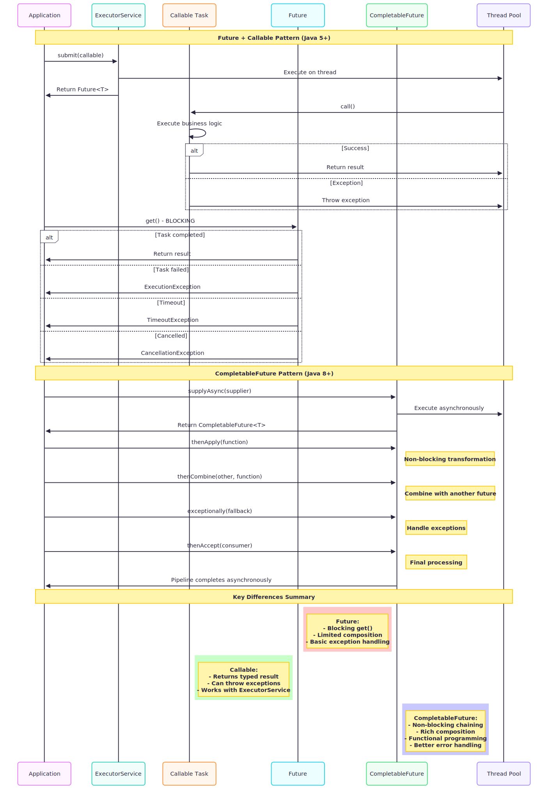

# Future, Callable & CompletableFuture in Java

- [Overview](#overview)
  - [Key Concepts Covered:](#key-concepts-covered)
- [What are Future, Callable & CompletableFuture?](#what-are-future-callable--completablefuture)
  - [Future Interface](#future-interface)
  - [Callable Interface](#callable-interface)
  - [CompletableFuture](#completablefuture)
- [Architecture Diagrams](#architecture-diagrams)
  - [Future, Callable & CompletableFuture Sequence Flow](#future-callable--completablefuture-sequence-flow)
  - [Future, Callable & CompletableFuture Execution Flow](#future-callable--completablefuture-execution-flow)
- [1. Future Interface (`a_SimpleFuture.java`)](#1-future-interface-a_simplefuturejava)
  - [Basic Future Usage](#basic-future-usage)
  - [Future with Timeout](#future-with-timeout)
  - [Future Cancellation](#future-cancellation)
  - [Key Future Methods](#key-future-methods)
- [2. Callable Interface (`b_SimpleCallable.java`)](#2-callable-interface-b_simplecallablejava)
  - [Callable vs Runnable Comparison](#callable-vs-runnable-comparison)
  - [Different Return Types](#different-return-types)
  - [Multiple Callables with invokeAll](#multiple-callables-with-invokeall)
  - [Practical Parallel Computation](#practical-parallel-computation)
- [3. CompletableFuture (`c_SimpleCompletableFuture.java`)](#3-completablefuture-c_simplecompletablefuturejava)
  - [Basic Creation Methods](#basic-creation-methods)
  - [Method Chaining and Transformation](#method-chaining-and-transformation)
  - [Combining Multiple Futures](#combining-multiple-futures)
  - [Exception Handling](#exception-handling)
  - [Practical Web Service Example](#practical-web-service-example)
  - [AllOf and AnyOf Operations](#allof-and-anyof-operations)
- [CompletableFuture Method Reference](#completablefuture-method-reference)
  - [Creation Methods](#creation-methods)
  - [Transformation Methods](#transformation-methods)
  - [Combining Methods](#combining-methods)
  - [Exception Handling](#exception-handling)
- [Evolution: Future → Callable → CompletableFuture](#evolution-future--callable--completablefuture)
  - [Traditional Future Limitations:](#traditional-future-limitations)
  - [CompletableFuture Advantages:](#completablefuture-advantages)
- [Best Practices](#best-practices)
  - [1. **Use CompletableFuture for New Code**](#1-use-completablefuture-for-new-code)
  - [2. **Handle Exceptions Properly**](#2-handle-exceptions-properly)
  - [3. **Use Custom Executors for CPU-Intensive Tasks**](#3-use-custom-executors-for-cpu-intensive-tasks)
  - [4. **Combine Multiple Operations Efficiently**](#4-combine-multiple-operations-efficiently)
  - [5. **Use join() vs get()**](#5-use-join-vs-get)
- [Performance Characteristics](#performance-characteristics)
  - [Future/Callable Performance:](#futurecallable-performance)
  - [CompletableFuture Performance:](#completablefuture-performance)
  - [Memory Considerations:](#memory-considerations)
- [Common Patterns](#common-patterns)
  - [1. **Timeout Pattern**](#1-timeout-pattern)
  - [2. **Retry Pattern**](#2-retry-pattern)
  - [3. **Cache Pattern**](#3-cache-pattern)
  - [4. **Fan-Out/Fan-In Pattern**](#4-fan-outfan-in-pattern)
- [Interview Questions & Answers](#interview-questions--answers)
  - [Q1: What is the difference between Future and CompletableFuture?](#q1-what-is-the-difference-between-future-and-completablefuture)
  - [Q2: What are the advantages of Callable over Runnable?](#q2-what-are-the-advantages-of-callable-over-runnable)
  - [Q3: How does CompletableFuture handle exceptions differently than Future?](#q3-how-does-completablefuture-handle-exceptions-differently-than-future)
  - [Q4: What is the difference between thenApply() and thenCompose() in CompletableFuture?](#q4-what-is-the-difference-between-thenapply-and-thencompose-in-completablefuture)
  - [Q5: When should you use allOf() vs anyOf() in CompletableFuture?](#q5-when-should-you-use-allof-vs-anyof-in-completablefuture)
  - [Q6: How do you handle timeouts in CompletableFuture?](#q6-how-do-you-handle-timeouts-in-completablefuture)
  - [Q7: What is the difference between join() and get() in CompletableFuture?](#q7-what-is-the-difference-between-join-and-get-in-completablefuture)
  - [Q8: How do you create a custom executor for CompletableFuture?](#q8-how-do-you-create-a-custom-executor-for-completablefuture)
  - [Q9: How do you combine CompletableFutures with different types?](#q9-how-do-you-combine-completablefutures-with-different-types)
  - [Q10: What are the best practices for exception handling in CompletableFuture chains?](#q10-what-are-the-best-practices-for-exception-handling-in-completablefuture-chains)

## Overview

This package demonstrates the evolution of asynchronous programming in Java, from the traditional `Future` and `Callable` interfaces to the modern `CompletableFuture` introduced in Java 8. These concepts are fundamental for building responsive, non-blocking applications that can handle concurrent operations efficiently.

### Key Concepts Covered:

1. **Future Interface** - Represents the result of an asynchronous computation
2. **Callable Interface** - A task that returns a result and can throw exceptions  
3. **CompletableFuture** - Enhanced Future with functional programming and composability
4. **Asynchronous Programming Patterns** - Non-blocking operations and pipeline composition
5. **Exception Handling** - Managing errors in asynchronous contexts

---

## What are Future, Callable & CompletableFuture?

### Future Interface
`Future<T>` represents a pending result of an asynchronous operation. It provides methods to:
- Check if computation is complete (`isDone()`)
- Wait for completion and retrieve result (`get()`)
- Cancel the computation (`cancel()`)
- Handle timeouts (`get(timeout, unit)`)

### Callable Interface  
`Callable<T>` is an enhancement over `Runnable` that:
- **Returns a result** (generic type T)
- **Can throw checked exceptions**
- **Works with ExecutorService** to return Future objects
- **Enables parallel computations** with result aggregation

### CompletableFuture
`CompletableFuture<T>` is a powerful enhancement over Future that provides:
- **Non-blocking operations** with callbacks
- **Method chaining** for pipeline operations  
- **Composition** of multiple futures
- **Better exception handling** with functional style
- **Asynchronous programming** without explicit thread management

---

## Architecture Diagrams

### Future, Callable & CompletableFuture Sequence Flow


### Future, Callable & CompletableFuture Execution Flow  


---

## 1. Future Interface (`a_SimpleFuture.java`)

### Basic Future Usage

```java
ExecutorService executor = Executors.newSingleThreadExecutor();

// Submit a Callable task that returns a result
Future<String> future = executor.submit(new Callable<String>() {
    @Override
    public String call() throws Exception {
        Thread.sleep(2000); // Simulate some work
        return "Hello from Future!";
    }
});

// Check if task is done (non-blocking)
System.out.println("Is done? " + future.isDone());

// Get the result (blocking call)
String result = future.get();
System.out.println("Result: " + result);
```

### Future with Timeout

```java
Future<Integer> future = executor.submit(() -> {
    Thread.sleep(5000); // Long operation
    return 42;
});

try {
    // Wait for result with timeout
    Integer result = future.get(3, TimeUnit.SECONDS);
    System.out.println("Result: " + result);
} catch (TimeoutException e) {
    System.out.println("Task timed out!");
    future.cancel(true); // Cancel the task
}
```

### Future Cancellation

```java
Future<String> future = executor.submit(() -> {
    for (int i = 0; i < 10; i++) {
        if (Thread.currentThread().isInterrupted()) {
            return "Cancelled";
        }
        Thread.sleep(1000);
        System.out.println("Working... " + (i + 1));
    }
    return "Completed normally";
});

// Cancel after 3 seconds
Thread.sleep(3000);
boolean cancelled = future.cancel(true); // true = interrupt if running
System.out.println("Cancellation successful: " + cancelled);
```

### Key Future Methods

| Method | Description | Blocking |
|--------|-------------|----------|
| `get()` | Get result, wait indefinitely | Yes |
| `get(timeout, unit)` | Get result with timeout | Yes |
| `isDone()` | Check if computation complete | No |
| `cancel(mayInterrupt)` | Cancel the computation | No |
| `isCancelled()` | Check if cancelled | No |

---

## 2. Callable Interface (`b_SimpleCallable.java`)

### Callable vs Runnable Comparison

```java
// Runnable - no return value, cannot throw checked exceptions
Runnable runnable = () -> {
    System.out.println("Runnable completed (no return value)");
};

// Callable - returns value, can throw checked exceptions  
Callable<String> callable = () -> {
    Thread.sleep(1000);
    return "Callable completed with return value";
};

// Submit both
Future<?> runnableFuture = executor.submit(runnable);
Future<String> callableFuture = executor.submit(callable);

// Runnable future has null result
System.out.println("Runnable result: " + runnableFuture.get()); // null
System.out.println("Callable result: " + callableFuture.get()); // "Callable completed..."
```

### Different Return Types

```java
// String Callable
Callable<String> stringCallable = () -> "Hello World";

// Boolean Callable
Callable<Boolean> booleanCallable = () -> Math.random() > 0.5;

// Custom Object Callable
Callable<Person> personCallable = () -> new Person("John Doe", 30);

// List Callable
Callable<List<Integer>> listCallable = () -> {
    List<Integer> numbers = new ArrayList<>();
    for (int i = 1; i <= 5; i++) {
        numbers.add(i * i); // Square numbers
    }
    return numbers;
};
```

### Multiple Callables with invokeAll

```java
List<Callable<Integer>> callables = new ArrayList<>();

for (int i = 1; i <= 5; i++) {
    final int taskNumber = i;
    callables.add(() -> {
        Thread.sleep(taskNumber * 200);
        return taskNumber * taskNumber; // Return square
    });
}

// Execute all Callables and wait for completion
List<Future<Integer>> futures = executor.invokeAll(callables);

// Collect results
for (int i = 0; i < futures.size(); i++) {
    Integer result = futures.get(i).get();
    System.out.println("Task " + (i + 1) + " result: " + result);
}
```

### Practical Parallel Computation

```java
// Parallel sum calculation
int[] numbers = new int[1000]; // Array of 1-1000
List<Callable<Long>> sumTasks = new ArrayList<>();
int chunkSize = numbers.length / 4;

for (int i = 0; i < 4; i++) {
    final int start = i * chunkSize;
    final int end = (i == 3) ? numbers.length : (i + 1) * chunkSize;
    
    sumTasks.add(() -> {
        long sum = 0;
        for (int j = start; j < end; j++) {
            sum += numbers[j];
        }
        return sum;
    });
}

// Execute and combine results
List<Future<Long>> futures = executor.invokeAll(sumTasks);
long totalSum = futures.stream()
    .mapToLong(future -> future.get())
    .sum();
```

---

## 3. CompletableFuture (`c_SimpleCompletableFuture.java`)

### Basic Creation Methods

```java
// Already completed future
CompletableFuture<String> completed = CompletableFuture.completedFuture("Hello World");

// Asynchronous supplier (returns value)
CompletableFuture<Integer> supply = CompletableFuture.supplyAsync(() -> {
    Thread.sleep(1000);
    return 42;
});

// Asynchronous runnable (no return value)
CompletableFuture<Void> run = CompletableFuture.runAsync(() -> {
    System.out.println("Async task completed");
});
```

### Method Chaining and Transformation

```java
CompletableFuture<String> pipeline = CompletableFuture
    .supplyAsync(() -> {
        System.out.println("Step 1: Getting initial value");
        return 10;
    })
    .thenApply(value -> {
        System.out.println("Step 2: Transforming " + value);
        return value * 2;
    })
    .thenApply(value -> {
        System.out.println("Step 3: Converting to string");
        return "Result: " + value;
    })
    .thenCompose(result -> {
        System.out.println("Step 4: Composing with another future");
        return CompletableFuture.supplyAsync(() -> result + " (composed)");
    });

// Side effect without return value
pipeline.thenAccept(result -> {
    System.out.println("Final result: " + result);
});
```

### Combining Multiple Futures

```java
CompletableFuture<Integer> future1 = CompletableFuture.supplyAsync(() -> {
    sleep(1000);
    return 10;
});

CompletableFuture<Integer> future2 = CompletableFuture.supplyAsync(() -> {
    sleep(1500);  
    return 20;
});

// Combine two futures with same type
CompletableFuture<Integer> combined = future1.thenCombine(future2, (a, b) -> {
    System.out.println("Combining " + a + " and " + b);
    return a + b;
});

System.out.println("Combined result: " + combined.join()); // 30
```

### Exception Handling

```java
CompletableFuture<Integer> riskyFuture = CompletableFuture.supplyAsync(() -> {
    if (Math.random() > 0.5) {
        throw new RuntimeException("Random failure!");
    }
    return 100;
});

// Method 1: exceptionally - handle exceptions
CompletableFuture<Integer> withExceptionally = riskyFuture
    .exceptionally(throwable -> {
        System.out.println("Handled exception: " + throwable.getMessage());
        return -1; // Default value
    });

// Method 2: handle - handle both success and failure
CompletableFuture<String> withHandle = riskyFuture
    .handle((result, throwable) -> {
        if (throwable != null) {
            return "Error: " + throwable.getMessage();
        } else {
            return "Success: " + result;
        }
    });

// Method 3: whenComplete - perform side effects
CompletableFuture<Integer> withSideEffects = riskyFuture
    .whenComplete((result, throwable) -> {
        if (throwable != null) {
            System.out.println("Task failed: " + throwable.getMessage());
        } else {
            System.out.println("Task succeeded: " + result);
        }
    });
```

### Practical Web Service Example

```java
// Simulate parallel web service calls
CompletableFuture<User> userFuture = getUserData(123);
CompletableFuture<List<Order>> ordersFuture = getUserOrders(123);
CompletableFuture<Preferences> preferencesFuture = getUserPreferences(123);

// Combine all data to create complete profile
CompletableFuture<UserProfile> profileFuture = userFuture
    .thenCombine(ordersFuture, (user, orders) -> {
        user.setOrders(orders);
        return user;
    })
    .thenCombine(preferencesFuture, (user, preferences) -> {
        return new UserProfile(user, preferences);
    })
    .exceptionally(throwable -> {
        System.out.println("Failed to create profile: " + throwable.getMessage());
        return new UserProfile(defaultUser(), defaultPreferences());
    });

UserProfile profile = profileFuture.join();
```

### AllOf and AnyOf Operations

```java
List<CompletableFuture<String>> futures = new ArrayList<>();
for (int i = 1; i <= 5; i++) {
    final int taskNum = i;
    futures.add(CompletableFuture.supplyAsync(() -> {
        sleep(taskNum * 200);
        return "Task " + taskNum + " completed";
    }));
}

// Wait for all to complete
CompletableFuture<Void> allCompleted = CompletableFuture.allOf(
    futures.toArray(new CompletableFuture[0])
);

CompletableFuture<List<String>> allResults = allCompleted.thenApply(v -> {
    return futures.stream()
        .map(CompletableFuture::join)
        .toList();
});

// Wait for any one to complete
CompletableFuture<Object> anyCompleted = CompletableFuture.anyOf(
    futures.toArray(new CompletableFuture[0])
);

System.out.println("First completed: " + anyCompleted.join());
System.out.println("All results: " + allResults.join());
```

---

## CompletableFuture Method Reference

### Creation Methods
| Method | Description | Return Type |
|--------|-------------|-------------|
| `completedFuture(value)` | Already completed future | `CompletableFuture<T>` |
| `supplyAsync(supplier)` | Async supplier with result | `CompletableFuture<T>` |
| `runAsync(runnable)` | Async runnable without result | `CompletableFuture<Void>` |

### Transformation Methods
| Method | Description | Input | Output |
|--------|-------------|-------|--------|
| `thenApply(function)` | Transform result | `T` | `U` |
| `thenCompose(function)` | Flat-map (chain futures) | `T` | `CompletableFuture<U>` |
| `thenAccept(consumer)` | Side effect with result | `T` | `Void` |
| `thenRun(runnable)` | Side effect without result | - | `Void` |

### Combining Methods
| Method | Description |
|--------|-------------|
| `thenCombine(other, function)` | Combine two futures |
| `allOf(futures...)` | Wait for all to complete |
| `anyOf(futures...)` | Wait for any one to complete |

### Exception Handling
| Method | Description |
|--------|-------------|
| `exceptionally(function)` | Handle exceptions only |
| `handle(bifunction)` | Handle both success and failure |
| `whenComplete(biconsumer)` | Side effects for both cases |

---

## Evolution: Future → Callable → CompletableFuture

### Traditional Future Limitations:
```java
// ❌ Blocking operations
String result = future.get(); // Blocks thread

// ❌ No composition
Future<String> f1 = ...;
Future<Integer> f2 = ...;
// No easy way to combine f1 and f2

// ❌ Poor exception handling
try {
    result = future.get();
} catch (ExecutionException e) {
    // Exception wrapped, hard to handle
}

// ❌ No callbacks
// Must poll or block to check completion
```

### CompletableFuture Advantages:
```java
// ✅ Non-blocking pipeline
CompletableFuture.supplyAsync(() -> "Hello")
    .thenApply(s -> s.toUpperCase())
    .thenAccept(System.out::println); // No blocking!

// ✅ Easy composition
CompletableFuture<String> combined = future1
    .thenCombine(future2, (a, b) -> a + b);

// ✅ Better exception handling
future.exceptionally(throwable -> "default")
    .thenAccept(System.out::println);

// ✅ Callbacks and async chains
future.thenAccept(result -> processResult(result))
    .thenRun(() -> cleanup());
```

---

## Best Practices

### 1. **Use CompletableFuture for New Code**
```java
// ✅ Preferred
CompletableFuture.supplyAsync(() -> heavyComputation())
    .thenApply(this::processResult)
    .thenAccept(this::displayResult);

// ❌ Legacy approach  
Future<String> future = executor.submit(() -> heavyComputation());
String result = future.get(); // Blocking
```

### 2. **Handle Exceptions Properly**
```java
// ✅ Always handle exceptions
CompletableFuture.supplyAsync(() -> riskyOperation())
    .exceptionally(throwable -> {
        log.error("Operation failed", throwable);
        return defaultValue();
    })
    .thenAccept(this::processResult);
```

### 3. **Use Custom Executors for CPU-Intensive Tasks**
```java
// ✅ Custom executor for CPU-bound tasks
Executor cpuExecutor = Executors.newFixedThreadPool(Runtime.getRuntime().availableProcessors());

CompletableFuture.supplyAsync(() -> cpuIntensiveTask(), cpuExecutor)
    .thenAccept(this::processResult);
```

### 4. **Combine Multiple Operations Efficiently**
```java
// ✅ Parallel execution with combination
CompletableFuture<String> user = getUserAsync(id);
CompletableFuture<List<Order>> orders = getOrdersAsync(id);

CompletableFuture<UserProfile> profile = user
    .thenCombine(orders, UserProfile::new);
```

### 5. **Use join() vs get()**
```java
// ✅ join() throws unchecked exceptions
String result = future.join();

// ❌ get() throws checked exceptions (more boilerplate)
try {
    String result = future.get();
} catch (InterruptedException | ExecutionException e) {
    // Handle exceptions
}
```

---

## Performance Characteristics

### Future/Callable Performance:
- **Thread Pool Overhead**: Requires ExecutorService management
- **Blocking Operations**: `get()` blocks calling thread
- **Limited Composition**: Difficult to chain operations
- **Exception Wrapping**: ExecutionException adds overhead

### CompletableFuture Performance:
- **Default ForkJoinPool**: Efficient work-stealing for parallel tasks
- **Non-blocking Chains**: Pipeline operations without thread blocking
- **Optimized Composition**: Built-in support for combining futures
- **Better Exception Handling**: Less wrapping, more efficient

### Memory Considerations:
```java
// ✅ Efficient - operations chained in single future
CompletableFuture.supplyAsync(this::fetchData)
    .thenApply(this::transform)
    .thenAccept(this::save);

// ❌ Less efficient - multiple future objects
CompletableFuture<Data> step1 = CompletableFuture.supplyAsync(this::fetchData);
CompletableFuture<ProcessedData> step2 = step1.thenApply(this::transform);
CompletableFuture<Void> step3 = step2.thenAccept(this::save);
```

---

## Common Patterns

### 1. **Timeout Pattern**
```java
CompletableFuture<String> result = CompletableFuture.supplyAsync(() -> slowOperation())
    .orTimeout(5, TimeUnit.SECONDS)
    .exceptionally(throwable -> "Timeout occurred");
```

### 2. **Retry Pattern**
```java
public CompletableFuture<String> withRetry(Supplier<String> operation, int maxRetries) {
    return CompletableFuture.supplyAsync(operation)
        .handle((result, throwable) -> {
            if (throwable != null && maxRetries > 0) {
                return withRetry(operation, maxRetries - 1).join();
            }
            return result;
        });
}
```

### 3. **Cache Pattern**
```java
private final Map<String, CompletableFuture<String>> cache = new ConcurrentHashMap<>();

public CompletableFuture<String> getData(String key) {
    return cache.computeIfAbsent(key, k -> 
        CompletableFuture.supplyAsync(() -> expensiveOperation(k))
    );
}
```

### 4. **Fan-Out/Fan-In Pattern**
```java
List<String> urls = Arrays.asList("url1", "url2", "url3");

// Fan-out: Start all requests
List<CompletableFuture<String>> futures = urls.stream()
    .map(url -> CompletableFuture.supplyAsync(() -> fetchData(url)))
    .toList();

// Fan-in: Combine all results
CompletableFuture<List<String>> allResults = CompletableFuture
    .allOf(futures.toArray(new CompletableFuture[0]))
    .thenApply(v -> futures.stream()
        .map(CompletableFuture::join)
        .toList());
```

---

## Interview Questions & Answers

### Q1: What is the difference between Future and CompletableFuture?
**Answer:** 
- **Future** is a basic interface representing a pending result with limited functionality (get, cancel, isDone)
- **CompletableFuture** is an enhanced implementation that adds:
  - Non-blocking operations with callbacks
  - Method chaining and composition
  - Better exception handling
  - Functional programming style
  - Built-in support for combining multiple futures

### Q2: What are the advantages of Callable over Runnable?
**Answer:**
- **Return Value**: Callable can return a result, Runnable cannot
- **Exception Handling**: Callable can throw checked exceptions, Runnable cannot  
- **Type Safety**: Callable is generic `Callable<T>`, providing type safety
- **Future Integration**: Callable works seamlessly with ExecutorService to return Future objects

### Q3: How does CompletableFuture handle exceptions differently than Future?
**Answer:**
CompletableFuture provides multiple exception handling methods:
- `exceptionally()`: Handle exceptions and provide default values
- `handle()`: Handle both success and failure cases
- `whenComplete()`: Perform side effects for both outcomes
- Exceptions are not wrapped in ExecutionException by default
- Better integration with functional programming patterns

### Q4: What is the difference between thenApply() and thenCompose() in CompletableFuture?
**Answer:**
- **thenApply()**: Transforms the result (similar to map) - `T → U`
- **thenCompose()**: Flat-maps the result (similar to flatMap) - `T → CompletableFuture<U>`
- Use thenApply for simple transformations, thenCompose when the transformation itself returns a CompletableFuture

### Q5: When should you use allOf() vs anyOf() in CompletableFuture?
**Answer:**
- **allOf()**: When you need all operations to complete before proceeding (e.g., aggregating data from multiple sources)
- **anyOf()**: When you need the first available result (e.g., racing multiple servers, timeout scenarios)

### Q6: How do you handle timeouts in CompletableFuture?
**Answer:**
```java
// Java 9+
CompletableFuture<String> result = CompletableFuture
    .supplyAsync(() -> slowOperation())
    .orTimeout(5, TimeUnit.SECONDS)
    .exceptionally(throwable -> "Default value");

// Pre-Java 9
CompletableFuture<String> timeout = new CompletableFuture<>();
ScheduledExecutorService scheduler = Executors.newScheduledThreadPool(1);
scheduler.schedule(() -> timeout.completeExceptionally(new TimeoutException()), 5, TimeUnit.SECONDS);

CompletableFuture<String> result = CompletableFuture
    .supplyAsync(() -> slowOperation())
    .applyToEither(timeout, Function.identity());
```

### Q7: What is the difference between join() and get() in CompletableFuture?
**Answer:**
- **join()**: Throws unchecked exceptions (RuntimeException), cleaner for lambda expressions
- **get()**: Throws checked exceptions (InterruptedException, ExecutionException), requires try-catch
- Both are blocking operations that wait for completion

### Q8: How do you create a custom executor for CompletableFuture?
**Answer:**
```java
// Custom thread pool
ExecutorService customExecutor = Executors.newFixedThreadPool(10);

// Use with CompletableFuture
CompletableFuture<String> future = CompletableFuture
    .supplyAsync(() -> heavyComputation(), customExecutor)
    .thenApplyAsync(this::transform, customExecutor);

// Don't forget to shutdown
customExecutor.shutdown();
```

### Q9: How do you combine CompletableFutures with different types?
**Answer:**
```java
CompletableFuture<String> stringFuture = CompletableFuture.supplyAsync(() -> "Hello");
CompletableFuture<Integer> intFuture = CompletableFuture.supplyAsync(() -> 42);

// Combine different types
CompletableFuture<String> combined = stringFuture
    .thenCombine(intFuture, (str, num) -> str + " " + num);
```

### Q10: What are the best practices for exception handling in CompletableFuture chains?
**Answer:**
- Place exception handling strategically in the chain
- Use `exceptionally()` for recovery with default values
- Use `handle()` when you need to process both success and failure
- Use `whenComplete()` for cleanup operations
- Consider placing exception handling at the end of long chains
- Always handle exceptions to prevent silent failures 
